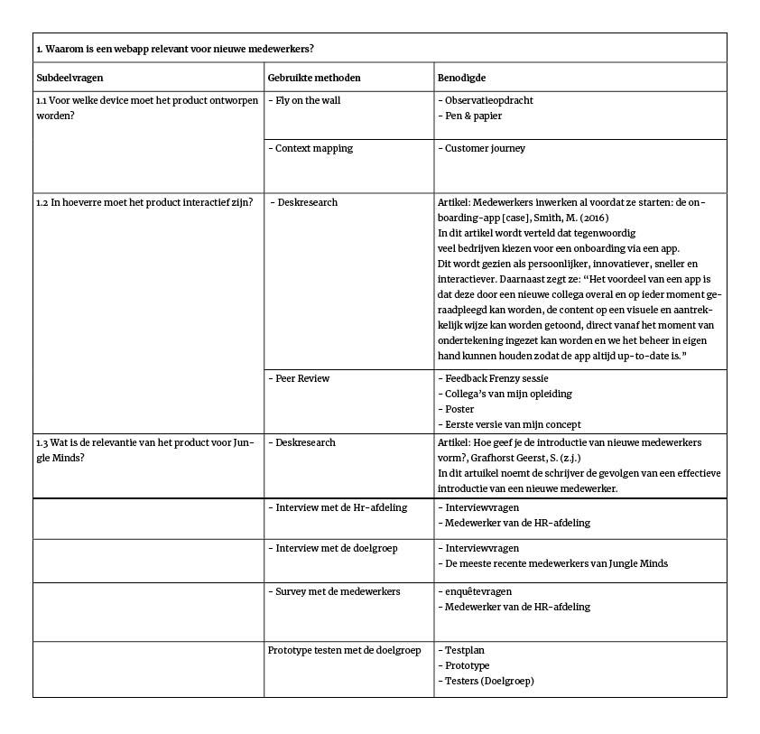
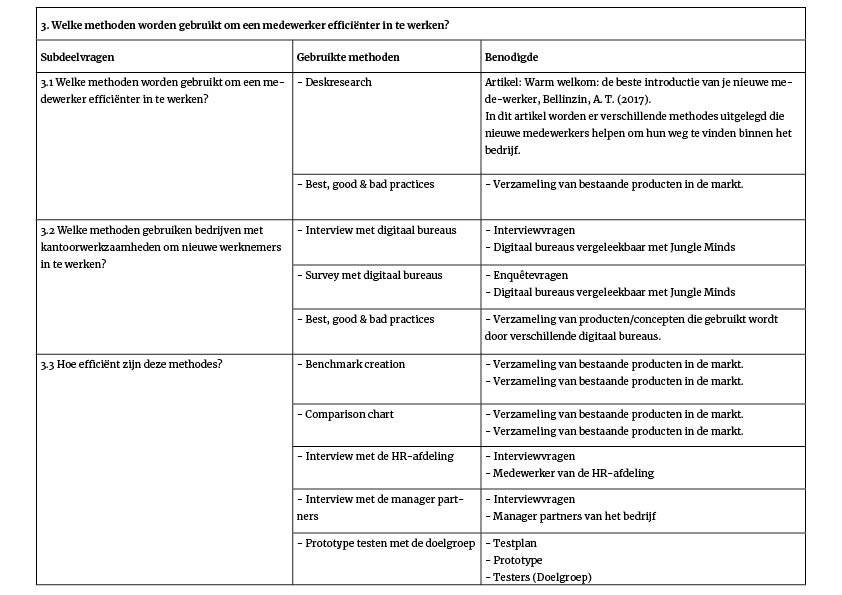

# 1.3 Inleiding

## Design challenge

“Bij Jungle Minds draait alles om de gebruikswaarde, het maken van digitale producten die ons dagelijks leven beter maken. De technologie en design die problemen oplossen, interactie stimuleren en een goede ervaring bieden. Dingen waarvan we zelf als gebruiker vinden, ‘fijn dat iemand daar goed over heeft nagedacht’.” \(Jungle Minds, z.j., p.9\) 

Met de bovenvermelde instelling van Jungle Minds in mijn achterhoofd heb ik de volgende ontwerpvraag geformuleerd voor mijn project: 

> “Hoe kan een webapp ervoor zorgen dat nieuwe medewerkers van Jungle Minds de benodigde informatie over procedures en regels binnen het bedrijf verkrijgen, zodat er efficiënter met de inwerktijd wordt omgegaan?”

## Onderzoeksvragen

### Deelvraag 1

### Deelvraag 2

### Deelvraag 3 

