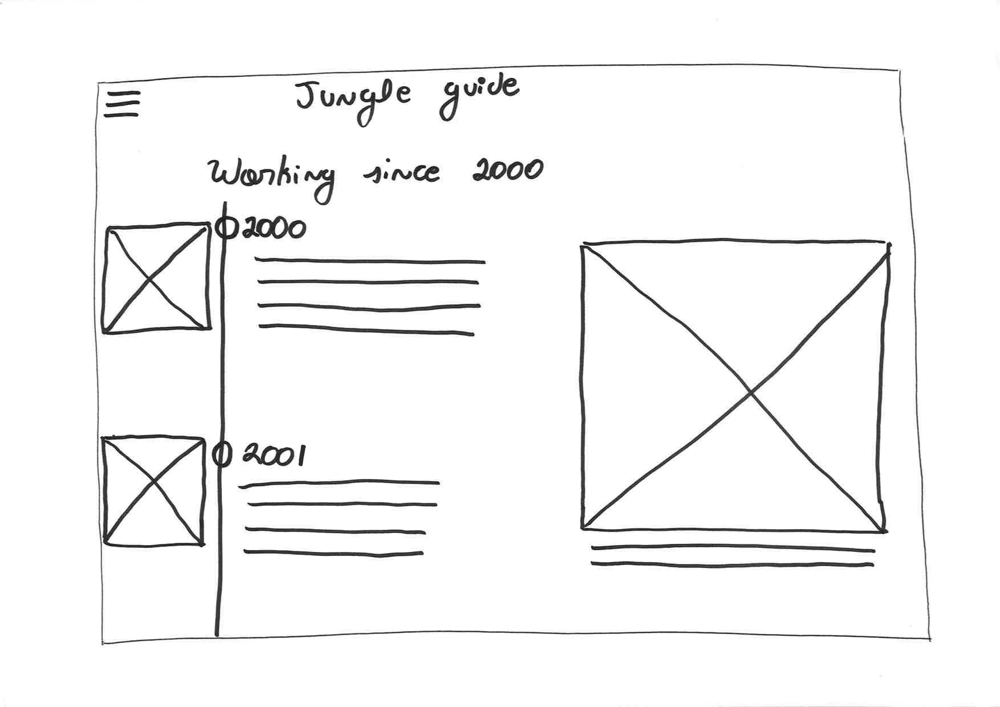

# Mood board Jungle Minds

## Jungle Minds 

Het bedrijf Jungle Minds bestaat al sinds 2000 en is werkt user centered. 

> Jungle Minds werd opgericht als het eerste _digital focussed_ onderzoeks- en strategiebureau van Nederland. Vanaf daar is het bedrijf gegroeid naar het bureau dat we vandaag zijn: een toonaangevend design & technologie bureau met aansprekende klanten binnen en buiten Nederland. Nog altijd 100% onafhankelijk. En bovenal: onveranderd gericht op user-value.

[https://jungleminds.nl/ons-verhaal](https://jungleminds.nl/ons-verhaal)

## Missie, visie & Inspiratie

### Missie

De missie van Jungle Minds wordt op verschillende manier omgeschreven. In hun website wordt Jungle Minds beschreven als:

>

### Visie

#### Human, business, shape

Dit zijn de kernwoorden van onze visie. Welk vraagstuk je ons ook voorlegt, ons team vertegenwoordigt altijd deze drie invalshoeken. Ze helpen ons het probleem te ontrafelen en waardevolle verbindingen te vinden tussen gebruikers en merken. \(Minds, z.j.\)

#### Klein team, korte cyclus

We houden van grote ambities maar wel in kleine, snelle stappen. Omdat we weten dat je zo tot een beter en sneller resultaat komt. We itereren vaak, valideren snel en zoeken voortdurend input van onze partners.  \(Minds, z.j.\)

#### Co-client

Is hoe we met onze opdrachtgevers samenwerken. Onze klanten zijn onlosmakelijk verbonden met ons team en onze manier van werken. Alleen zo leren we je business echt kennen en kunnen we begrijpen welke veranderingen nodig zijn. \(Minds, z.j.\)

### Inspiratie


TODO: Inspiratie 


## Identiteit & merkbeleving


TODO: Identiteit & merkbeleving


## Huisstijl


TODO: Voeg huistijl PDF toe 


## Onderzoek


TODO: Inleiding doel van de interviews, wat ik eruit wilde halen.



TODO: Een samenvatting van de insights uit de interviews.


### Interview



### De geïnterviewde

### Het bedrijf

* **Waar staat Jungle Minds voor?** De ambitie van Jungle Minds is om bepaalde merken te helpen om aan hun doelgroep gebruikswaarden te geven, waarin digital central staat. Digital is iets wat je tegenwoordig steeds minder hoeft te benoemen omdat tegenwoordig is digital al helemaal in. Dit doen we met een groep van 50 mensen van verschillende disciplines die samen werken om een kwalitatief product aan te leveren en dat maakt Jungle Minds onderscheidend. 
* **Wat is de missie van Jungle Minds? **Merken te helpen om aan hun doelgroep gebruikswaarden te geven, waarin digital central staat. 
* **Wat is de visie van Jungle Minds? **Een groep van 50 mensen van verschillende disciplines die samen werken om een kwalitatief product aan te leveren. 
* **Hoe straalt Jungle Minds haar missie en visie?** _Aan medewerkers_: Jungle Minds heeft een eenduidig verhaal waarin iedereen zich in herkennen. Iedereen deelt hetzelfde cultuur en is hier opzoek naar een kwalitatief en uitdagende werkplek die Jungle Minds kan bieden. _Aan klanten_: Binnen ons eigen cirkel weten mensen heel goed wat Jungle minds is en waar we voorstaan, mensen buiten ons weten mensen niet zo goed hoe en wat we zijn. Echter, zodra ze ons kennen zijn ze verbaasd dat Jungle Minds veel kan. Jungle Minds is erg bescheiden, Wij maken veel mooie dingen maar met weinig oog om dit naar de wereld toe te vertellen. 
* **Wat zijn dingen die het bedrijf inspireren? \(bedrijven, producten en/of diensten\)** - Technologie inspireert ons enorm, want daar is natuurlijk waar ons werk omdraait. - Maar internationale bureau is ook iets wat wij vaak naar uitkijken. We willen zien hoe zij eruit zien en wat voor werk zij doen. Voorbeeld van deze bedrijven zijn: [ideal](https://www.ideal.nl/en/), [huge](https://www.hugeinc.com/) , [fabrique](https://www.fabrique.nl/?gclid=Cj0KCQiA5t7UBRDaARIsAOreQtgTjeZW5xnUnLl5_GE2vOh9JBZ2YjMIpOIwbZ5acElmj35N3ZdbLQ8aAodLEALw_wcB). We kijken niet alleen naar bureaus die als Jungle Minds zijn, maar naar hoe bedrijven zich ontwikkelen, daar kunnen we veel van leren. Ook met ons eigen klanten bedrijven leren we veel gedurende het traject, die zijn vaak veel van beïnvloeding van wat wij hier doen. - Ook leren wij veel van de Jungle pro's, deze zitten bij onze klanten en zijn goeie professionals die weten waar ze over hebben. 
* **Waar bent u het meeste trots op van het bedrijf?** Combinatie van professionaliteit en cultuur die we heir hebben gezet. we zijn in staat om goed met klanten te werken iets professionals opleveren en nog leuk werken.

### Medewerkers

* **Uit hoeveel medewerkers bestaat het bedrijf? **Ongeveer 50 mensen. 
* **Werken jullie ook met internationale medewerkers?** Ja, niet alleen medewerkers maar ook klanten. Ons toekomst zicht is dat we steeds meer gaan werken met internationale medewerkers dus het is essential dat wij een switch maken naar het engels. Wij zijn al met deze switch begonnen door ons "Monday mornings" en "Jungle days" in het engels te geven. 
* **Wat is de visie van het bedrijf bij het groeien maar niet groter worden dan 50 medewerkers?**  
  Je moet zo zien dat per jaar gaan ongeveer 5 medewerkers bij ons weg. Dit kan gebeuren omdat zij zelf buiten Jungle Minds zich willen ontwikkelen of wij vinden dat een persoon zich niet verder ontwikkelt binnen het bedrijf. Het blijven dus altijd doorstroom, daarnaast betekent niet dat nieuwe mensen alleen de gregratie is van groei maar het is een doorstroom van het bureau.  

  Daarnaast hebben wij ons Jungle pro's die zeker deel uitmaken van het bedrijf maar dan net op een andere manier. Het zal voor ons als bedrijf fijn zijn om hun ook vaker te kunnen betrekken in ons visie en missie. Zo kunnen ze ook een idee hebben in wat allemaal zich afspeelt en waarom wij bepaalde keuzes maken.

### Inwerk procedures en Informatievoorzieningen

* **Wat is jullie "normale"procedure bij een nieuwe medewerker?** - Eerst twee dagen bij de hand genomen om alles te laten zien van lunch tot timetell. - Daarna word je gekoppeld aan een buddy, daar kan je terecht als je vragen hebt. - Wij kiezen een eerst project uit waarvan wij verwachten dat de nieuwe medewerker goed zal kunnen meedraaien om alle procedures te ervaren. 
* **Welke informatie geven jullie aan een nieuwe medewerker?** - Handboek - Personeelgids - Toegang tot slack enzo \(maar niet gestructureerd aangegeven\) - Welkom to the jungle presentatie 
* **Welke informatie vindt u noodzakelijk dat een medewerker moet weten?** - "Jungle day" verhaal, want het heeft een kader van waar we voor staan en wat we hier doen. Wij vinden het belangrijk dat alle medewerkers begrijpen belangrijk hoe wij de wereld zien, hoe wij dingen doen en waarom wij bepaalde keuzes maken. 
* **Is er iets wat u zal willen veranderen aan de manier waarop nieuwe medewerkers worden ingewerkt?** - On boarding proces verbeteren - Beter staart projecten hebben 
* **Hoe wordt nu de identiteit van Jungle Minds overgebracht aan de nieuwe medewerkers? **Cultuur wordt goed over gedraagt, de medewerkers ervaren het snel waardoor je meteen merkt of ze een klik hebben met het bedrijf of niet. Er is binnen ons bedrijf geen hierarchie, dit steelt iedereen open om naar elke medewerker toe te lopen. Ook vinden wij als bedrijf transparantie erg belangrijk. Hierdoor stellen wij onze financieel open zodat iedereen weet waarom wij bepaalde keuzes maken. Een onafhankelijk bedrijf zijn speelt hier een grote rol in. 
* **Wat beschouwt u als inhoudelijke informatie over het bedrijf? -** Hoe wij over het algemeen aan het werk gaan. - De pyramide van "Jungle day".  - Wat elke fase betekent  - Wat wij precies doen in elke faze  - Wat er verwacht wordt van elke fase - Designsprints die wij doen  - Bij welke fase doe je dat precies \(_**Bart Vijfhuizen**_ kan jou meer informatie over vertellen\) - welke research kan je bij elke fase doen: \(_**Imke**_ kan jou meer informatie over vertellen\) - Kort uitleg van wat er wordt verwacht van elke discipline die wij binnen het bedrijf hebben is wel handig. - _**Bart van Steege**_ heeft ook veel te vertellen over het bedrijf en zijn visie.

### Tips, ideeën en opmerkingen

*  _Het product zal gedeeld kunnen worden in 2 delen namelijk: - Deel 1: Wat wij, Jungle Minds, belangrijk vinden als normen en waarden. - Deel 2:_ Wat de manier van werken is van _Jungle Minds.  - Hoe wij een bepaalde keuze maken en waar het van afhangt.  - Hoe wij werken \(sprints, design sprints van een week\)  - Welke research wij doen bij een fase._
* Zie de presentatie van afgelopen "Jungle day" voor meer informatie over het bedrijf.


[TODO: PDF file toevoegen 2018.02.08.JD1\_PUBLIC.pdf](https://files.nuclino.com/files/8a977453-24e8-4f67-ab8a-9092d5329052/2018.02.08.JD1_PUBLIC.pdf)




### De geïnterviewde

### Het bedrijf

* **Waar staat Jungle Minds voor?**  
  bureau: staan we voor digitale inovatie en verbetering &gt; brand produtcs en team. strategisch niveau merken verbetren. op alle niveaus beter scheiden voor gebruikers onderscheidend te maken

  Naar werknemers: Staan we voor het feit dat we geoie werkgevers zijn proberne te zijn. investering op mensen die hier werken. fijn voelt.  

* **Wat is de missie van Jungle Minds? **bedrijven suc6 vol amken gericht op eindgebruiekr. user value &gt;&gt; boeiend functioneel. meaningfull &gt; wat jungle minds is . persoonlijk bkijft, onafhankelijkheid speelt heir een grote rol in. geld meer te zien als status stelt om een fijne tijd met elkaar te hebben. gevoel van "dit is net anders" 
* **Wat is de visie van Jungle Minds? **E 
* **Hoe straalt Jungle Minds haar missie en visie?** _onafhankelijkheid ,_ identiteit. is nog veel te doen. rebranding in de missie die wij hebben als bureau . zowel extern als intern. intern communicatie is veel beter dan onze externe. we zijn een introvert bureau. vooral buiten profieliee kan intelligenten. 
* **Wat zijn dingen die het bedrijf inspireren? \(bedrijven, producten en/of diensten\)** -ideo &gt; speach vab south soith west. strategisch bureau en hoe z eom gaan met de vraagstukken. - werknemerschap kan aller kant opkomen. - digitale spellers&gt; overgenomen van google over tribes. - toffe communicatie maken 
* **Waar bent u het meeste trots op van het bedrijf?** op de sfeer die wij onderling hebben. troef kaart - onafhankelijkheid, blijft herhallen maar dat is feitelijk alles waarmee begint. opdrachtevers tof zijn, kan leiden tot onprofessiopnele gedrag , dus kan ytegen je zeer keren maar 9/10 gevallen is goeie eigenschap. transparent, mensen motiveren om beter te worden in hun vak. 

### Medewerkers

* **Uit hoeveel medewerkers bestaat het bedrijf? **50 
* **Werken jullie ook met internationale medewerkers?**  
  heel belangrijk 2 redenen &gt;&gt; talent je kan beter talent zoeken

  diversiteit beter omdat wij international willen groeien.  
  

* **Wat is de visie van het bedrijf bij het groeien maar niet groter worden dan 50 medewerkers?** jungle pros's belangrijk - welkom to the jungle presentatie - criteria voor jungle pro's zouden eigenlijk een op een zelfde moeten zijn als jungle minds medewerkers.

### Inwerk procedures en Informatievoorzieningen

* **Wat is jullie "normale"procedure bij een nieuwe medewerker?** - Eeen van de drie presentatie doe van de welkom to the jungle - bos bloemen en computer is geregeld - detail is meer met alexandra - tribe speelt een rol - handboek op de website 
* **Welke informatie geven jullie aan een nieuwe medewerker?** - H 
* **Welke informatie vindt u noodzakelijk dat een medewerker moet weten?** - personeel gids presentatie - Arbeid situatie goed wordt uitgelegd - Alles wat je nodig hebt om je thuis te voelen - vertrouweloijk persoon - Wat mag ik verwachten als iets gebeurt. -personeelgids nivauw 
* **Is er iets wat u zal willen veranderen aan de manier waarop nieuwe medewerkers worden ingewerkt?** - onboarden van freelancers. een grote todo.  
* **Hoe wordt nu de identiteit van Jungle Minds overgebracht aan de nieuwe medewerkers? **C 
* **Wat beschouwt u als inhoudelijke informatie over het bedrijf? -** H

### Tips, ideeën en opmerkingen

*  _Grappen engels naar nederlands taal._
* elke week een tribe mee lopen.cyclus er zijn standard verhalen &gt; welke fases erzijn wrm doen we dat.
* Wat is typisch jungle minds.
* wrm
* zorgpad een app die de voortraject nazorg doorloopt. proces stappenplan app.
* Bam heeft stappelplan als voorbeeld.
* traject als stapelplan
* zo snel als kan duurzaam dat het blijft. Wat wij willen is niet elilend maar wat werkt.
* deep dive door alle delen. wat moeyt ik weten om aan de slag te kunnen.
* medewerker wordt sneller productief en de tevredenheid neemt toe.
* redenering moet
* gevoelsmatig serie van 4 weken,
* culturele introductie
* procesmatig introductie
* huishoudelijk ding hoe werkt timetell.
* financieel wel tof.
* fasering &gt; wie is oberon wat ze doen.
* een topic per week.
  * hr alexandra
  * cultureel bartt
  * kars
* Het moet op maandag ochtend.



### De geïnterviewde

### Het bedrijf

* **Waar staat Jungle Minds voor?** Eeen bureau waarde toevoeged vor klanten en gebruikers. mnaken van mooie goedwerkende we producten 
* **Wat is de missie van Jungle Minds? **gebruikerswaarde toevoegen/bieden 
* **Wat is de visie van Jungle Minds? **E 
* **Hoe straalt Jungle Minds haar missie en visie?** Dat kan beter, naar huigdige klanten gaat gord, maar naar biuiten kandat beter 
* **Wat zijn dingen die het bedrijf inspireren? \(bedrijven, producten en/of diensten\)** - vanuit jungleminds &gt; kunst, nieuwe markten, innovatie. verschillende typen kalmnten, gezondheid sports gezelligheid. locatie. 
* **Waar bent u het meeste trots op van het bedrijf?** op de cultuur die we hier hebben. moeilijk om ergens anders te vinden. Met elkaar omgaan. 
* **Omschrijf jouw functie binnen het bedrijf?** plan ik mensen, de juiste mensen op de juiste planning gepland worden. Puzzle dagelijks, soft project management voor kleine projecten. Grote rol in uren e project admnistratie.

### Procedures en Informatie

* **Wat beschouwt u als inhoudelijke informatie over het bedrijf? -** H
* **Welke zijn de procedures binnen Jungle Minds wat een project betreft?** - Standarts project: - Bedrijf rechtsstreeks of zelf promoten - Maken voorstel of workshop fase om te laten zien wat we de klanten kunne binnen. - Als het bevalt gaat het akkord met een bepaalde budget. - Project leider maakt een plan van hoeveel mensen gaan werken en budget - eerste concept - design - bouwen  budget speelt grote rol , ambtie van de klant. 
* **Hoe zit de planning uit van het bedrijf bij projecten? -** H 
* **Waar moet er rekening gehouden worden tijdens het plannen van projecten? -** beschikbaarheid, ambitie van mensen, team samenstelling voor prestatie. 
* **Welke informatie vindt u noodzakelijk dat een medewerker moet weten over het bedrijf?** - missie en vissie &gt; goed op de hoogte - achtergrond, geschiedenis - Cultuur behouden door geod kenismakingsgesprekken met iedereen - Financieel door strakke uren proces. \(kars ligt het uit, voor de transparantie\) - Hoe werken we. de werkwijze, welke tools en welke procesen er zijn om achter een bepaalde dingen te komen. 
* **Is er iets wat u zal willen veranderen aan de manier waarop nieuwe medewerkers worden ingewerkt?** - verbeterd afgelopen maande maar het blijft lastig omdat verschil in wat iemand kan, en junior is meestal lastig omadat het best een intensief traject kan zijn qua beschikbaarheid, 

### Tips, ideeën en opmerkingen

*  dingen die met jungleminds te maken hebben zoals pondtijd
* manieren heo je kan dingen reserveerd, ruoimte auto
* boek wie is wie.
* planning voor kennismakinggesprek
* jaar agenda van JM &gt; wnr zijn jungle days, tribe meetings uittjes. rekening houden met interne uitjes.
* templates van presentaties.
* tijdlijn samenvatting welkom to the jungle belangrijke data



### De geïnterviewde

### Het bedrijf

* **Waar staat Jungle Minds voor?** lastig om te omschrijven. Handboek te lezen, want als ik product niveau en personeel. informatie uithalen uit de handboek en website. Presentaties van jungle day. 
* **Wat is de missie van Jungle Minds? **Me 
* **Wat is de visie van Jungle Minds? **leading partner te zij user experience te gebruike toetepassen in producten. en daar altijd meaningful difference in te geven. 
* **Hoe straalt Jungle Minds haar missie en visie?**  
  naar buiten toe uitstrallen&gt; website en vertellen naar klanten tijdens presentaties. ervaren op welke manier we producten doen.

  intern&gt; blijven herhallen op jungle3 days. iets wat van osn allemaal hoort.  

* **Wat zijn dingen die het bedrijf inspireren? \(bedrijven, producten en/of diensten\)** - andere bureaus huge \(inspiratie bron voor de heren\) wij vergelijekn ons niet echt met andere bureaus. 
* **Waar bent je het meeste trots op van het bedrijf?** dat wij echt mooie dingen maken. we krijgen veel gedaan, bedrijven in beweging en maken echt producten die een vershcil betekenen die echt heel geod zijn voor de gebruikers en op een manier die wij zelf niet arrogant op worden. wij blijven hetzelfde. mensen zijn altijd opzoek naar verbetreing maart op ene nuttire manier. 

### Medewerkers

* **Uit hoeveel medewerkers bestaat het bedrijf? **Ongeveer 50 mensen. 
* **Werken jullie ook met internationale medewerkers?** J 
* **Wat is de visie van het bedrijf bij het groeien maar niet groter worden dan 50 medewerkers?** J

### Inwerk procedures en Informatievoorzieningen

* **Wat is jullie "normale"procedure bij een nieuwe medewerker?**  
  - als ieman in dienst kotm, krijgt hij

  - Personeelsgids. Praktische dingen

  - rondleding door het pand  
  - uitleggen sleutes en code  
  - sessie met HR  
  - Joyce verteld over timetell  
  - Bart vertelt over de missie ne vissie. ontstaan van jungle minds en ontwikeling  
  - Vanuit tribe legt iemand uit hoe daar dingen aan toe gaat, hoe de map structuur.  
  

* **Welke informatie geven jullie aan een nieuwe medewerker?** - H 
* **Welke informatie vindt u noodzakelijk dat een medewerker moet weten vanuit het bedrijf?**  
  - visie van het bedrijf

  - Praktische zaken in projecten, dropbox, samenvwerking, hoe het werkt.

  - praktische zaken, zoals wifi bij wie je terechtmoet  
  - informatie over personeelsbeleid &gt; wat voor verzekering we hebben  
  - processen, orgenisatie inrichtingen. OKR's met elkaar verbiending staat.  
  - hyper tribe. 1 x in 6 weken.  
  - jaar planning \(jungle days\)  

* **Is er iets wat u zal willen veranderen aan de manier waarop nieuwe medewerkers worden ingewerkt?** - O 
* **Hoe wordt nu de identiteit van Jungle Minds overgebracht aan de nieuwe medewerkers? **C 
* **Wat beschouwt u als inhoudelijke informatie over het bedrijf? -** k

### Tips, ideeën en opmerkingen

*  _programma's &gt; welke lisenties wij hebben. bij wie je terecht kan \(sadie, astrid\)_
* dropbox mapstructuur&gt; duidelijk uitleg. \(projectleiders\)
* Hoe wij in projecten te werk gaan \(projectmanagers\)
* Structuur kan geven aan jezelf.



### Survey

### Fly on the wall

