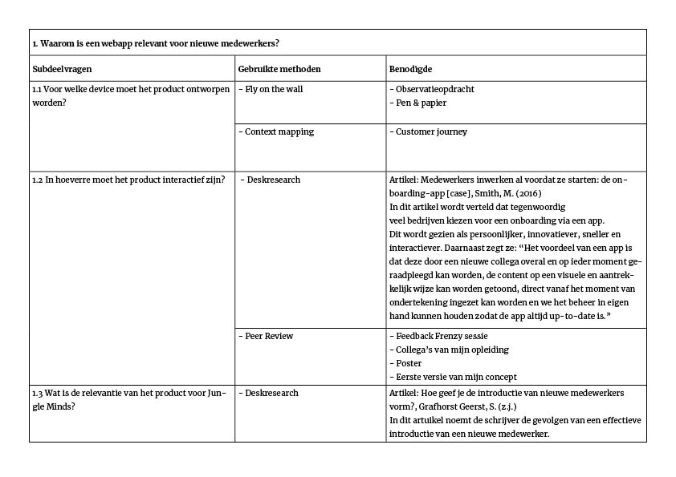
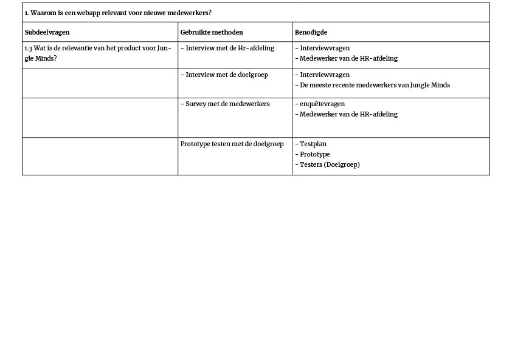
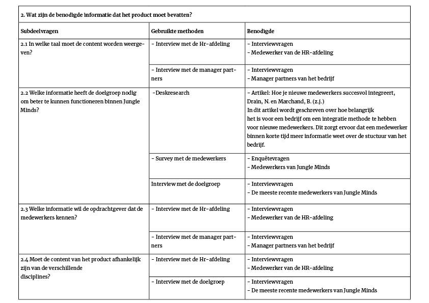

# 2.7 Onderzoeksvragen

## Hoofdvraag

> “Hoe kan een webapp ervoor zorgen dat nieuwe medewerkers van Jungle Minds de benodigde informatie over procedures en regels binnen het bedrijf verkrijgen, zodat er efficiënter met de inwerktijd wordt omgegaan?”

## Deelvragen {#onderzoeksvragen}

Aan het begin van mijn traject ben ik mijn onderzoek begonnen met de volgende drie deelvragen om uiteindelijk mijn hoofdvraag te kunnen beantwoorden:

* Waarom is een interactieve gids relevant voor nieuwe medewerkers?
* Welke content moet het product bevatten?
* Welke methoden gebruiken bedrijven met kantoorwerkzaamheden om nieuwe werknemers in te werken?

Deze deelvragen heb ik geformuleerd tijdens de Design Brief workshop die gegeven werd door mijn opleiding CMD Amsterdam. Vanuit deze deelvragen heb ik ze weer kleiner gemaakt en subdeelvragen geformuleerd. Aan de hand daarvan heb ik een toepasselijke onderzoeksmethode aangekoppeld en de benodigde ervoor opgeschreven. Zie hieronder in de tabel voor [Deelvraag 0.1](onderzoeksvragen.md#deelvraag-0-1), [Deelvraag 0.2](onderzoeksvragen.md#deelvraag-0-2) en [Deelvraag 0.3](onderzoeksvragen.md#deelvraag-0-3).

### Deelvraag 0.1 {#deelvraag-1}

### Deelvraag 0.2 {#deelvraag-2}

### Deelvraag 0.3 {#deelvraag-3}

Tijdens mijn onderzoek ben ik snel achtergekomen dat ik enkele vragen anders zal moeten formuleren om een betere resultaat te krijgen. De deelvragen waarmee ik mee verder ging werken waren de volgende:

### Deelvraag 1

### Deelvraag 2

### Deelvraag 3

