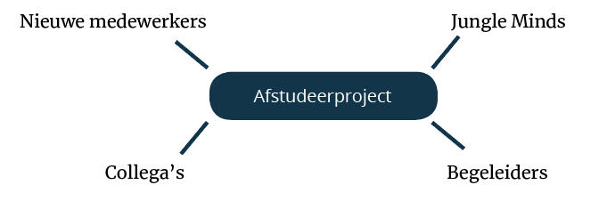

# 2.3 De context

## Het probleem

Tijdens de eerste twee maanden van mijn afstudeerstage heb ik de gelegenheid gekregen om het bedrijf beter te leren kennen. Ik liep tijdens deze periode maar twee dagen per week stage i.v.m. het versnellingstraject die ik op mijn opleiding CMD volg. 

Mijn ervaring als nieuwe stagiaire ervoer ik erg chaotisch. Op mijn eerste werkdag kreeg ik meteen een eigen project toegewezen. Ik was de enige developer in het team en zonder enige ervaring van hoe het bedrijf zelf aan de slag gaat. Hierdoor heb ik geen inwerk proces gehad en heb ik veel informatie en procedures van Jungle Minds gemist. 

Door deze ervaring ben ik gaan brainstormen en andere medewerkers gaan vragen hoe ze hun eerste weken in het bedrijf hadden ervaart. Uit dit kleine onderzoek bleek dat andere medewerkers ook niet altijd alle benodigde informatie kregen. Echter, iedereen ervoer het een beetje anders. Dat hing af van de begeleider waar elke nieuwe medewerker aan gekoppeld werd. 

## Stakeholders

Onbewust wordt er tijdens het inwerkperiode informatie achtergehouden voor nieuwe medewerkers. Dit heeft als gevolgen dat medewerkers geen goed inwerkperiode krijgen en hun weg binnen het bedrijf niet kunnen vinden. Op afbeelding 10 ziet u de stakeholders overzicht die te maken hebben met deze probleemsituatie.

### **Nieuwe medewerker** 

De doelgroep binnen dit project zijn de nieuwe medewerkers van Jungle Minds tijdens hun inwerkperiode. Deze medewerkers bestaan uit vaste medewerkers, freelancers en stagiaires die zowel fulltime als parttime werken. 

Deze doelgroep zijn de personen die het meest last hebben van de probleemsituatie. Hun behoeftes binnen deze situatie is dat ze goed op de hoogte gehouden willen worden van de procedures en belangrijke informatie binnen het bedrijf. Dit is een zekere behoefte waar ik achtergekomen ben doordat ik zelf ook deze situatie meegemaakt heb. Daarnaast kwam dit ook naar voren tijdens de gesprekken die ik met nieuwe medewerkers ging voeren. 

Wanneer nieuwe medewerkers niet de benodigde informatie krijgen tijdens hun inwerkperiode kan dat gevolgen hebben op hun werkbeleving. Vaak voelen de nieuwe medewerkers dat ze zich in de diepte worden gegooid en kunnen hun weg binnen het bedrijf moeilijk vinden. \(Brown, 2007\) 

### Jungle Minds

Binnen Jungle Minds zorgt de HR-afdeling voor alle zaken die betrekking hebben tot de medewerkers. Zij zijn degene die nieuwe medewerkers aannemen en verantwoordelijk zijn voor het koppelen van begeleiders en nieuwe medewerkers voor tijdens hun inwerkperiode. Samen met de managing partners van Jungle Minds vormen ze de opdrachtgevers binnen mijn project

Wanneer de probleemsituatie zich afspeelt kan het bedrijf veel verlies aan lijden. Doordat de medewerker twee keer zo lang de tijd nodig heeft om zijn plek te vinden en de procedures correct te volgen. 

Daarnaast is het beleid van het bedrijf om de medewerkers zich prettig te laten voelen binnen hun werkomgeving. Door een gesprek met de HR-afdeling kwam ik erachter dat ze al van plan waren om een instructie documentje samen te stellen voor de nieuwe medewerkers. Hierdoor weet ik dat het bedrijf de behoefte heeft om informatie te delen met de nieuwe medewerkers. 

### Begeleider

De HR-afdeling heeft het over het algemeen erg druk met allerlei zaken. Hierdoor geven ze de inwerking taak tijdens de inwerkperiode door aan een ervarende medewerker van het bedrijf. Elke begeleider geeft op zijn eigen manier de informatie door aan nieuwe medewerkers. Doordat bepaalde informatie erg vanzelfsprekend is voor iemand of omdat ze het simpelweg vergeten te vermelden, wordt er onbewust veel informatie achtergehouden. 

Door een oplossing te bedenken voor deze probleemsituatie zullen de begeleiders het minder druk krijgen met wat ze allemaal moeten vertellen. En zou de begeleider zich meer kunnen focussen op de informatie van zijn eigen vakgebied en zal elke nieuwe medewerker dezelfde informatie krijgen met betrekking tot het bedrijf.. Dit is een aanname, gedurende dit project zal ik er onderzoek naar doen. 

### Collega's

De collega’s zijn de overige medewerkers van het bedrijf, de mensen waarmee je in een team zit en/of mensen die aan je bureau eiland zitten. Zij hebben indirect te maken met deze probleemsituatie. 

Tijdens de probleemsituatie kunnen de nieuwe medewerkers altijd hulpvragen aan hun collega’s. De collega’s staan altijd bereid om iedereen te helpen. Echter, hebben die vaak het ook druk en kunnen ze niet altijd hulp verlenen. Dit is een aanname, ik zal tijdens dit project onderzoeken naar de behoeftes van de collega’s doen. Daarnaast vind een nieuwe medewerker het moeilijk om op andere collega’s af te stappen en vragen te stellen. Vaak weten ze ook niet bij wie ze terecht kunnen voor bepaalde vragen. 

## Omgevingsfactoren

### **Trends** 

Jungle Minds ontwikkeld zich continu samen met de technologie. Zo proberen ze altijd op de hoogte te zijn van de nieuwe trends binnen ons vakgebied. Een belangrijke trend dat het bedrijf altijd toepast is responsive design. Daarnaast kunnen trends als gamification, sociaal media en branding een invloed hebben bij het maken van mijn project. 

Daarnaast speelt ‘Werkgeluk’ een grote rol binnen de maatschappelijke trends. Zo is het al jaren bekend dat tevreden en betrokken medewerkers productiever en gezonder zijn. Ook zorgen ze voor betere prestaties van een organisatie. Werkgeluk begint het met het bewustzijn en de ambitie om als organisatie te investeren in het geluk van medewerkers. \(Driessen, 2018\) 

### **Kansen** 

Het product die ik aan het maken ben is gericht op Jungle Minds. Als het product succesvol wordt kan het ook worden ingezet voor andere bedrijven. 

### **Bedreigingen** 

De grootste bedreiging die zich voor Jungle Minds kan afspelen binnen mijn project is het lekken van gevoelige informatie. Het is voor mij belangrijk om precies te weten welke informatie ik probleemloos in het product kan verwerken zonder dat ik informatie voor concurrenten weggeef van het bedrijf zelf of van de bedrijven waarmee ze werken. 

