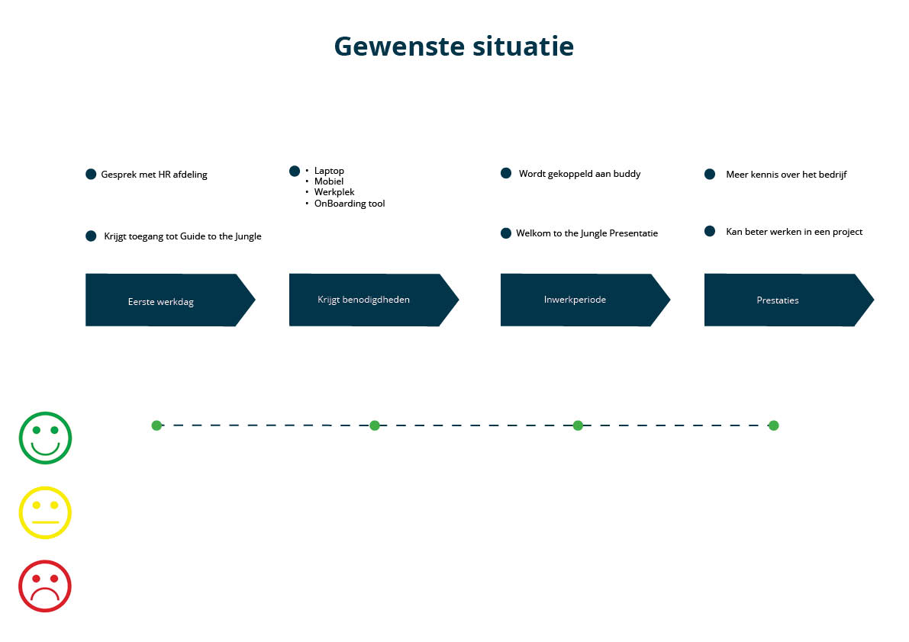

# 2.4 Customer journey

## Huidige situatie

Uit de [interviews](../onderzoek-methodes/interviews/), het antwoord op mijn [enquête](../onderzoek-methodes/surveys/working-at-jungle-minds.md) en de ['fly on the wall'](../onderzoek-methodes/6.3-fly-on-the-wall.md) onderzoek heb ik een customer journey gemaakt die de huidige situatie schetst. De customer journey heb ik gecombineerd met een emotional journey om het visueel aan te kunnen tonen in welke deel de probleemsituatie zich afspeelt. Zie hieronder de customer journey van de huidige situatie.

## Gewenste situatie

Uit de [interviews](../onderzoek-methodes/interviews/) en het antwoord op mijn [enquete](../onderzoek-methodes/surveys/working-at-jungle-minds.md) heb ik een customer journey gemaakt die de gewenste situatie weergeeft met het product die antwoord geeft op de [hoofdvraag](../1.-introductie/1.4-onderzoeksvragen.md#hoofdvraag). De customer journey heb ik gecombineerd met een emotional journey om het visueel te kunnen tonen hoe de situatie verholpen zal worden. Zie hieronder de customer journey van de huidige situatie.

