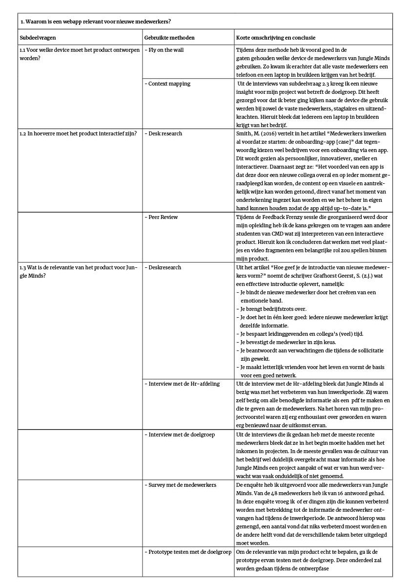
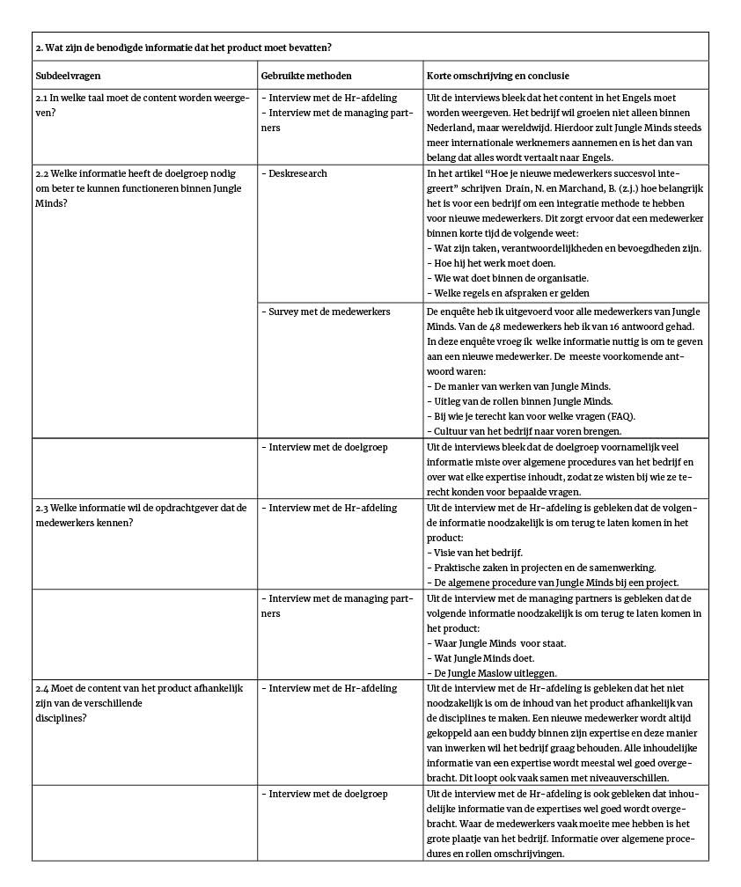

# 2.7 Conclusie

### Deelvraag 1

Om deelvraag 1 te beantwoorden heb ik voornamelijk deskresearch en interviews uitgevoerd. Zie afbeelding 15 voor een korte samenvatting van mijn verkregen inzichten tijdens het beantwoorden van de subdeelvragen uit deelvraag 1.

Uit mijn deskresearch onderzoek kwam ik op twee inzichten, namelijk wat een effectieve introductie oplevert en de voordelen van een onboarding tool app.  Zo wordt er in het artikel “Hoe geef je de introductie van nieuwe medewerkers vorm?” door de schrijver Grafhorst Geerst, S. \(z.j.\) uitgelegd wat een effectieve introductie oplevert voor zowel de medewerkers als voor het bedrijf,  namelijk: 

* Je bindt de nieuwe medewerker door het creëren van een emotionele band.
* Je brengt bedrijfstrots over.
* Iedere nieuwe medewerker krijgt dezelfde informatie.
* Je bespaart leidinggevenden en collega’s \(veel\) tijd. 
* Je bevestigt de medewerker in zijn keus. 
* Je beantwoordt aan verwachtingen die tijdens de sollicitatie  zijn gewekt. 

Daarnaast wordt er door Smith, M. \(2016\) in het artikel “Medewerkers inwerken al voordat ze starten: de onboarding-app \[case\]” het volgende verteld: “Het voordeel van een app is dat deze door een nieuwe collega overal en op ieder moment geraadpleegd kan worden, de content op een visuele en aantrekkelijk wijze kan worden getoond, direct vanaf het moment van ondertekening ingezet kan worden en we het beheer in eigen hand kunnen houden zodat de app altijd up-to-date is.”

### Deelvraag 2

Om deze deelvraag te beantwoorden heb ik deskresearch, interviews en enquêtes uitgevoerd. Zie afbeelding 16 voor een korte samenvatting van mijn verkregen inzichten tijdens het beantwoorden van de subdeelvragen uit deelvraag 2.

Uit mijn onderzoek kwam ik erachter dat er binnen de doelgroep een vraag is naar vier onderwerpen over Jungle Minds, namelijk:

* De manier van werken.
* Uitleg van de verschillende rollen.
* Bij wie je terecht kan voor welke vragen.
* De cultuur van het bedrijf naar voren brengen.

De bovengenoemde onderwerpen worden gebruikt als basis content voor het product. Daarnaast moet de content in het Engels worden weergeven, omdat er ook Engelstalige medewerkers aanwezig zijn binnen het bedrijf. 

