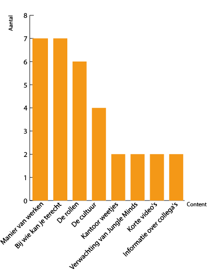

# 2.5 Content richtlijnen

Aan de hand van de interviews met de doelgroep \([claire](../onderzoek-methodes/interviews/6.1.4-team-designer-claire.md), [Noor](../onderzoek-methodes/interviews/6.1.5-visual-designer-noor.md) en [Luisa](../onderzoek-methodes/interviews/6.1.6-frontend-developer-luisa.md)\) en de antwoorden op mijn [enquete](../onderzoek-methodes/surveys/survey-working-at-jungle-minds.md) heb ik gekeken naar waar de meeste vraag naar content was. Zie afbeelding 1 voor de weergave van de meeste voorkomende content.

Naast de interviews en enquetes met de doelgroep heb ik ook en deskresearch onderzoek gedaan om te kunnen zien wat voor soort informatie er bewezen is om nuttig te zijn voor een nieuwe medewerker. Uit deze onderzoek heb ik de volgende geconstateerd:

* 

Aan de hand van de voorafgaande onderzoek heb ik besloten dat de volgende vier onderwerpen in de webapp moeten komen. 

* Manier van Werken van Jungle Minds
* De Rollen binnen Jungle Minds
* Bij wie kan je terecht voor welke vragen \(FAQ\)
* Cultuur van het bedrijf naar voren brengen

### 

### Literature Study

#### Nederlandse uitspraken naar Engels

* [https://www.fashionscene.nl/fashion/172743/gieren-nederlandse-spreekwoorden-vertaald-in-engels](https://www.fashionscene.nl/fashion/172743/gieren-nederlandse-spreekwoorden-vertaald-in-engels)
* [https://froot.nl/posttype/froot/dit-gebeurt-er-als-je-nederlandse-uitspraken-letterlijk-vertaalt-naar-het-engels/](https://froot.nl/posttype/froot/dit-gebeurt-er-als-je-nederlandse-uitspraken-letterlijk-vertaalt-naar-het-engels/)

### Storytelling

