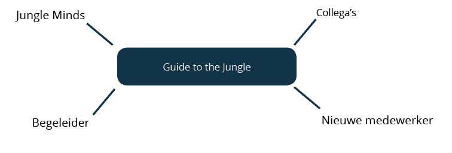

# 2.3 Het probleem

Onbewust wordt er tijdens het inwerkperiode informatie achtergehouden voor nieuwe medewerkers. Dit heeft als gevolgen dat medewerkers geen goed inwerkperiode krijgen en hun weg binnen het bedrijf niet kunnen vinden. Op afbeelding 10 ziet u de stakeholders overzicht die te maken hebben met dit probleem situatie.

