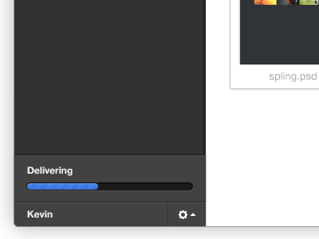

# 3.3 Inspiratie patterns

## Deskresearch

Voordat ik begon met het schetsen van [verschillende concepten](3.4-concept-schetsen.md), ben ik op zoek gegaan naar welke UI/UX patterns een onboarding tool bevat. Omdat ik tijdens deze fase nog niet wist welke richting ik op wilde gaan met de onboarding tool, wilde ik graag ideeën verzamelen voor tijdens mijn concept brainstorm.

Uit het artikel "We Categorized More Than 500 User Onboarding Experiences Into 8 UI / UX Patterns For You to Use" Beschrijft de schrijver Magnin, T. \(2016\) acht UI/UX patterns die effectief zijn bij een onboarding tool die gebruikt wordt bij nieuwe softwares en websites. Hieronder heb ik een selectie gemaakt van elementen die nuttig kunnen zijn tijdens het schetsen van verschillende concepten.

* **Welkomstberichten** ze definiëren een welkomstbericht als een begroeting die maar één keer wordt weergegeven voor nieuwe gebruikers en meestal tekst bevat zoals hallo of welkom: het bericht hoeft niet helemaal gewijd te zijn aan het zeggen van hallo, het omvat meestal een mogelijkheid tot actie. Zie afbeelding 25 voor een visuele weergave van een welkomstbericht. Met welkomstberichten kunnen gebruikers zich beter verwelkomd voelen bij een applicatie en kunnen ze de verwachtingen en de toon zetten voor hun eerste ervaring.

* **Productrondleidingen** Productreizen oriënteren nieuwe gebruikers en helpen hen de snelste manier te vinden om hun eerste moment van waarde te bereiken. Rondleidingen leiden een gebruiker vaak door een belangrijke workflow zoals in afbeelding 26 wordt getoond het wijst op een paar belangrijke stappen die anders misschien worden gemist.

* **Voortgangsbalken** Mensen zijn bevooroordeeld in de richting van het voltooien van taken die ze krijgen. Zie afbeelding 27 voor een voorbeeld van een progressie balk. Producten spelen vaak op deze vooringenomenheid door voortgangsbalken in hun gebruikersinterface op te nemen om nieuwe gebruikers te motiveren om aan boord te gaan. Een voortgangsbalk herinnert ons eraan dat we een taak hebben gekregen en we hebben het gevoel dat we die taak moeten voltooien.

*  **Checklists** Controlelijsten, zoals voortgangsbalkjes, kunnen gebruikers helpen te weten wat er van hen verwacht wordt om aan boord te komen. Het belangrijkste verschil is echter dat checklists vaker worden gebruikt voor items die langdurig aan boord zijn. Zie afbeelding 28 voor een voorbeeld waar een checklist gebruikt wordt.

* **Hotspots** Hotspots zijn een relatief nieuw UI-patroon dat overal in de SaaS-wereld is ontstaan. Zie afbeelding 29 voor een voorbeeld hoe een hotspot gebruikt wordt. Hotspots zijn een goed alternatief voor tooltips omdat ze minder ingrijpend zijn voor gebruikers. Ze worden niet automatisch geopend en kunnen gemakkelijk worden genegeerd. 

* **Action-driven tooltips** Voor meer technische workflows of accountactivatie op meerdere pagina's kunnen actiegedreven tooltips een spelwisselaar zijn in termen van uw activerings- en retentiegraden. In afbeelding 30 ziet u hoe Slack gebruik maakt van tooltips om zijn UI uit te leggen. 

In tegenstelling tot de bovengenoemde artikel wordt in het artikel "Bulletproof User Onboarding" geschreven door Hulick, S. \(2017\) wordt op een rij gezet welke aspecten belangrijk zijn voor een goede onboarding tool. Hierin worden tegenstrijdige meningen geuit, waardoor ik als ontwerper zelf zal koeten nagaan wat voor mijn gebruiker het beste oplossing zal zijn. Hulick beschrijft in zijn artikel de heilige drie-eenheid van Onboarding "Bulletproof-heid", namelijk:

1. **Het moet Geïntegreerd zijn in tegenstelling tot afleiding.** __Hij vertelt dat technieken zoals tooltip-rondleidingen, introductievideo's en zelfs die kleine pulserende hotspots vaak de aandacht van de gebruiker wegtrekken van de essentie van het product.  
2. **Het moet zinvol zijn in tegenstelling tot controlerend\(begeleid\) zijn.**  Leid de gebruikers naar waar de gebruiker de tool voor gebruikt, in plaats van ze mee te nemen op een rondleiding door de UI. 
3. **Standvastig in tegenstelling tot vlokkig.** Investeer op de lange termijn, en je zult merken dat je inspanningen meer dan beloond worden.

Hulick gaf aan dat een goede element die effectief is in een onboarding tool is het gebruik maken van een [progressie balk](3.3-inspiratie-patterns.md#progressie-balk). Dit laat duidelijk zien aan de gebruiker hoeveel er van hem wordt verwacht, hij krijgt feedback bij het afronden van onderdelen binnen de tool en de gebruiker kan een schatting maken van de termijn dat de tool zal duren. 

## Patterns voor v.0.1 &gt;

De websites die ik gebruikte om de design patterns te zoeken heb ik gevonden uit de artikel [https://uxdesign.cc/ui-inspiration-b019453058d7](https://uxdesign.cc/ui-inspiration-b019453058d7)

### Content weergave

Om de content te kunnen weergeven ben ik op zoek naar patterns die verschillende onderwerpen op een pagina weergeven. Het moet duidelijk in een oog opslag zijn dat het gaat om verschillende onderwerpen. Daarnaast moet het niet chaotisch ogen.

Voorbeelden van content weergave:

### Menu

Voor een goede navigatie heb ik een menu nodig. Deze menu moet een samenhang hebben met de content overzicht pagina. 

Voorbeelden van content weergave:

  
\(https://daks2k3a4ib2z.cloudfront.net/59d85b98aaa78100013e8eec/5a5335c135a80000013532f5\_customer-io-dash.jpeg\)

### Timeline

In het artikel "20 Gorgeous Examples Of Timeline In Web Design For Inspiration geschreven door Young, N. \(z.j.\) worden er 20 voorbeelden gegeven van verschillende tijdlijns. Uit deze lijstje heb ik drie geselecteerd die ik het meeste toepasselijk vond voor een onboarding tool.   

#### realestate.com

Bij de website realestate.com.au wordt er gebruik gemaakt van een verticale tijdlijn, zie afbeelding 36. Deze tijdlijn gebruikt plaatjes aan de rechterkant om de content weer te geven een aan het einde wordt er op een speelse manier een icon geïntroduceerd die weergeeft de tijd om de relaxen.

  
[http://littlebigdetails.com/post/138021904934/realestatecomau-at-the-end-of-the-days](http://littlebigdetails.com/post/138021904934/realestatecomau-at-the-end-of-the-days)

#### A visual history of computers

De tijdlijn van deze website wordt gebruikt over het hele viewport, zie afbeelding 37. Je scrolt met de muis en je krijgt een volledig nieuwe section in beeld. Het is een verticale tijdlijn die door middel van rondjes aan de zijkant feedback geeft aan de gebruiker van uit hoeveel sections de tijdlijn bestaan. Je zal deze voorbeeld kunnen vergelijken met een slideshow die je zelf in handen hebt.  
[http://www.akita.co.uk/computing-history/](http://www.akita.co.uk/computing-history/)

#### lance-stroll

In deze pagina wordt een statische horizontale tijdlijn weergeven, zie afbeelding 38. Deze tijdlijn is statisch maar maakt gebruik van animaties om de nadruk te leggen op de verschillende jaartalen van de tijdlijn.  
[http://lancestroll.com/](http://lancestroll.com/)

### Testemonials

#### Online Faxes

Bij de website Online Faxes wordt er gebruik gemaakt van twee testemonials naast elkaar, zie afbeelding 39.   
[https://goodui.org/fastforward/patterns/19/](https://goodui.org/fastforward/patterns/19/)

  
Andere voorbeelden van testemonials die gebruiken maken van het hele breedte van de pagina zie afbeelding 40 en afbeelding 41.

## Patterns voor v.0.5 &gt;

Na de feedback te hebben ontvangen van [prototype versie 0.5](../4.-ontwerpfase/4.5-prototype-v.0.5.md) is mijn concept wat betreft de UX van de onboarding tool wat verandert. De voorafgaande versies waren voornamelijk gericht op het weergeven van de informatie en vanaf de versie 0.6 wordt de focus voornamelijk geleegd bij de interactie van de content met de gebruiker. Van de inzichten die ik verkreeg van de [expert review van prototype v.0.5](../6.5-prototype-tests/6.5.4-expert-review-v0.5.md) heb ik een lijstje gemaakt van mogelijke patterns om naar onderzoek te doen voor het bouwen van de volgende prototypes.

### **Unlock features**

Vanaf nu wordt de beschikbaar content weergegeven in een vorm van modules die beschikbaar gesteld worden aan de hand van welke inwerkweek de medewerker zich bevindt. Hierdoor zocht ik naar patterns die op een visuele manier weergeven dat bepaalde content niet beschikbaar is. Zie afbeeldingen 41 en afbeelding 42 voor de mogelijke patterns.  
****

### **Vragen \(opdrachten\)**

Vanaf deze prototype worden er opdrachten gesteld aan de gebruiker om gedurende de module uit te voeren. Hiervoor wilde ik een design kiezen dat bij het tegenkomen van een vraag het meteen zichtbaar wordt gemaakt dat het om een opdracht gaat. Hiervoor heb ik naar de volgende design patterns gevonden ter inspiratie, zie afbeelding 43 tot en afbeelding 44.

## Patterns voor v.0.8 &gt; ****

### **Quiz**

Naast de opdrachten die gedurende de modules voorbij komen is uit de testresultaten van prototype versie 0.7 gebleken dat gebruikers fijn zouden vinden om een quiz te krijgen na elke module. Door de quiz kunnen ze nagaan of ze de geleerde informatie hebben onthouden en/of begrepen. In afbeelding 45 tot en met afbeelding 47 worden er voorbeelden weergeven van design patterns voor een quiz. 

### **Progressie balk**

In de artikel "Onboarding techniques to impress your users" op de website Medium\(2017\) wordt uitgelegd hoe voortgangsbalken werken bij gebruikers. Het zijn visuele indicatoren die de gebruiker gemotiveerd houdt om het onboarding-proces te voltooien. Het belooft een beloning of geeft de gebruiker aan hoe dichtbij hij is om het onboarding-proces te voltooien.

Tips bij het designen van een voortgangsbalk : 

* Toon prominente sprongen. 20% tot 22% is niet bemoedigend genoeg, maar 20% tot 40% is zeer motiverend!
* Heb een ideaal tijdsbestek voor voltooiing

Zie afbeelding 48 tot en met afbeelding 51 voor voorbeelden van voortgangsbalken:

