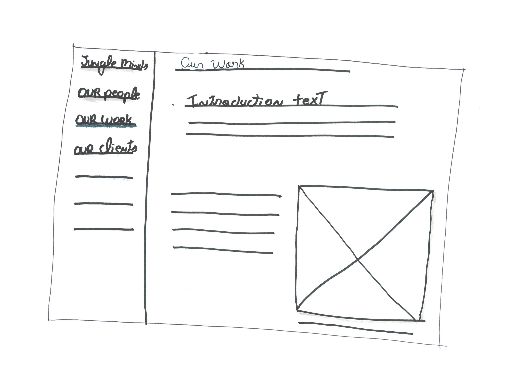

# 3.4 Concept schetsen

## Zero state

De zero state scherm wordt bedoeld als introductiescherm voor de onboarding tool. Voor de introductiescherm heb ik enkele variaties ervan geschetst. Zie de onderste variaties voor de verschillende concept uitwerkingen. Voor de onderste variaties heb ik de beginscherm van de keynote presentaties van Jungle Minds, zie afbeelding ..., als inspiratiebron gebruikt.

### Variatie 1

 Deze variatie bevat de titel van de onboarding tool: "Guide to the Jungle" en een knop met als tekst "Discover our Jungle". Door op deze knop te drukken krijgt de gebruiker toegang tot de applicatie content. 

### Variatie 2

 Voor deze variatie heb ik gekozen om naast de titel van de onboarding tool: "Guide to the Jungle" en invulveld te zetten waar de gebruikers hun naam kunnen invullen voordat ze verder kunnen klikken op de knop met als tekst "Enter the Jungle". Door op deze knop te drukken krijgt de gebruiker toegang tot de applicatie content. Wanneer de gebruikers hun naam invult, kan deze informatie bewaard worden zodat er later in de app het terugkomt. Dit maakt de onboarding tool persoonlijker.

## Content weergave

### Concept 1

Voor deze concept heb ik gekozen voor een hamburger menu die wordt linksboven weergegeven. Bij het klikken ervan schuift de menu open en kan de gebruiker kiezen om een andere pagina te bekijken. Daarnaast wordt in deze pagina de content weergegeven door middel van een tijdlijn. Deze tijdlijn bevat een jaartal, de tekst en een afbeelding. De afbeelding wordt in het klein weergeven links aan de tijdlijn en in het groot rechts van de tijdlijn. De afbeelding rechts kan ook bestaan uit meerdere afbeeldingen en dan werkt het als een slideshow. Door het scrollen binnen deze pagina wordt er de volgende jaartalen in beeld gebracht. De pagina "Working since 2000" is de hoofdpagina van de applicatie. 

### Concept 2

Concept 2 bestaat uit een "sticky footer" menu. Dit betekent dat de menu altijd in beeld is en wordt weergegeven aan de onderkant van de pagina. Deze menu bevat 7 onderwerpen die gekozen zijn aan de hand van de content richtlijnen beschreven in[ 2.5 Content richtlijnen](../2.-verkenningsfase/2.5-content-richtlijnen.md). De menu bevat iconen en de titel van de pagina. Daarnaast begint ook deze concept met de ontwikkeling van het bedrijf als hoofdscherm. 

### Concept 3

Concept 3 bestaat uit een hoofdscherm die een overzicht toont van 8 onderwerpen. Deze onderwerpen worden ingevuld aan de hand van de gekozen content beschreven in[ 2.5 Content richtlijnen](../2.-verkenningsfase/2.5-content-richtlijnen.md). Bij het klikken van een van deze onderwerpen wordt je gelinkt naar de pagina van de desbetreffende onderwerp. Per onderwerp wordt er een afbeelding weergegeven en de titel van de onderwerp.

### Concept 4

Concept 4 bevat een "side" menu die altijd zichtbaar in beeld is. De content van de menu zijn de onderwerpen van de gekozen content beschreven in[ 2.5 Content richtlijnen](../2.-verkenningsfase/2.5-content-richtlijnen.md). Door het klikken van een van deze onderwerp wordt de gebruiker gelinkt naar de desbetreffende pagina. De pagina waar de gebruiker zich bevindt wordt gehighlight, zodat de gebruiker weet op welke pagina hij zich bevindt.  
De inhoudt van de pagina's worden weergegeven door middel van de pagina titel, een introductie tekst en de hoofdcontent. De hoofdcontent bestaat uit twee kolommen. Een kolom is voor tekst en de andere voor afbeeldingen. 

### Concept 5

Concept 5 bestaat uit een tabblad menu, de content van deze menu zijn de onderwerpen van de gekozen content beschreven in[ 2.5 Content richtlijnen](../2.-verkenningsfase/2.5-content-richtlijnen.md). Verder wordt de menu altijd bovenaan weergegeven. De inhoudt van de pagina's worden weergegeven door middel van de pagina titel en de hoofdcontent. De hoofdcontent bestaat uit twee kolommen. Een kolom is voor tekst en de andere voor afbeeldingen. 

### 

