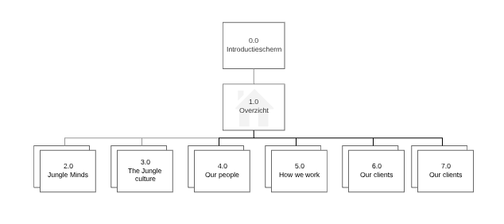
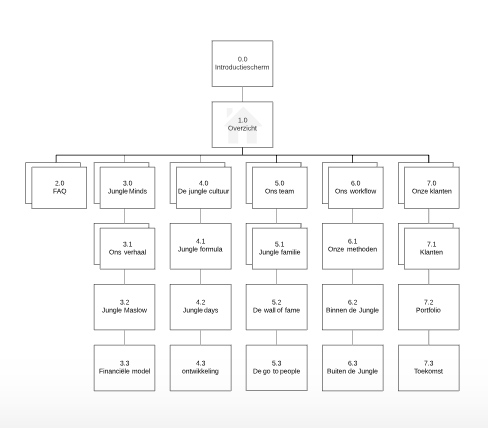

# 3.5 Het concept

Per belangrijke versie van mijn prototype heb ik hieronder de jobstory die ik als uitgangspunt naam tijdens het ontwerpen ervan. Daarnaast leg ik uit wat de risico's van het concept kan zijn. En ik laat de sitemap zien van de prototype. 

## Versie 0.1 &gt;

* [Prototype v.0.1](../4.-ontwerpfase/prototype-v0.1.md)
* Prototype v.0.2

### Jobstory

Wanneer de Jungle Minds onboarding tool gebruik wil ik informatie verkrijgen van het bedrijf, zodat ik beter tijdens mijn werk kan presteren.

Op afbeelding 60 ziet u de belangrijkste scherm van dit prototype voor deze jobstory.

### Risk analyse

Tijdens dit prototype ligt de risico ervan om goed de content te structureren. Omdat tijdens deze fase de content nog niet vast stond wilde ik door middel van deze prototype de essentie van het concept naar voren laten komen om ideeën te verkrijgen hoe ik het beste de informatie kon structureren.  

### sitemap

Voor de sitemap van deze prototype's zie afbeelding 61.

## Versie 0.3 &gt;

### Jobstory

Wanneer de Jungle Minds onboarding tool gebruik wil ik in een oogopslag te zien krijgen welke informatie ik over het bedrijf krijg, zodat ik niet voor verassingen sta als ik bezig ben met de tool.

Op afbeelding 62 ziet u de belangrijkste scherm van dit prototype voor deze jobstory.

### Risk analyse

Tijdens dit prototype ligt de risico ervan om de tool niet te klein te maken. Bij het gebruiken van een onboarding tool moet de gebruiker door middel van een digitale omgeving de nodige kennis, vaardigheden en gedrag kan verwerven om effectief te worden binnen het bedrijf. Hierdoor moet de content informatief zijn en voldoende om als een nieuwe medewerker zijn weg binnen het bedrijf beter vinden. 

### sitemap

  
Voor de sitemap van deze prototype's zie afbeelding 63.

## Versie 0.5 &gt;

### Jobstory

Wanneer de Jungle Minds onboarding tool gebruik wil ik door middel van de tool meer het cultuur van het bedrijf terugzien, zodat ik het bedrijf beter kan leer kennen. 

Op afbeelding 64 ziet u de belangrijkste scherm van dit prototype voor deze jobstory.

### Risk analyse

Tijdens dit prototype ligt de risico ervan om passende foto's de vinden bij elke onderdeel van de onderwerpen en het schrijven van een passende, kort en krachtig beschrijving van de onderwerpen. Daarnaast moeten de interacties binnen dit concept voldoende zijn, dat de gebruiker plezier zal hebben bij het lezen van de informatie in deze tool.

### sitemap

Voor de sitemap van deze prototype's zie afbeelding 65.

## Versie 0.7 &gt;

### Jobstory

Wanneer de Jungle Minds onboarding tool gebruik wil ik de benodigde informatie over het bedrijf per week krijgen met daarin zelfstandige opdrachten verwerkt, zodat ik gestimuleerd om op zoek te gaan naar de antwoorden op mijn vragen over het bedrijf. 

Op afbeelding 66 ziet u de belangrijkste scherm van dit prototype voor deze jobstory.

### Risk analyse

Tijdens dit prototype ligt de risico ervan om de vormgeving van de zelfstandige opdrachten zodanig ontwerpen dat het duidelijk is dat het om een opdracht gaat die hij moet uitvoeren. 

### sitemap

Voor de sitemap van deze prototype's zie afbeelding 67.

## Versie 0.9

### Jobstory

Wanneer de Jungle Minds onboarding tool gebruik wil ik getest worden op de informatie die ik zo juist heb verkregen, zodat ik de informatie beter kan onthouden.

Op afbeelding 68 ziet u de belangrijkste scherm van dit prototype voor deze jobstory.

### Risk analyse

Tijdens dit prototype ligt de risico ervan om het functioneel uit te werken. Bij een quiz moet er nagedacht worden over hoe het functioneert en welke feedback de gebruiker terugkrijgt. 

### sitemap

Voor de sitemap van deze prototype's zie afbeelding 69.

## Versie 1.0

### Jobstory

Wanneer de Jungle Minds onboarding tool gebruik wil ik feedback van de tool krijgen dat ik het heb afgerond, zodat ik bewust ben dat ik alle nodige informatie heb ontvangen.

Op afbeelding 70 ziet u de belangrijkste scherm van dit prototype voor deze jobstory.

### Risk analyse

Tijdens dit prototype ligt de risico ervan om aan de gebruiker duidelijk te maken dat de informatie die hij verkreeg via de tool slechts een deel is van de informatie over het bedrijf en dat hij met de tijd en door middel van vragen te stellen aan collega's meer informatie over het bedrijf zal te weten komen.

### sitemap

Voor de sitemap van deze prototype's zie afbeelding 71.

