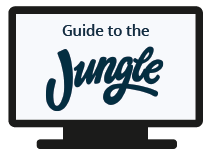

# 3.6 Conclusie

## Conclusie

### Subdeelvraag 3.1

Uit mijn voorafgaande onderzoek \([Offline](3.2-best-good-and-bad-practices.md#offline) en [Online](3.2-best-good-and-bad-practices.md#online)\)  ben ik op de volgende inzichten gekomen die antwoord geven op de subdeelvraag "[3.1 Welke methoden worden gebruikt om een medewerker efficiënter in te werken?](../1.-introductie/1.4-onderzoeksvragen.md#deelvraag-3)":

* Bedrijven die voor een offline inwerk methode kiezen meestaal voor de volgende methoden:
  * Werknemershandboek en papierwerk bekijken.
  * Ken een mentor toe.
  * Faciliteit rondleiding.
  * Stel een evaluatieperiode in
* Bedrijven die voor een online tool verkiezen bevatten de volgende:
  * De bedrijf's kernwaarden en historie
  * De bedrijfs cultuur
  * Video’s 
  * Checklists 
  * Quizzen / Interactieve opdrachten

### Subdeelvraag 3.2

Uit mijn voorafgaande onderzoek \([Bureaus](3.2-best-good-and-bad-practices.md#bureaus)\) ben ik op de volgende inzichten gekomen die antwoord geven op de subdeelvraag "[3.2 Welke methoden gebruiken bedrijven met kantoorwerkzaamheden om nieuwe werknemers in te werken?](../1.-introductie/1.4-onderzoeksvragen.md#deelvraag-3)":

* Grotere bedrijven die maandelijks nieuwe werknemers aannemen gebruiken vaak een tool tijdens de inwerkperiode. 
* De inwerk tool bevat vaak informatie als:
  * De werkwijze van het bedrijf.
  * Systemen waarmee een bedrijf werkt.
  * De bedrijf's kernwaarden en historie.
* Kleine en middelgrote bedrijven gebruiken vaak een online pdf om het bedrijfs historie en cultuur te vertellen.

### Subdeelvraag 3.3

Uit mijn voorafgaande onderzoek \([Inspiratie voorbeelden](3.2-best-good-and-bad-practices.md#inspiratie-voorbeelden)\) ben ik op de volgende inzichten gekomen die antwoord geven op de subdeelvraag "[3.3 Hoe efficiënt zijn deze methodes?](../1.-introductie/1.4-onderzoeksvragen.md#deelvraag-3)". Om een efficiënte applicatie van te maken moet het de volgende bevatten:

* Het moet persoonlijk worden gemaakt.
* De flow van de website is belangrijk. Het moet aangegeven worden wat de gebruiker binnen de website kan doen en tegelijkertijd wordt er veel geïnformeerd over het bedrijf.
* De weergave van de content moet duidelijk en overzichtelijk worden voor de gebruikers.

## Concept

### Relevantie

Aan het begin van mijn project tijdens de verkenningsfase heb ik aan de hand van het beantwoorden van [deelvraag “1. Waarom is een webapp relevant voor nieuwe medewerkers?”](../1.-introductie/1.4-onderzoeksvragen.md#deelvraag-1-1) kunnen bepalen welke concept richting het project moest hebben. Uit mijn voorafgaande onderzoeken kwam ik op de volgende inzichten: 

* Wat een effectieve introductie oplevert voor zowel de medewerkers als voor het bedrijf. \(Grafhorst Geerst, S. z.j.\) 
* De voordelen van een onboarding tool app. \(Smith, M. 2016\) 
* Het bedrijf hield zich bezig met het verbeteren van hun inwerkperiode 
* Aanpak informatie en verwachtingen van Jungle Minds zijn vaak onbekend bij nieuwe medewerkers. Uit de verkregen inzichten heb ik kunnen concluderen dat het product een onboarding tool, voor tijdens het inwerkperiode, moest worden. Met een onboarding tool wordt bedoeld dat de gebruiker de nodige kennis, vaardigheden en gedrag moet verwerven uit een tool om effectief te worden. Zo beschrijft Weidema, N. \(2017\) “een goede onboarding tool laat de werknemer alvast kennismaken met de organisatie. Hij of zij leert meer over het bedrijf, soms in de vorm van een virtuele rondleiding, kan contact leggen met zijn nieuwe collega’s, en ziet welke professionele eisen aan hem worden gesteld.”.

### Device keuze

Uit een [fly on the wall](../onderzoek-methodes/6.3-fly-on-the-wall.md) onderzoek kwam ik achter dat elke medewerker een laptop ter beschikking krijgt, waardoor ik besloten heb om de applicatie op desktop formaat te ontwerpen, zie afbeelding 72 De applicatie zal dan door alle doelgroep gebruikt kunnen worden. 

### Content

Uit [interviews](../onderzoek-methodes/6.1-interviews/#samenvatting) met de managing partners, de HR-afdeling en de doelgroep kwam ik op de volgende inzichten: 

* Voertaal van de tool moet engels worden. 
* App moet de cultuur van Jungle Minds uitstralen. 
* De content van de applicatie moet relevant zijn voor alle medewerkers ongeacht hun expertise. 

Aan de hand van de[ voorafgaande onderzoek](../2.-verkenningsfase/2.5-content-richtlijnen.md) zal de onboarding tool de volgende content bevatten:

* Manier van werken van Jungle Minds. 
* De Rollen binnen Jungle Minds. 
* De cultuur van het bedrijf. 
* Bij wie kan terecht je voor bepaalde vragen \(FAQ\) 

