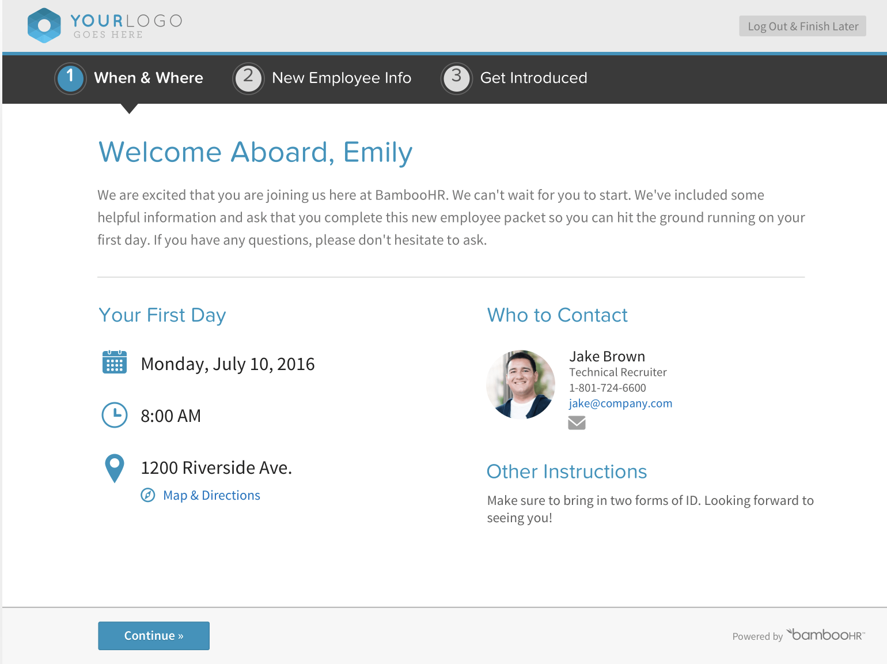
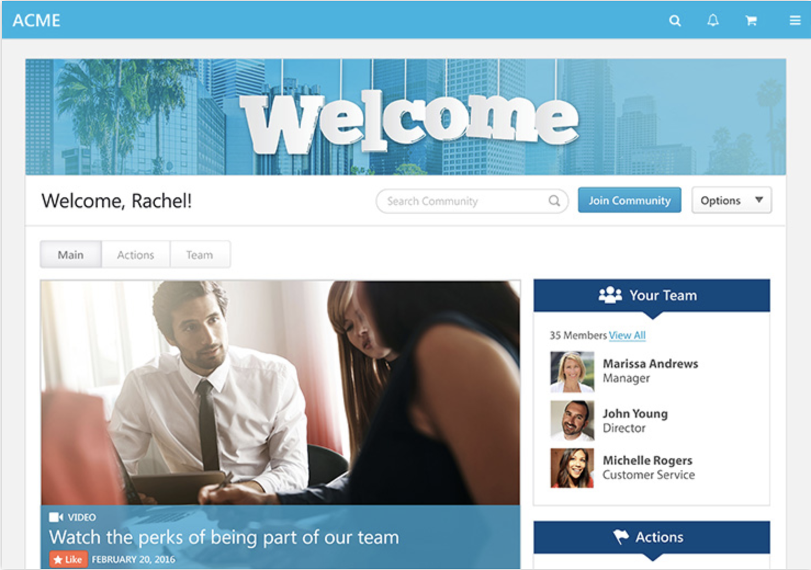
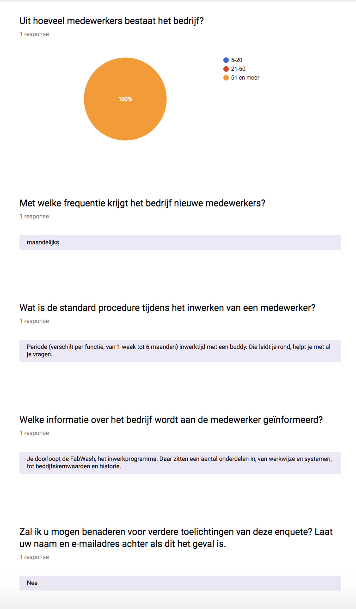

# 3.2 Best, good & bad practices

In deze fase van mijn project ben ik van bewust dat het eindproduct een onboarding tool moet worden. Echter, is het aan mij over om dit te vertalen naar een onboarding tool met een toegevoegde waarde voor Jungle Minds. 

Om mijn subdeelvraag "[3.1 Welke methoden worden gebruikt om een medewerker efficiënter in te werken?](../1.-introductie/onderzoeksvragen.md#deelvraag-3)" te kunnen beantwoorden heb ik onderzoek gedaan naar de verschillende methodes die gebruikt worden binnen verschillende bedrijven. Voor deze fase heb ik onderzoek gedaan naar zowel offline als online methodes. Dit geeft mij een brede zicht voor de inhoudt die het eindproduct zal/moet kunnen bevatten. 

## Offline

In de artikel "Example of an Orientation Program for New Employees" vertelt Brookins, M. \(2017\) dat oriëntatieprogramma's kunnen variëren afhankelijk van de industrie, de managementstijl en de algehele bedrijfscultuur. Hieronder volgen er een aantal voorbeelden die vaak gebruikt worden door kleine en middelgrote bedrijven. Daarnaast beantwoord ik de subdeelvraag "[3.3 Hoe efficiënt zijn deze methodes?](../1.-introductie/onderzoeksvragen.md#deelvraag-3)". 

### Voorbeelden

In de artikel "Example of an Orientation Program for New Employees" benoemt Brookins, M. \(2017\) enkele voorbeelden van de meeste voorkomende inwerkmethodes:

* Werknemershandboek en papierwerk bekijken

  Een werknemershandboek bevat de regels en voorschriften van een bedrijf. Het omvat ook informatie over bedrijfsvoordelen, betaaldata, betaald verlof, lunch- en andere pauzes, nationale en federale arbeidswetten en -handelingen en meer. In plaats van elke pagina te lezen, markeer de belangrijkste secties en laat de medewerker het tijdens zijn eerste week lezen.  

* Training en schaduw bieden

  Hoewel een medewerker mogelijk ervaring heeft in uw branche, moet hij nog steeds worden opgeleid om te leren hoe uw bedrijf specifiek binnen de branche opereert. Training kan variëren van het bijwonen van seminars, het aanpakken van computerprogramma's of het schaduwen van een medewerker die dezelfde of een vergelijkbare functie vervult als de nieuwe medewerker.  

* Faciliteit rondleiding

  Nieuwe medewerkers moeten onmiddellijk kennismaken met hun nieuwe werkplek. Neem ze mee op een rondleiding door het kantoor en wees op essentiële locaties zoals personeel, het kantoor van hun manager, badkamers, pauzeruimtes, het printgedeelte, technologische ondersteuning en het bedrijfsrestaurant.  

* Ken een mentor toe

  Nieuw aankomen bij een bedrijf is niet altijd een geruststellende situatie voor werknemers en vaak zoeken ze een informele mentor om hen de eerste paar weken bij het bedrijf te begeleiden. Zet de eerste stap en wijs nieuwe medewerkers een mentor toe waar ze terecht kunnen met vragen of aanmoediging.

* Introduceer aan collega's

  Tijdens een rondleiding door de faciliteit, kunt u nieuwe medewerkers introduceren bij collega's. Plan een formele vergadering met de leden van het directe team of de afdeling waar de medewerker zal werken voor meer diepgaande inleidingen.  

* Review doelen en taakverwachtingen

  Een nieuwe werknemer kan een optimaal niveau van productiviteit en efficiëntie bij een bedrijf niet bereiken als ze zijn doelen niet presenteert en past in de algemene behoeften van het bedrijf of haar werkverwachtingen. Deze informatie moet tijdens de nieuwe werknemersoriëntatie worden besproken, zodat een medewerker opheldering kan krijgen over punten waar hij niet zeker van is.  

* Plan een lunch

  Lunchen met een selecte groep collega's biedt nieuwe medewerkers een meer ontspannen manier om collega's te ontmoeten en meer over hen en het bedrijf te leren. Medewerkers kunnen gemeenschappelijke interesses delen, de bedrijfscultuur bespreken en vragen beantwoorden die de nieuwe medewerker heeft, en dat allemaal tijdens een maaltijd binnen/buiten het kantoor.  

* Stel een evaluatieperiode in

  Evaluaties bieden werknemers ook de mogelijkheid om hun werkgever feedback te geven over hun ervaringen met het bedrijf. Geef tijdens de oriëntatie medewerkers informatie over het evaluatieproces van uw bedrijf, zodat zij weten hoe hun prestaties worden beoordeeld. In plaats van een jaar te wachten om uw eerste feedback te geven, stelt u een beoordelingsperiode van 30, 60 of 90 dagen in voor nieuwe werknemers. Dit geeft je een kans om te zien hoe ze zich binnen het bedrijf vestigen in hun rollen en verantwoordelijkheden voor een jaarlijkse beoordeling.

### Jungle Minds procedure

Van de genoemde aantal voorbeelden worden er een aantal gedaan door Jungle Minds. In [een interview met de HR-afdeling](../onderzoek-methodes/interviews/6.1.3-hr-manager-alexandra.md) heb ik gevraagd wat het normale inwerkproces is binnen het bedrijf en die zit er als volgt uit:

* Medewerker krijgt de Arbeidsvoorwaarden en de Jungle Minds handboek toegestuurd
* Bij het tekenen van het contract krijgt de medewerker de personeelsgids met daarin praktische dingen als declaratie, pensioen, enz.
* Tijdens zijn eerste werkdag krijgt hij een rondleiding door het pand.
* Krijgt uitleg over sleutels en codes.
* Heeft een sessie met de HR waar er praktische zaken besproken worden.
* Krijgt de welkom to the Jungle presentatie, waarbij achtergrond informatie wordt verteld over het bedrijf. 
* Medewerker wordt gekoppeld aan een mentor.

## Online

Vaak wordt door grote bedrijven gekozen om te werken met een onboarding tool tijdens het inwerkperiode van een nieuwe medewerker. Dit komt vaak voor bij bedrijven waar wel dagelijks iemand aangenomen wordt. De voordeel van een onboarding tool is dat de medewerkers altijd dezelfde informatie verkrijgen en het bedrijf bepaald zelf welke informatie zij vertellen. Zie hieronder een aantal voorbeelden van tools die gebruikt wordt door verschillende bedrijven.

### Voorbeelden

Op de markt bestaan al een aantal onboarding tools, in het artikel "Onboardingtools: de mogelijkheden en aandachtspunten" benoemt Weidema, N. \(2017\) een aantal voorbeelden: 

* [**ADP**](https://www.adp.nl/producten/adp-ihcm2/)  Richt zich met iHCM op het verbeteren van de medewerkers-ervaring vanaf de eerste werkdag tot de eerste evaluatie van hun functioneren en de periode daarna. Deze biedt nu ook onboarding- opties die werkgevers het volledige recruitmentproces van begin tot eind laten volgen. Medewerkers en managers krijgen inzicht in en toegang tot de activiteiten op het gebied van professionele ontwikkeling. 
* [**Appical**](https://appical.net/)  Maakt online inwerkprogramma’s met video’s, checklists, quizzen, interactieve opdrachten of virtual reality. Zo kunnen bedrijven een interactief inwerktraject te maken voor nieuwe medewerkers. 
* [**Bamboo HR**](https://www.bamboohr.com/employee-self-onboarding/)  Biedt tools en softwareoplossingen voor kleine en middelgrote bedrijven. Een van de producten is een tool waarmee nieuwe werknemers hun eigen onboarding ter hand kunnen nemen. Zo beginnen ze beter voorbereid aan hun eerste werkdag. Voor HR betekent de onboarding tool veel tijdbesparing omdat een groot deel van de voorbereiding is geautomatiseerd. 
* [**Cornerstone**](https://www.cornerstoneondemand.nl/onboarding)  Heeft onboarding-software die nieuwe medewerkers welkom heet met gepersonaliseerde pagina’s en een centrale bron van organisatorische informatie. De software zorgt ervoor dat nieuwe medewerkers sneller worden ingewerkt door taken, training, doelen en certificaten toe te wijzen. Ook is er een functie voor geautomatiseerd onboarding-formulierbeheer. 
* [**Kronos**](https://www.kronosglobal.nl/hulpmiddelen/kronos-workforce-ready-hr)  Biedt met Workforce Ready een HR-oplossing met een centrale bron van werknemers informatie. Workforce Ready integreert recruiting, onboarding, prestatiemanagement, verzuimmanagement, payroll en meer. 
* [**SAP SuccessFactors**](https://www.successfactors.com/en_us/lp/hcm-solutions-suite.html?Campaign_CRM=CRM-XM17-GTM-1HR_HCMS02)  Heeft geïntegreerde software die alle aspecten van het HR-werk omvat. Het bieden van een goede ervaring, onboarding en toegang tot alle relevante HR-data horen daarbij. 
* [**Talentsoft**](http://www.talentsoft.nl/hr-software/recruiting-nl/onboarding/)  Biedt software voor werving en selectie en voor onboarding. Met behulp van de carrièresite kunnen bedrijven vacatures publiceren. De tool zorgt verder voor automatische selectie van de sollicitanten. De tool genereert automatisch contracten, en geeft notificaties bij aflopende proefperiodes en contracten. De sollicitanten krijgen alle relevante informatie via een persoonlijk account. 
* [**Tinqwise**](https://tinqwise.nl/wat-we-voor-je-doen/case-tommy-hilfiger)  Maakt leeroplossingen voor professionals. Dit kan ook de vorm krijgen van een online leerplatform dat nieuwe medewerkers klaarstoomt voor hun werkzaamheden en de kennis van huidige werknemers up to date houdt.

### Inspiratie voorbeelden

Uit de bovenste voorbeelden heb ik een selectie gemaakt van drie onboarding tools die mij het meeste aanspraken. Deze producten bevatten verschillende elementen die mij inspireren voor mijn eigen eindproduct. Daarnaast beantwoord ik de subdeelvraag "[3.3 Hoe efficiënt zijn deze methodes?](../1.-introductie/onderzoeksvragen.md#deelvraag-3)" over de relevantie van deze methodes. 

* [**Bamboo HR**](https://www.bamboohr.com/employee-self-onboarding/) 

  Biedt tools en softwareoplossingen voor kleine en middelgrote bedrijven. Deze onboarding tool inspireert mij omdat het persoonlijk is gemaakt door eigen informatie van de eerste werkdag van de nieuwe medewerker aan te koppelen. Zo is een nieuwe medewerker beter voorbereid voor hun eerste werkdag. Voor de HR betekent de onboarding tool veel tijdbesparing omdat een groot deel van de voorbereiding is geautomatiseerd. \(Bamboo, z.j.\) Zie afbeelding 19 voor een visuele weergave van Bamboo.

* [**Cornerstone**](https://www.cornerstoneondemand.nl/onboarding) 

  Cornerstone heeft onboarding tool die nieuwe medewerkers welkom heet met gepersonaliseerde pagina’s en een centrale bron van organisatorische informatie. Deze tool zorgt ervoor dat nieuwe medewerkers sneller worden ingewerkt door taken, training, doelen en certificaten toe te wijzen. Uit deze tool vind ik de flow van deze website fijn. Het is makkelijk aangegeven wat de gebruiker binnen de website kan doen en tegelijkertijd wordt er veel geïnformeerd over het bedrijf. \(Cornerstone, z.j\) Zie afbeelding 20 voor een visuele weergave van Cornerstone. 

* [**Tinqwise**](https://tinqwise.nl/wat-we-voor-je-doen/case-tommy-hilfiger)  Maakt leeroplossingen voor professionals. Dit kan ook de vorm krijgen van een online leerplatform dat nieuwe medewerkers klaarstoomt voor hun werkzaamheden en de kennis van huidige werknemers up to date houdt. Zie afbeelding 21 voor een voorbeeld weergave van Tinqwis gebruikt door het bedrijf Tommy Hilfiger. Uit deze tool vind ik de weergave van de leeromgeving duidelijk. Je kan binnen een oogopslag zien uit welke delen de tool bestaat en door de titels kan je ook weten waarover elke deel is. 

## Bureaus

Om een beter beeld te krijgen van hoe andere vergelijkbare bedrijven als Jungle Minds hun medewerkers inwerken, heb ik een kleine enquete aangemaakt met de vraag aan bedrijven wat hun proces is gedurende de inwerkperiode van een nieuwe medewerker. Door middel van deze onderzoek geef ik antwoord op de subdeelvraag "[3.2 Welke methoden gebruiken bedrijven met kantoorwerkzaamheden om nieuwe werknemers in te werken?](../1.-introductie/onderzoeksvragen.md#deelvraag-3)". 

De bedrijven die ik benaderd heb waren [Fabrique](https://www.fabrique.nl/), [Huge](https://www.hugeinc.com/) en [Ideo](https://www.ideo.com/eu). Ik heb bewust deze drie bedrijven benaderd omdat uit mijn interviews met de opdrachtgevers werden deze bedrijven als inspiratiebronnen benoemd voor Jungle Minds. 

### Fabrique

[Fabrique](https://www.fabrique.nl/) \(2018\) beschrijft haar bedrijf als een strategisch ontwerpbureau, die gelooft in de vernieuwende kracht van design. Ontwerp als kracht om dingen te veranderen, te verbeteren en om impact te hebben. Niet slechts om dingen mooi of bruikbaar te maken.

Via een e-mail heb ik Fabrique benaderd en verzocht om mijn enquete te beantwoorden voor mijn afstudeerproject. Zie afbeelding 22 voor de antwoorden op mijn enquete gegeven door Fabrique. Uit de enquete heb ik de volgende inzichten kunnen krijgen over de inwerkproces van dit bedrijf:

* Het bedrijf bestaat uit meer dan 51 medewerkers.
* Het bedrijf neemt maandelijks nieuwe medewerkers aan. 
* De inwerkperiode verschilt per functie, van 1 week tot 6 maanden met een buddy. 
* Buddy leidt nieuwe medewerkers rond en helpt hem met al zijn vragen.
* Nieuwe medewerkers doorloopt de "FabWash", het inwerkprogramma. Daar zitten een aantal onderdelen in, van werkwijze en systemen, tot bedrijf's kernwaarden en historie.

### Huge

[Huge](https://www.hugeinc.com/) \(2018\) transformeert bedrijven door het ontwerpen van best-in-class ervaringen, aangedreven door sterke creatieve en geworteld in de technologie, data en organisatorische strategie die nodig is voor operationele uitmuntendheid. Ze combineren deze mogelijkheden tot één oplossing, waarbij huge  merkervaringen creëert die industrieën veranderen en zinvolle relaties met gebruikers bevorderen. Deze gebruikersgerichte aanpak heeft van huge het snelst groeiende bureau van het afgelopen decennium gemaakt.

Via een e-mail heb ik Huge benaderd en verzocht om mijn enquete te beantwoorden voor mijn afstudeerproject. Omdat het een engelstalige bedrijf is heb ik een e-mail opgesteld waarin ik kort uitleg gaf over mijn project en waarin ik ze vriendelijk verzocht om vier vragen te beantwoorden voor mijn afstudeerproject. Zie afbeelding 23 voor de e-mail die ik naar ze heb opgestuurd. Helaas, heb ik geen antwoord van Huge terug gehad. 

### Ideo 

[Ideo](https://www.ideo.com/eu) \(2018\) beschrijft zijn bedrijf als is een gemeenschap van ontwerpers, ondernemers, ingenieurs, docenten, onderzoekers en meer. Hun gedeelde waarden en overtuigingen beïnvloeden het werk dat ze doen en de impact die Ideo hoopt te bereiken. Als pioniers van mensgericht ontwerpen, houden we mensen centraal in ons werk. Het is een belangrijk principe van ontwerpdenken, en zelfs als onze methoden evolueren in antwoord op nieuwe, complexe uitdagingen, ontwerpen we altijd eerst oplossingen voor mensen. We bouwen aan leren en leren terwijl we bouwen, door inspiratie, ideeën en implementatie.

Via een e-mail heb ik Ideo benaderd en verzocht om mijn enquete te beantwoorden voor mijn afstudeerproject. Omdat het een engelstalige bedrijf is heb ik een e-mail opgesteld waarin ik kort uitleg gaf over mijn project en waarin ik ze vriendelijk verzocht om vier vragen te beantwoorden voor mijn afstudeerproject. Zie afbeelding 24 voor de e-mail die ik naar ze heb opgestuurd. 

Mijn contact persoon binnen Ideo, komt uit de afdeling [Ideo U](https://www.ideou.com/pages/design-thinking-certificate?utm_medium=cpc&utm_source=google&utm_campaign=1360634357&utm_term=ideo%20design%20thinking%20certification&gclid=Cj0KCQjwgMnYBRDRARIsANC2dfkF_AAuCqggJFYYfsBShIGgCXAvLEi4aCdT8q6KXlpiHSl3h9WzSd4aAlVEEALw_wcB). Ideo U \(2018\) is een online school waar iedereen zijn creatieve potentieel kan ontsluiten en complexe problemen kan oplossen door middel van ontwerpgericht te denken. Zie afbeelding 25 voor de beantwoorde e-mail van Ideo U. Uit de antwoord die ik kreeg op mijn verstuurde e-mail heb ik de volgende inzichten verkregen over Ideo's inwerkproces:

* Ideo U bestaat uit 25 medewerkers en is snel aan het groeien. 
* Via "[https://lboi.ideo.com/](https://lboi.ideo.com/)" kunnen potentiële nieuwe medewerkers lezen over het bedrijfsgeschiedenis en cultuur.
* Verder mocht het bedrijf niet veel informatie vertellen over hun inwerkproces.  

## Conclusie

### Subdeelvraag 3.1

Uit mijn voorafgaande onderzoek \([Offline](best-good-and-bad-practices.md#offline) en [Online](best-good-and-bad-practices.md#online)\)  ben ik op de volgende inzichten gekomen die antwoord geven op de subdeelvraag "[3.1 Welke methoden worden gebruikt om een medewerker efficiënter in te werken?](../1.-introductie/onderzoeksvragen.md#deelvraag-3)":

* Bedrijven die voor een offline inwerk methode kiezen meestaal voor de volgende methoden:
  * Werknemershandboek en papierwerk bekijken.
  * Ken een mentor toe.
  * Faciliteit rondleiding.
  * Stel een evaluatieperiode in
* Bedrijven die voor een online tool verkiezen bevatten de volgende:
  * De bedrijf's kernwaarden en historie
  * De bedrijfs cultuur
  * Video’s 
  * Checklists 
  * Quizzen / Interactieve opdrachten

### Subdeelvraag 3.2

Uit mijn voorafgaande onderzoek \([Bureaus](best-good-and-bad-practices.md#bureaus)\) ben ik op de volgende inzichten gekomen die antwoord geven op de subdeelvraag "[3.2 Welke methoden gebruiken bedrijven met kantoorwerkzaamheden om nieuwe werknemers in te werken?](../1.-introductie/onderzoeksvragen.md#deelvraag-3)":

* Grotere bedrijven die maandelijks nieuwe werknemers aannemen gebruiken vaak een tool tijdens de inwerkperiode. 
* De inwerk tool bevat vaak informatie als:
  * De werkwijze van het bedrijf.
  * Systemen waarmee een bedrijf werkt.
  * De bedrijf's kernwaarden en historie.
* Kleine en middelgrote bedrijven gebruiken vaak een online pdf om het bedrijfs historie en cultuur te vertellen.

### Subdeelvraag 3.3

Uit mijn voorafgaande onderzoek \([Inspiratie voorbeelden](best-good-and-bad-practices.md#inspiratie-voorbeelden)\) ben ik op de volgende inzichten gekomen die antwoord geven op de subdeelvraag "[3.3 Hoe efficiënt zijn deze methodes?](../1.-introductie/onderzoeksvragen.md#deelvraag-3)". Om een efficiënte applicatie van te maken moet het de volgende bevatten:

* Het moet persoonlijk worden gemaakt.
* De flow van de website is belangrijk. Het moet aangegeven worden wat de gebruiker binnen de website kan doen en tegelijkertijd wordt er veel geïnformeerd over het bedrijf.
* De weergave van de content moet duidelijk en overzichtelijk worden voor de gebruikers.

