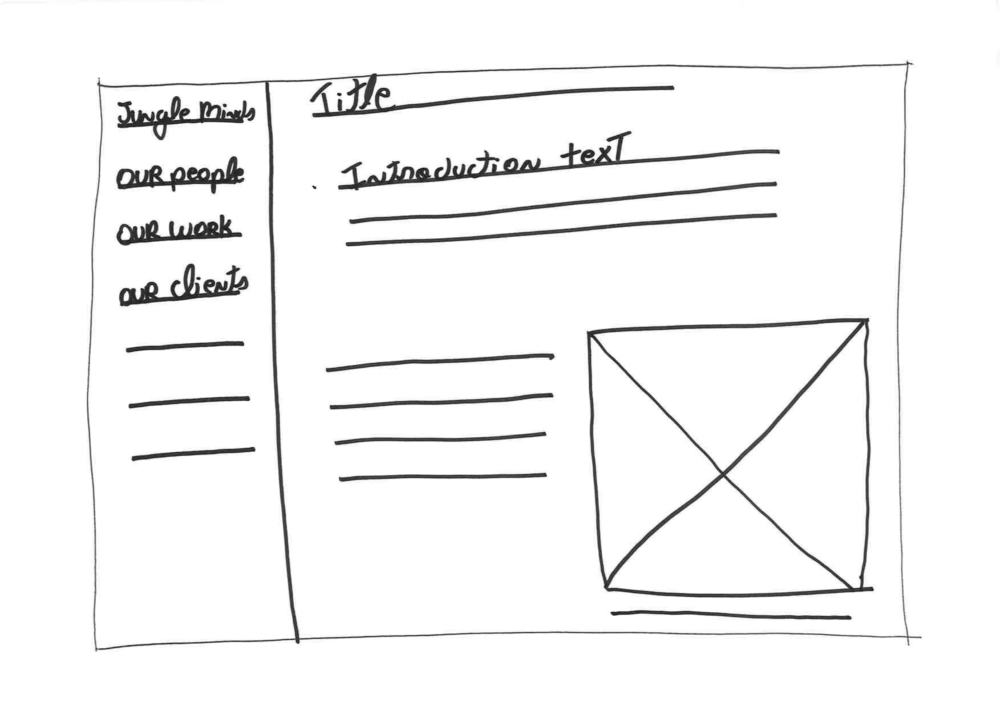
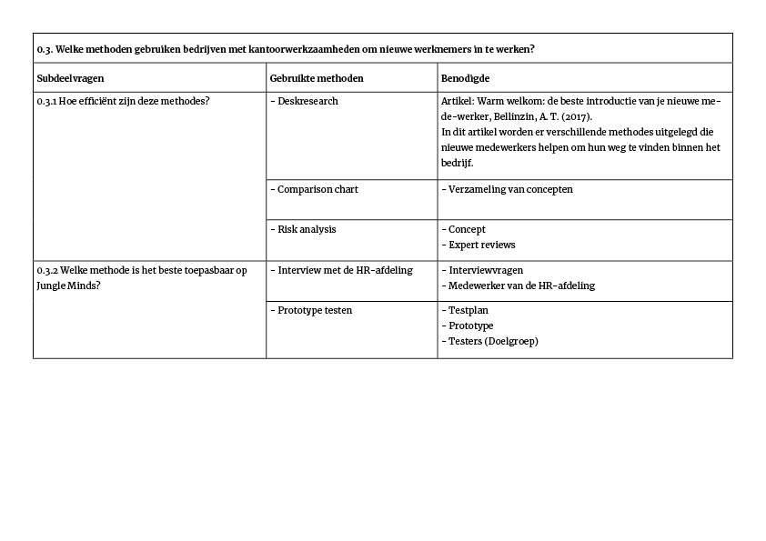

# 3.4 Concept: 10 ideeën

Onboardingtool.

Wat houdt een onboarding tool in?  
 Met een onboarding wordt bedoeld dat de gebruiker moet de nodige kennis, vaardigheden en gedrag verwerven om effectief te worden.

Webapp uitstraling: 

* Fun
* Freedom
* Ambitious
* Social

## Concept: 10 ideeën

### Concept 1

### Concept 2

### Concept 3

### Concept 4

### Concept 5

### Concept 6

### Concept 7

### Concept 8

### 

### Concept 9

### Concept 10

