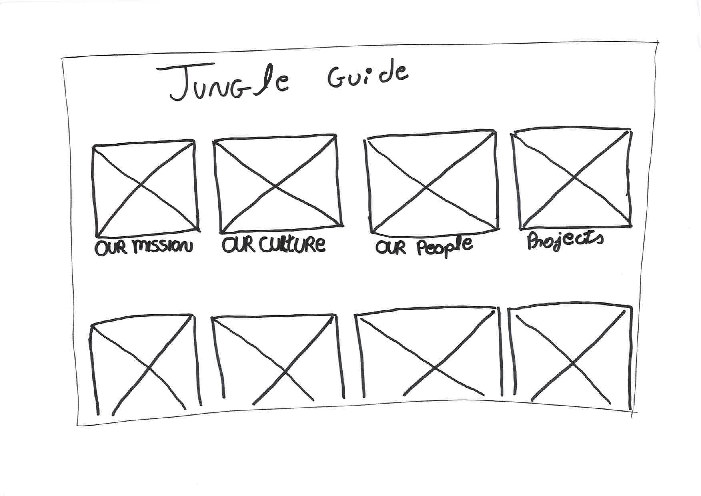

# 3.4 Concept: 10 ideeën

## Onboardingtool

### Doel

Met een onboarding tool wordt bedoeld dat de gebruiker door middel van een digitale omgeving de nodige kennis, vaardigheden en gedrag kan verwerven om effectief te worden binnen het bedrijf.

### Tone of voice

Om te bepalen wat de tone of voice van de onboarding tool moet bevatten heb ik aan de hand van de interviews met de doelgroep \([claire](../onderzoek-methodes/interviews/6.1.4-team-designer-claire.md), [Noor](../onderzoek-methodes/interviews/6.1.5-visual-designer-noor.md) en [Luisa](../onderzoek-methodes/interviews/6.1.6-frontend-developer-luisa.md)\) en de antwoorden op mijn [enquete](../onderzoek-methodes/surveys/working-at-jungle-minds.md)  gekeken naar hoe de medewerkers het bedrijf Jungle Mind beschrijven. Uit dit onderzoek is er gebleken dat Jungle Minds wordt beschreven als:

* Fun Levi, een deelnemer van de enquete onderzoek, beschrijft fun als: "We zijn altijd bezig met het ontwerpen en bieden van oplossingen voor onze klanten, maar we houden ook van intern plezier te hebben om een leuke sfeer te hebben."
* Vrijheid Coen, een deelnemer van de enquete onderzoek, beschrijft vrijheid als: "Ik vind het leuk dat Jungle Minds mij de vrijheid biedt om me te concentreren op dingen die ik leuk vind om te doen. Ik voel nooit micromanaged. En als ik dat doe, is er een proces dat rekening houdt met deze feedback."
* Ambitious Alexandra, een deelnemer van de enquete onderzoek, beschrijft ambitious als: "Er werken geen grote ego's bij Jungle Minds, mensen zijn aardig voor elkaar en we willen het hier fijn hebben. Daarnaast maken we ook nog eens supermooie producten en willen we onderscheidend zijn in het leveren van gebruikerswaarde \(meaningful difference\)."
* Sociaal Coen, een deelnemer van de enquete onderzoek, beschrijft sociaal als: "Ik hou van het feit dat Jungle Minds voor zijn mensen zorgt, door persoonlijke ontwikkelingsdoelen, winstdeling schema's en sociale bijeenkomsten bieden."

Aan de hand van de 

## Concept: 10 ideeën

### Concept 1

### Concept 2

### Concept 3

### Concept 4

### Concept 5

### Concept 6

### Concept 7

### Concept 8

### 

### Concept 9

### Concept 10

