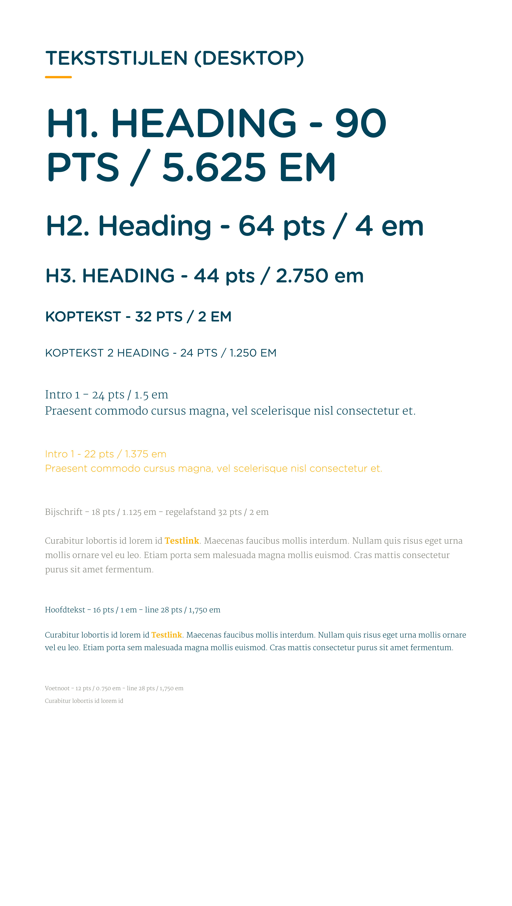

# 4.2 Identiteit & merkbeleving

## Huisstijl

### Nieuwe huisstijl

Regels:

* Gotham niet meer gebruiken voor teksten. Alleen voor graphs, illustraties en diagrammen.  Ook mag het gebruikt worden als section title. \(Je mag hem gebruiken bij teksten waar je niet goed te lezen en alsnog begrijpt waarover het gaat.\)
* Driehoeken stellen iets unieks voor. Het verhaal erachter is dat het wordt toegevoegd bij de component die je wilt laten zien waar je op trots bent. Het dient als een dienblad als het ware, maar je wilt niet arrogant over komen. De positie van deze driehoeken zijn altijd anders. Ze zijn dynamisch alsof ze heel langzaam aan het bewegen zijn door de ruimte.

TODO: Voeg huistijl PDF toe

