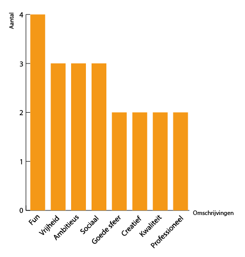
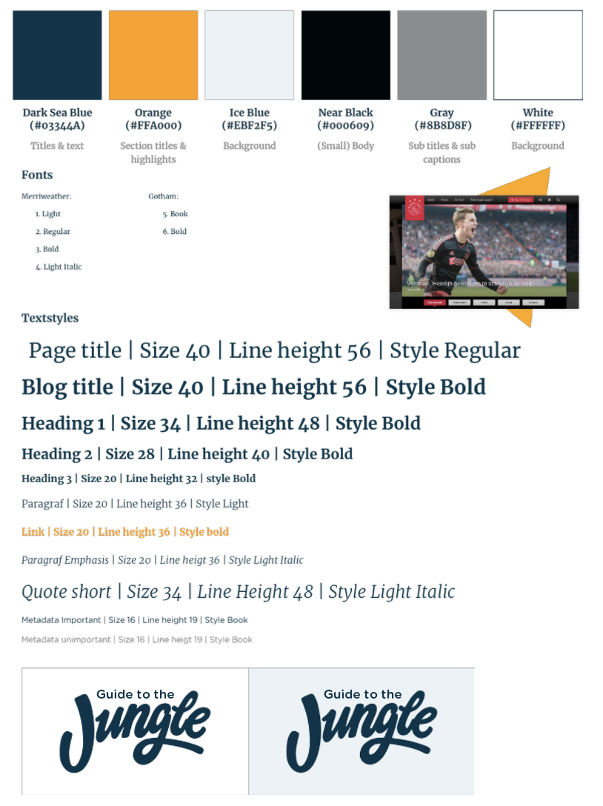
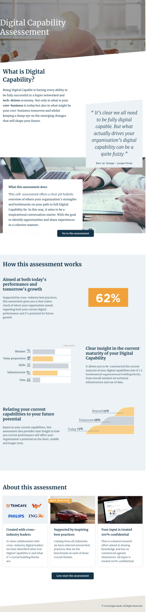

# 4.2 Identiteit & merkbeleving

## Onboardingtool

### Doel

Met een onboarding tool wordt bedoeld dat de gebruiker door middel van een digitale omgeving de nodige kennis, vaardigheden en gedrag kan verwerven om effectief te worden binnen het bedrijf.

### Tone of voice

Om te bepalen wat de tone of voice van de onboarding tool moet bevatten heb ik aan de hand van de interviews met de doelgroep \([claire](../onderzoek-methodes/interviews/6.1.4-team-designer-claire.md), [Noor](../onderzoek-methodes/interviews/6.1.5-visual-designer-noor.md) en [Luisa](../onderzoek-methodes/interviews/6.1.6-frontend-developer-luisa.md)\) en de antwoorden op mijn [enquete](../onderzoek-methodes/surveys/working-at-jungle-minds.md)  gekeken naar hoe de medewerkers het bedrijf Jungle Mind beschrijven. Zie afbeelding ... voor de resultaten van mijn onderzoek. 

Uit het onderzoek is er gebleken dat Jungle Minds wordt beschreven als:

* Fun Levi, een deelnemer van de enquete onderzoek, beschrijft fun als: "We zijn altijd bezig met het ontwerpen en bieden van oplossingen voor onze klanten, maar we houden ook van intern plezier te hebben om een leuke sfeer te hebben."
* Vrijheid Coen, een deelnemer van de enquete onderzoek, beschrijft vrijheid als: "Ik vind het leuk dat Jungle Minds mij de vrijheid biedt om me te concentreren op dingen die ik leuk vind om te doen. Ik voel nooit micromanaged. En als ik dat doe, is er een proces dat rekening houdt met deze feedback."
* Ambitious Alexandra, een deelnemer van de enquete onderzoek, beschrijft ambitious als: "Er werken geen grote ego's bij Jungle Minds, mensen zijn aardig voor elkaar en we willen het hier fijn hebben. Daarnaast maken we ook nog eens supermooie producten en willen we onderscheidend zijn in het leveren van gebruikerswaarde \(meaningful difference\)."
* Sociaal Coen, een deelnemer van de enquete onderzoek, beschrijft sociaal als: "Ik hou van het feit dat Jungle Minds voor zijn mensen zorgt, door persoonlijke ontwikkelingsdoelen, winstdeling schema's en sociale bijeenkomsten bieden."

Aan de hand van de bovenste resultaten ga ik deze vier kernwoorden  vertalen naar de manier waarop de verschillende componenten worden weergegeven in de onboarding tool. 

### Nederlandse uitspraken

Om de kernwoord "Fun" te overbrengen in de applicatie heb ik de verzoek gekregen tijdens de interview met de [managing partner Bart ](../onderzoek-methodes/interviews/6.1.2-managing-partner-bart.md#tips-ideeen-en-opmerkingen)om typische Nederlandse uitspraken letterlijk naar het engels te vertalen en deze terug laten komen in de applicatie. Nu dat het voertaal van het bedrijf engels begint te worden, is het gebruikelijk dat het bedrijf zulke grappen met de medewerkers doet.

Voorbeeld van Typische Nederlandse uitspraken die gebruikt kunnen worden zijn: 

* There is nothing on the hand: Er is niks aan de hand
* Make that the cat wise: maak dat de kat wijs.
* I am monkeyproud: Ik ben apentrots.
* The points on the i: De punten op de i.
* I always get my sin: ik krijg altijd mijn zin.

Meer voorbeelden van Nederlandse spreekwoorden in het Engels zijn de vinden op: [https://kunst-en-cultuur.infonu.nl/taal/23563-nederlandse-spreekwoorden.html](https://kunst-en-cultuur.infonu.nl/taal/23563-nederlandse-spreekwoorden.html)

## Huisstijl

Aan het begin van mijn project was ik begonnen met het werken met de huidige huisstijl van Jungle Minds. Deze huisstijl wordt voorlopig gebruikt bij de website van Jungle Minds. Zie afbeelding ... voor de weergave ervan. 

### Huidige huisstijl

De huidige huisstijl bestaat uit Tekststijlen, zie afbeelding ..., en Iconen, zie afbeelding ....

### Nieuwe huisstijl

Tijdens het testen van prototype v0.2 met een van de designers uit Jungle Minds ben ik te weten gekomen dat Jungle Minds bezig was met het ontwikkelen van een nieuwe huisstijl. Dit was ook de gewenste huisstijl voor deze product. Zelf vond ik in het begin moeilijk om de nieuwe stijl toe te passen omdat deze nog niet eerder gebruikt werd voor een website alleen voor de keynotes presentaties van Jungle Minds. Na het verzamelen van deze regels en de informatie over het gebruiken van de huisstijl die ik uit interne keynote document kon halen heb ik een style tile aangemaakt. Zie afbeelding ... voor de style tile weergave van de nieuwe huisstijl. 

Later in mijn proces heb ik de website "[https://digitalmaturity.jungleminds.nl/](https://digitalmaturity.jungleminds.nl/)" gekregen van een van de designers waarop ik mij zal kunnen baseren voor het gebruiken van de huisstijl. Hij vertelde dat deze website dit jaar is ontworpen met de nieuwe huisstijl, omdat het om een dienst gaat die binnen Jungle Minds valt. Echter, is de stijl die toegepast werd in de website van Digital Maturity niet hetzelfde als de stijl die toegepast zal worden voor Jungle Minds. Dit gebruikte ik enkel richtlijn, zie afbeelding ... voor de visuele weergave van de website van Digital Maturity.

#### Style regels:

* Gotham niet meer gebruiken voor teksten. Alleen voor graphs, illustraties en diagrammen.  Ook mag het gebruikt worden als section title. \(Je mag hem gebruiken bij teksten waar je niet goed te lezen en alsnog begrijpt waarover het gaat.\)
* Driehoeken stellen iets unieks voor. Het verhaal erachter is dat het wordt toegevoegd bij de component die je wilt laten zien waar je op trots bent. Het dient als een dienblad als het ware, maar je wilt niet arrogant over komen. De positie van deze driehoeken zijn altijd anders. Ze zijn dynamisch alsof ze heel langzaam aan het bewegen zijn door de ruimte.

