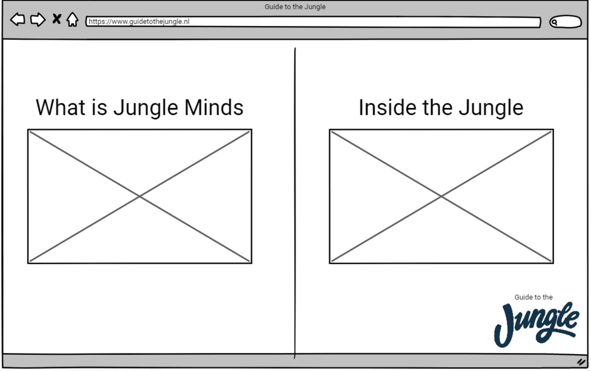
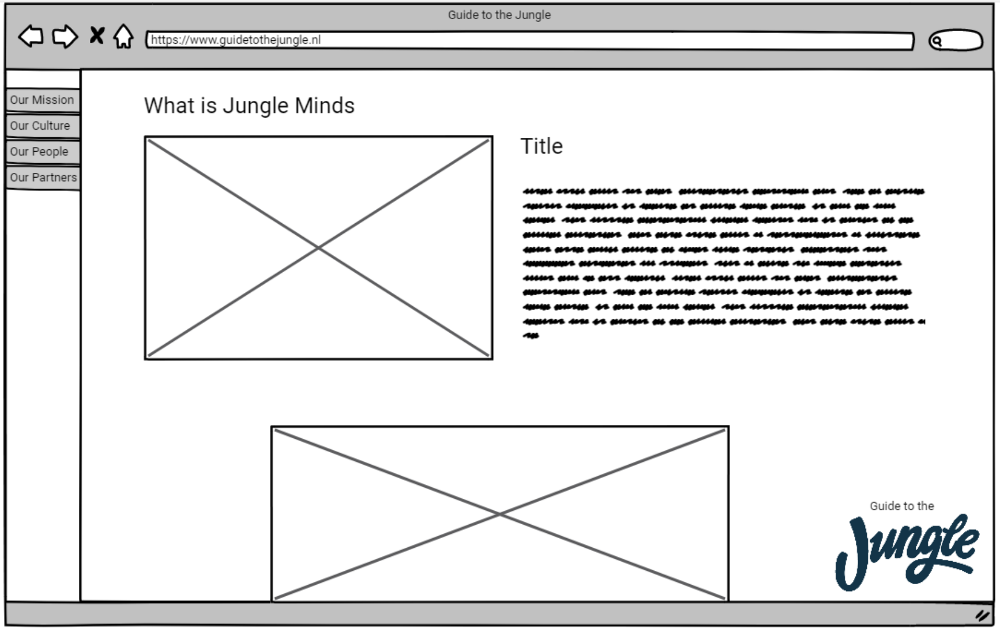
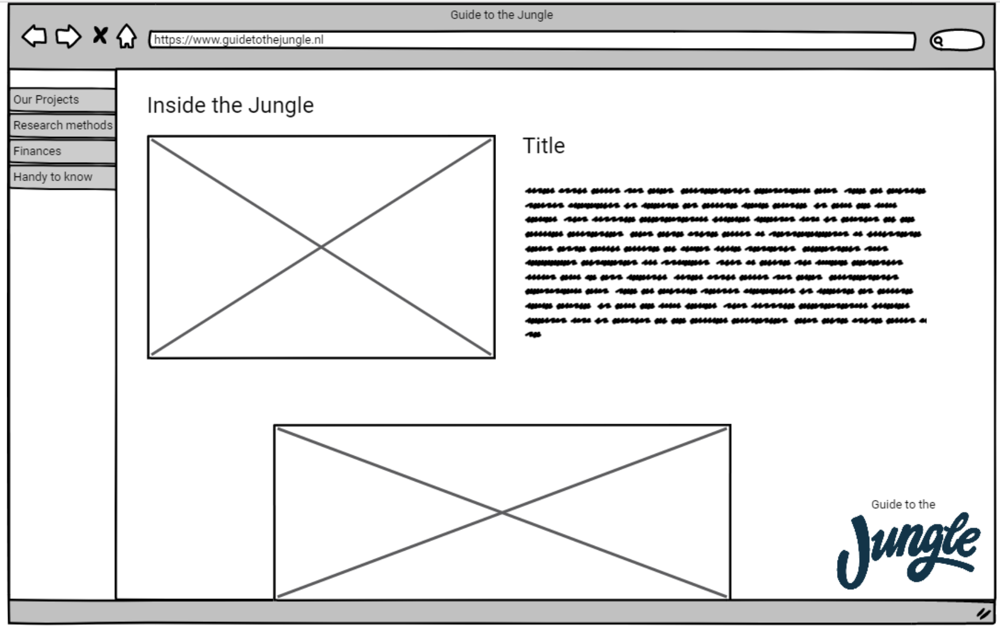

# 4.3 Prototype v.0.1

## Prototype

Voor de feedback Frenzy heb ik een lo-fi prototype gemaakt om de richting van mijn product te kunnen aantonen. De prototype gaf een beeld van de content die terug zal komen in het eind product en de mogelijke weergave van de content. Een interactieve versie van deze prototype is te vinden op [https://invis.io/K4GQM0HC9F2\#/289913261\_home](https://invis.io/K4GQM0HC9F2#/289913261_home).

Zie hieronder de schermen die gebruikt zijn voor de prototype met een korte uitleg erover:

* Introductie pagina Op afbeelding 80 zie je de introductie pagina van de "Guide to the Jungle". Bij deze pagina wordt de logo van het product duidelijk naar voren gebracht en het pagina bevat een input veld waar de gebruikers hun naam kunnen invullen. Door de naam te hebben ingevuld op deze pagina wordt de naam van de gebruiker in andere pagina's weer getoond. Dit zorgt  ervoor dat de gebruiker op een persoonlijke manier wordt benaderd door de applicatie. 

* Hoofdmenu Op afbeelding 81 wordt een de hoofdmenu weergeven van de applicatie. Deze menu bevat twee keuze's namelijk "What is Jungle Minds" wat informatie bevat over het bedrijf zelf, denk aan de cultuur, normen, waarden, medewerkers en de mensen waarvoor Jungle Minds werkt. Zie afbeelding 82 voor de weergave van deze pagina. En de andere keuze is "Inside the Jungle" die informatie bevat over procedures van het bedrijf en inhoudelijke informatie als financiën. Zie afbeelding 83 voor de weergave van de "Inside the Jungle" pagina.

* "What is Jungle Minds" pagina

* "Inside the Jungle" pagina

## Peer review 

Deze prototype heb ik door middel van een [peer review](../6.5-prototype-tests/6.5.1-peer-review-v0.1.md) getest met mijn medecollega's van CMD. Hieruit heb ik de volgende inzichten gekregen:

* Zo snel mogelijk beginnen met het ontwerpen van een testbare versie van een prototype. 
* Gebruik de huisstijl van het bedrijf om de "look & feel" over te brengen.

### Conclusie

De belangrijkste bevinding uit de peer review is dat ik mij bezig moet houden met het koppelen van de huisstijl van Jungle Minds met het product. Dit zal ervoor zorgen dat ik tijdens het bouwen van de benodigde componenten goed over na zal denken of het binnen het bedrijf's stijl past. 

