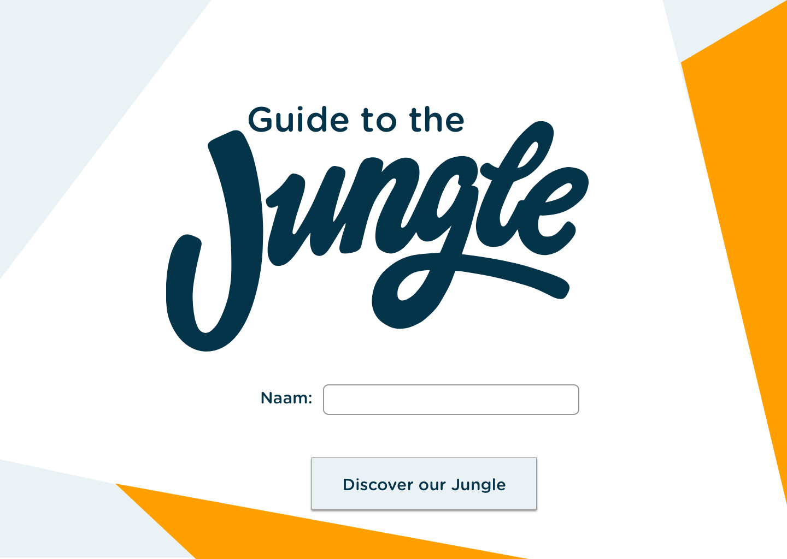
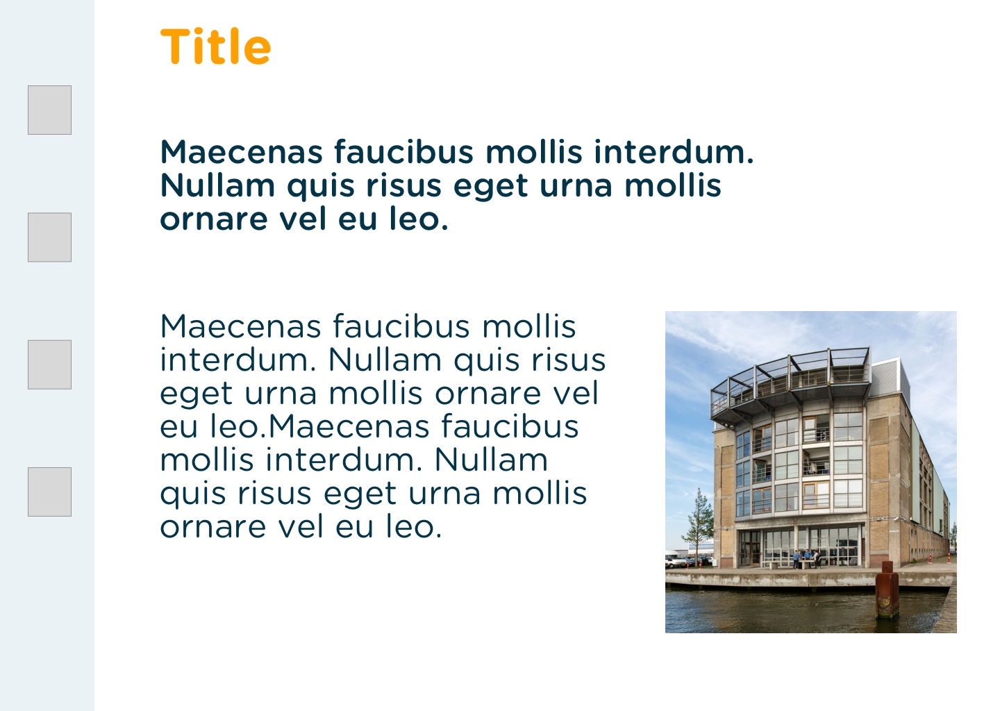
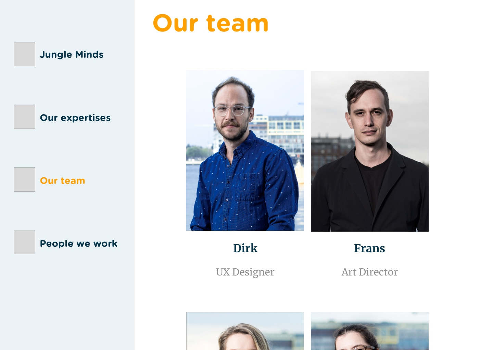

# 4.4 Prototype v.0.3

## Prototype 

Vanaf prototype v0.3 ben ik begonnen met het gebruiken van de nieuwe huisstijl. Deze wordt beschreven in [4.2 Identiteit & merkbeleving](4.2-identiteit-and-merkbeleving.md#nieuwe-huisstijl). Tijdens heb bouwen van deze prototype ben ik bezig geweest met het testen van verschillende variaties die ik zal kunnen toepassen voor het eindproduct.

Ik wilde een beter idee krijgen over hoe ik de content zou structureren en hoe ik het huisstijl zou toepassen. Omdat ik tijdens deze fase nog geen content had heb ik gewerkt met "Lorem ipsum".

### Introductie pagina

Voor de introductie pagina, heb ik twee variaties van "[Zero state](../3.-concept/3.4-concept-schetsen.md#zero-state)" uit 3.4 Concept schetsen gedigitaliseerd. Zie afbeelding 84 en 85. In een latere fase zal ik testen met de opdrachtgever en de doelgroep welke van de twee variaties gewenst is.

### Beginscherm: Jungle Minds pagina

Dit is het eerste scherm die de gebruiker te zien krijgt na de introductiescherm. Ze krijgt eerst informatie over het bedrijf, die wordt weergegeven door middel van tekst een plaatje. Zie afbeelding 86 en 87 voor de weergave van deze pagina.

Deze pagina bestaat uit de volgende  componenten:

* Menu:
  * Is altijd in beeld aan de linkerkant.
  * Bevat icon en tekst
* Pagina titel
* Introductie tekst
* Text
* Foto

### Our team pagina

Bij deze pagina worden de medewerkers van het bedrijf in beeld gebracht. Zie afbeelding 88 en 89 voor de weergave van deze pagina.

Deze pagina bestaat uit de volgende  componenten:

* Menu:
  * Is altijd in beeld aan de linkerkant.
  * Bevat icon en tekst
* Pagina titel
* Element van medewerkers:
  * Foto
  * Naam
  * Expertise
  * modal \(opent wanneer op de foto geklikt wordt.\)

### Our Team modal

Wanneer op een van de team component wordt geklikt opent er een modal met meer gegevens van de desbetreffende medewerker.

Deze pagina bestaat uit de volgende  componenten:

* Modal:
  * Naam
  * Foto
  * Expertise
  * Eigen verhaal

Voor de modal heb ik een aantal variaties gemaakt waarbij de huisstijl componenten op verschillende manier toegepast worden, zie afbeelding 90, 91 en 92. Door middel van een expert review met een visual designer van Jungle Minds wil ik een keuze maken voor welke variatie ik moet gaan gebruiken.

## Expert review

Deze prototype heb ik door middel van een [Expert review](../6.5-prototype-tests/6.5.2-expert-review-v0.3.md) getest met een van de visual designers van Jungle Minds, die ook verantwoordelijk is voor de huidige en nieuwe huisstijl van het bedrijf. Hieruit heb ik de volgende inzichten gekregen:

* Gebruik alleen iconen als ze vanzelfsprekend zijn. Dus zonder de tekst moeten de iconen te begrijpen zijn. Daarnaast kreeg ik een vrije kaart om nieuwe iconen te ontwerpen \(in hetzelfde stijl\) als dat nodig zal zijn .
* Denk aan de hierargie van de items die in beeld komen.
* Beslis van te voren de content om te kunnen bepalen wat en waar elementen moeten komen.

### conclusie

De belangrijkste bevinding uit de Expert review was dat ik eerst mijn content zal moeten beslissen om vervolgens een goede ontwerp ervoor te kunnen maken. Echter, ben ik erg afhankelijk van het bedrijf om de content te krijgen. De content die het bedrijf beschikbaar heeft is vaak in het Nederlands, waardoor ik zelf zal moeten vertalen of zal moeten wachten tot de juiste persoon binnen Jungle Minds mij zal kunnen helpen ermee. Hierdoor zal ik tijdens mijn prototype vaak gebruik maken van "Lorem ipsum" of Nederlandse teksten. Tijdens het testen van de prototype met de doelgroep zal ik ervoor zorgen dat deze teksten allemaal in het Engels wordt. 

Daarnaast heb ik gekeken naar de beschikbare iconen en ik heb een selectie gemaakt van potentiële iconen die ik zal kunnen gebruiken voor de menu. Die heb ik daarna aan mensen gevraagd of ze de betekenis van wisten zonder dat er tekst bij zat en vaak kreeg ik een negatieve antwoord. Zelf iconen ontwerpen zal een oplossing kunnen zijn, maar vanwege tijdbeperkingen was dat voor mij geen oplossing. Hierdoor ben ik naar verschillende design patterns gaan kijken die mij een andere mogelijkheid boden voor de menu. 

