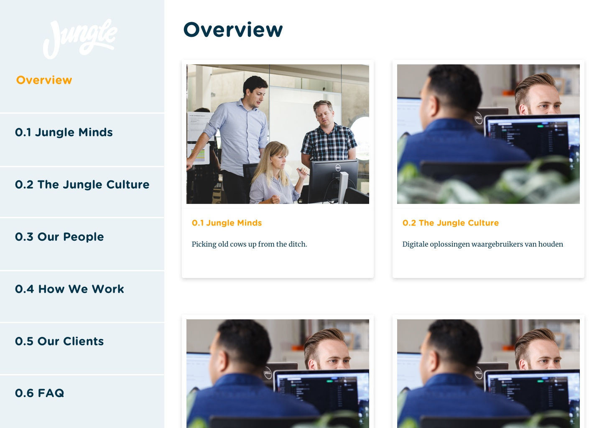
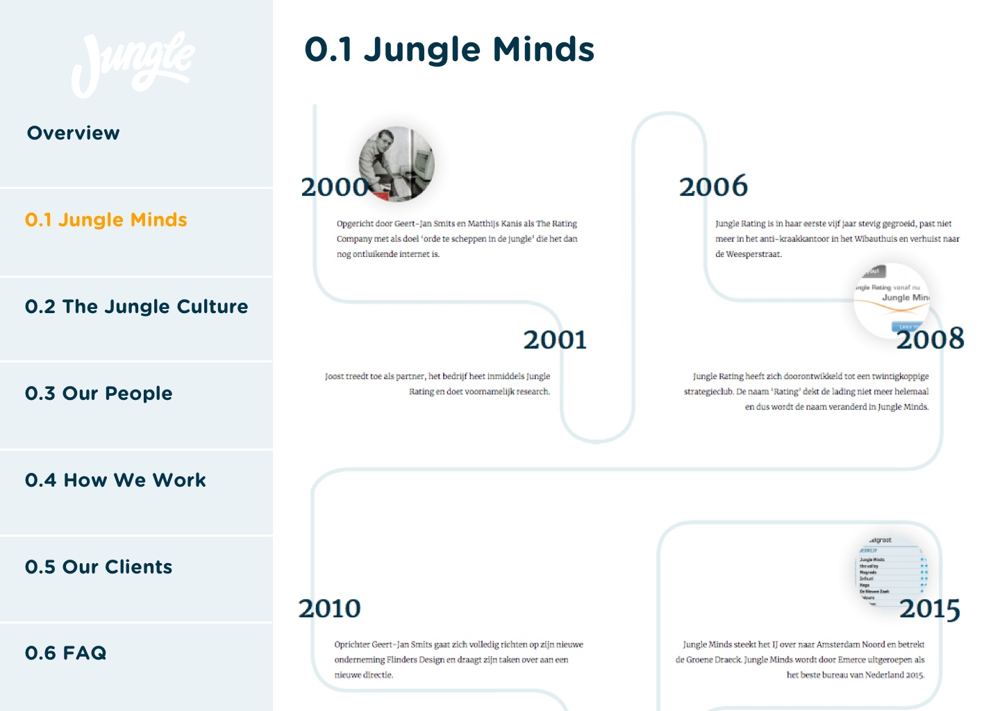
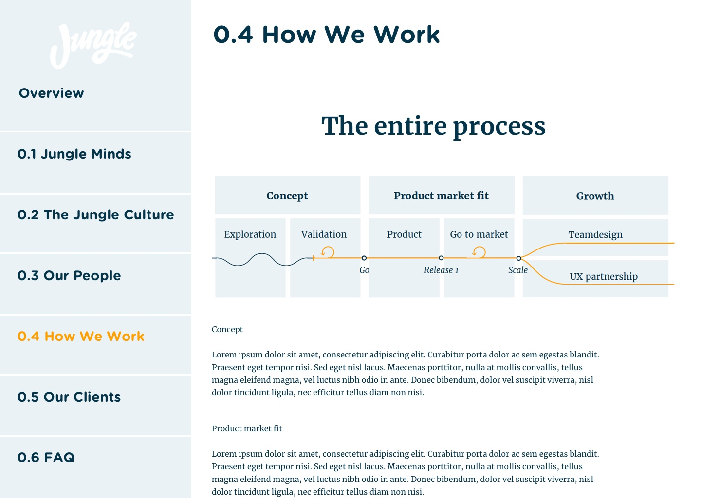

# 4.4 Prototype v0.4

## Prototype

Zie de afbeeldingen ... tot en met ... voor de weergave van de ontwerp van prototype v0.4

* Introductie pagina 

* Overview 

De "overview" pagina is de hoofdpagina na de introductie pagina. In deze pagina ziet de gebruiker een overzicht van de onderwerpen die behandelt worden binnen de applicatie. De gebruiker zit aan de linker menu in een oog opslag alle onderwerpen staan en in de overzicht worden alle onderwerpen weergegeven door middel van een block met een afbeelding, de pagina titel en een korte beschrijving. In deze beschrijving was mijn idee om een [Nederlandse uitsprak ](4.2-identiteit-and-merkbeleving.md#nederlandse-uitspraken)te laten zien die te maak heeft met het onderwerp. 

* 0.1 Jungle Minds

* 0.2 The Jungle Culture

* 0.3 Our People

* 0.4 How we work

* 0.5 Our clients

* 0.6 FAQ

## Expert review

Deze prototype heb ik door middel van een "Expert review" getest met een van de visual designers van Jungle Minds. Hieruit heb ik de volgende inzichten gekregen:

* Test de logo door middel van verschillende \(kleur\) variaties te maken.
* Maak gebruik van meer witruimte tussen de verschillende elementen.
* Wees consistent bij het gebruiken van titels en introductieteksten.
* Zoek naar design patterns om een "testemonial" weer te geven. 

### conclusie

De belangrijkste bevinding uit de "Expert review"

