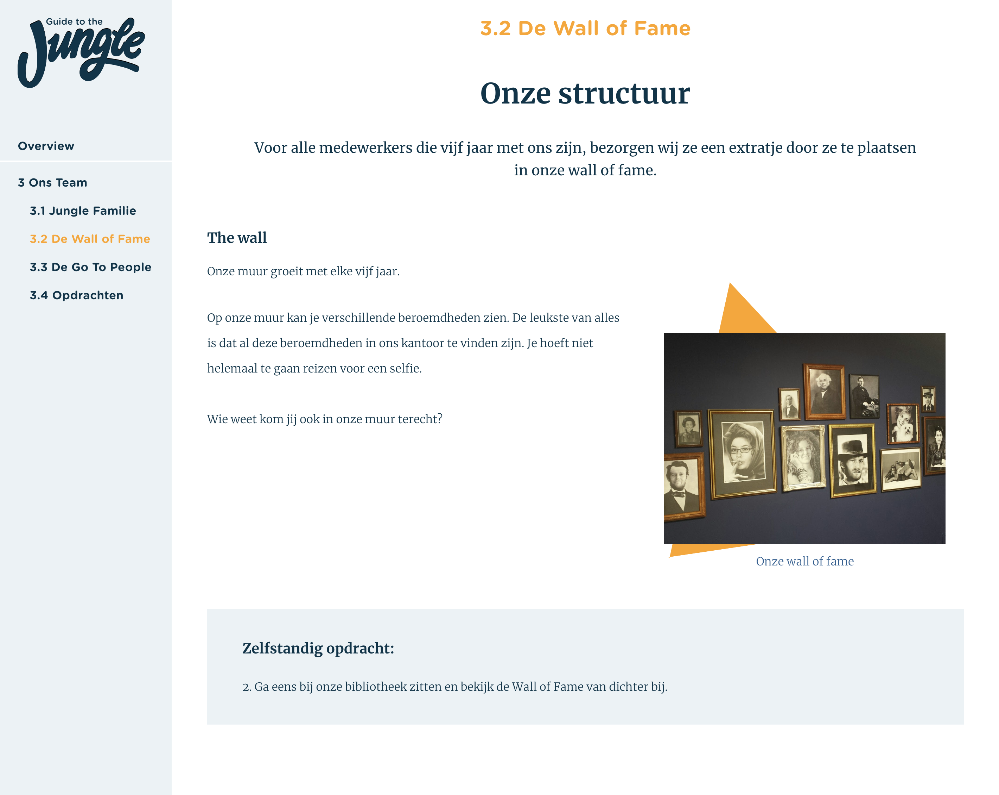

# 4.7 Prototype v.0.7

## Prototype

Uitgaande van mijn vorige prototypes en mijn Expert review met de opdrachtgever heb ik het concept kunnen veranderen naar een product waar het bedrijf echt wat aan heeft.  

Hier volgen de schermen van prototype versie 0.7:

### Overzicht

In afbeelding 109 ziet u de visuele weergave van de overzicht pagina, dit is de homepage van het applicatie. In deze pagina ziet u de gebruiker 6 onderwerpen. Het bestaat uit een pagina met de FAQ en 5 modules. Elke module wordt in de desbetreffende week behandeld. Zo is in het eerste week alleen module 1 beschikbaar voor de gebruiker.

### FAQ

Bij dit pagina worden de meeste gestelde vragen weergegeven. Dit zijn vragen met betrekking tot de rooster, uren en arbeidsvoorwaarden.

Wanneer op een vraag geklikt wordt klapt het open en wordt de "+" en "-".

### Module 1

Module 1 gaat over de geschiedenis en de principes van Jungle Minds.  
Zie afbeelding 111 tot en met afbeelding 113 voor de weergave van de inhoud van module 1.

### Module 2

Module 2 gaat over de cultuur van Jungle Minds.  
Zie afbeelding 114 tot en met afbeelding 116 voor de weergave van de inhoud van module 2.

### Module 3

Module 3 gaat over de medewerkers van Jungle Minds.  
Zie afbeelding 117 tot en met afbeelding 119 voor de weergave van de inhoud van module 3.

### Module 4

Module 4 gaat over de cultuur van Jungle Minds.  
Zie afbeelding 120 tot en met afbeelding 122 voor de weergave van de inhoud van module 4.

### Module 5

Module 5 gaat over de cultuur van Jungle Minds.  
Zie afbeelding 123 tot en met afbeelding 125 voor de weergave van de inhoud van module 5.

  

## Technisch

Om mijn profilering te kunnen uitoefenen en beter te worden in het coderen met React heb ik besloten om de laatste versies van het prototype te gaan coderen. Dit was ook van toegevoegde waarde voor het bedrijf, omdat Jungle Minds vaak minder tijd heeft voor interne projecten. Als het bedrijf beslist om dit product daadwerkelijk te gaan gebruiken hoeven ze niet van nul te beginnen, maar hebben ze al een goede basis staan in de programmeertaal die de developers van het bedrijf gebruiken.

De prototype is gemaakt in [React](https://reactjs.org/), een JavaScript library. Zelf had ik sinds dit jaar Januari pas leren werken met React, dus het was voor mij ook een uitdaging om mijn hele prototype hiermee te moeten coderen. Echter, zag ik deze kans als een mooie moment om een nieuwe taal te leren, aangezien het bedrijf heir gebruik van maakt. 

Tijdens mijn stage heb ik meegewerkt aan het coderen van [Digital Maturity](https://digitalmaturity.jungleminds.nl/) website die enkele elementen gebruikt van de nieuwe huisstijl van Jungle Minds. Dus enkele componenten van de website heb ik gebruikt voor mijn prototype.

Daarnaast heb ik ook gebruik gemaakt van de twee libraries voor het coderen van de tijdline van Module 1:

* [https://github.com/oliviertassinari/react-swipeable-view](https://github.com/oliviertassinari/react-swipeable-views)
* [https://github.com/sherubthakur/react-horizontal-timeline](https://github.com/sherubthakur/react-horizontal-timeline)

## Usability testing

Gedurende mijn project waren er geen nieuwe medewerkers aangenomen voor Jungle Minds, hierdoor heb ik mijn prototype getest met 2 personen die buiten Jungle Minds werken, maar wel de rol hebben van een nieuwe medewerker in een andere bedrijf en ik heb het getest met de twee meeste recente medewerkers van Jungle Minds. 

Uit de [testresultaten](../6.5-prototype-tests/6.5.5-usability-testing-v.0.7.md) van de medewerkers van Jungle Minds kreeg ik de volgende belangrijke inzichten:

* Er is veel meer tekst dan plaatjes, echter ervoeren de testers het niet als vervelend om te lezen. Door de teksten verdeeld is in verschillende hoofdstukken oogt het minder te zijn waardoor je makkelijker doorheen leest.
* De verhalen over de ervaringen van collega’s binnen projecten of gebeurtenisen van Jungle Minds was onverwacht voor de medewerkers. Echter, vonden ze het erg leuk om te lezen. Hierdoor kregen ze nieuwe inzichten van collega’s.
* De twee testpersonen gaven aan dat ze veel informatie herkende van de website of het “Welkom to the Jungle” boekje. Echter, gaven ze ook aan dat niet elke nieuwe medewerker van deze informatie bronnen bewust is.Ondanks dat veel informatie te vinden was op de website of het boekje, vonden de testpersonen dat de informatie van de gids informatiever en uitgebreider was en dat ze meer inzichten kregen doordat de toegevoegde elementen als foto’s, quote’s en tijdslijn. 
* Testers gaven het idee om elke module te sluiten met een mini quiz. Ze gaven aan dat het dan veel serieuzer wordt genomen en dat de informatie die wordt verteld beter blijft hangen.

### conclusie

De belangrijkste bevinding uit de Usability testing is dat de flow van de tool goed wordt begrepen en ervaren. Echter zijn er sommige onderdelen van de tool die beter moeten ogen, onderdelen als de zelfstandig opdrachten en de FAQ vakje. Zie "[3.3 Inspiratie patters](../3.-concept/3.3-inspiratie-patterns.md#patterns-voor-v-0-5-greater-than)" voor mijn onderzoek naar de patterns van deze elementen. 

Daarnaast was tijdens de test aangegeven dat de gebruikers een miniquiz van het behandelde stof zouden fijn vinden om te controleren of ze de informatie wel goed hebben begrepen. Ook vroegen ze om een extra scherm tussen de overzicht pagina en de eerste pagina van de module's content. Dit om het voor de gebruikers het overzichtelijker te maken.

