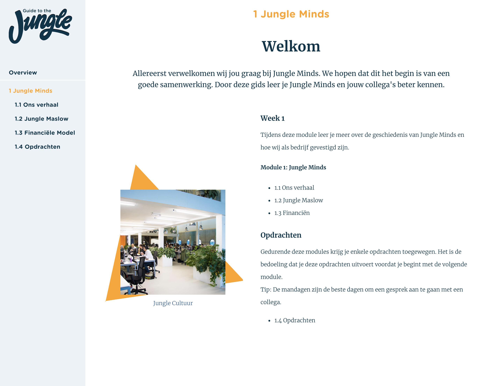
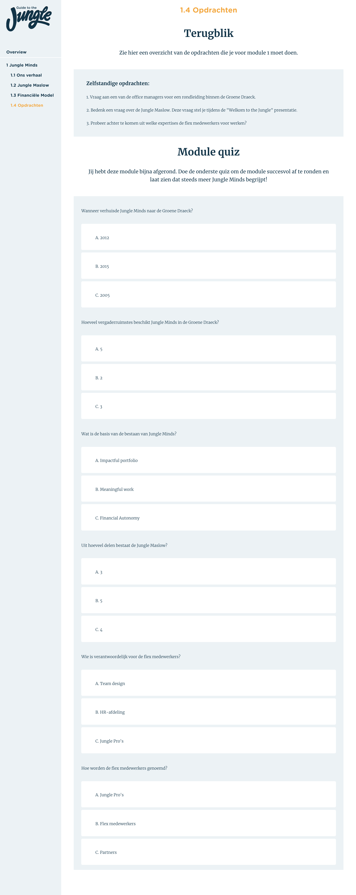
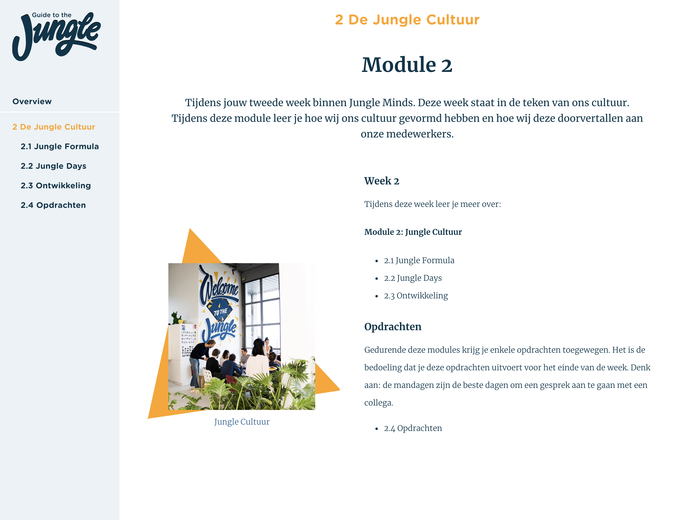
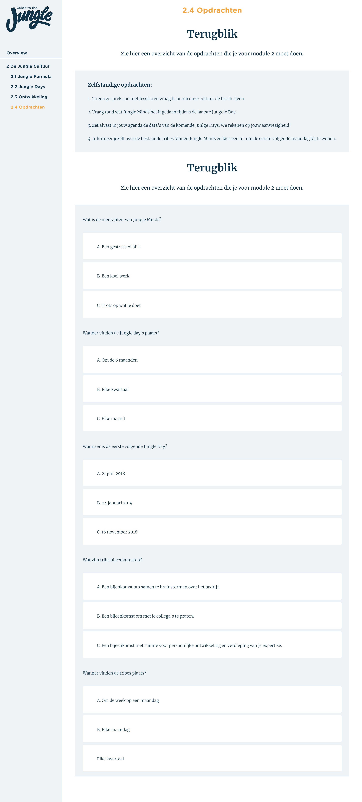
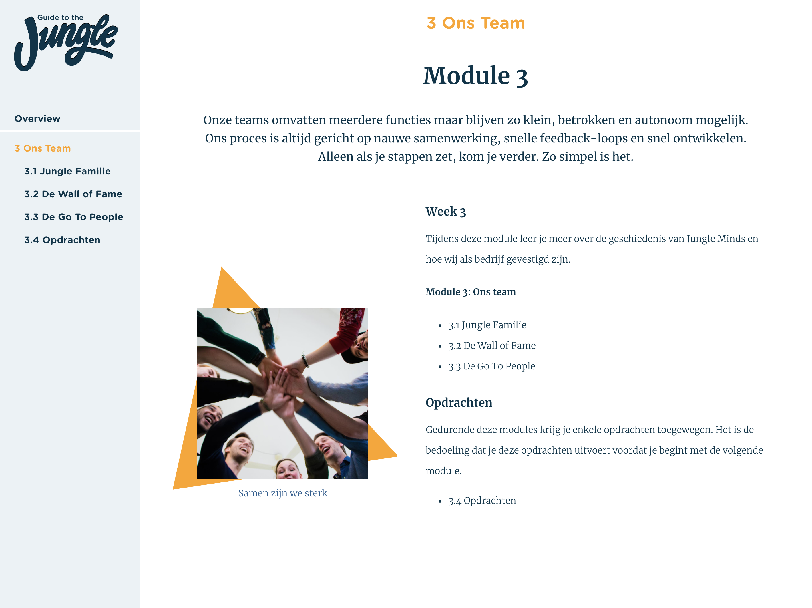

# 4.8 Prototype v.0.9

## Prototype

Uit mijn bevindingen van de [Usability testing van prototype v.0.7](../6.5-prototype-tests/6.5.5-usability-testing-v.0.7.md) heb ik vernomen dat ze een introductiescherm wilden hebben per module. In deze scherm wilden ze een korte introductie lezen over de stof die behandeld zal worden in de module. Daarnaast willen ze ook de module kunnen afsluiten met een quiz.

Zie hieronder de nieuwe schermen die erbij zijn gekomen naast de al bestande schermen van [prototype v.0.7](4.6-prototype-v.0.7.md). Van elke module is er een module introductie pagina toegevoegd en de quiz per module.

### Module introductie

De module introductie bestaat uit de volgende componenten:

* Pagina titel
* Onderwerp titel
* Introductie tekst
* Samenvatting van de stof van de module
  * Subtitel
  * Tekst
  * Module afbeelding

### Module quiz

De module quiz bestaat uit de volgende componenten:

* Pagina titel
* Onderwerp titel
* Introductie tekst
* Zelfstandige opdrachten
  * section titel
  * Vragen van de module
* Quiz 
  * Section titel
  * Vragen 
  * Multiple choice antwoorden.

## Afbeedingen

### Module 1

Zie afbeelding 126 voor de introductie pagina van module 1.

Zie afbeelding 127 voor de afsluiting quiz van module 1.

### Module 2

Zie afbeelding 126 voor de introductie pagina van module 1.

Zie afbeelding 127 voor de afsluiting quiz van module 1.

### Module 3

Zie afbeelding 126 voor de introductie pagina van module 1.

Zie afbeelding 127 voor de afsluiting quiz van module 1.

### Module 4

Zie afbeelding 126 voor de introductie pagina van module 1.

Zie afbeelding 127 voor de afsluiting quiz van module 1.

### Module 5

Zie afbeelding 126 voor de introductie pagina van module 1.

Zie afbeelding 127 voor de afsluiting quiz van module 1.

## Usability testing

### Conclusie

## Expert review

Deze prototype heb ik door middel van een [Expert review](../6.5-prototype-tests/6.5.4-expert-review-v0.5.md) getest met een van de visual designers van Jungle Minds. Ik wilde de laatste aanpassingen vanuit de usability testing controleren met de design en de laatste puntjes op de i zetten, wat design betreft.

Uit deze expert review heb ik de volgende inzichten gekregen:

* Denk aan de componenten goed uitlijnen met elkaar.
* Denk aan gebruik maken wit ruimte.
* 
De content moet in weken verdeeld worden.

* Er moet een indicatie komen van progressie.
* De introductiescherm moet een invulveld bevatten voor naam en startdatum.
* Er moeten opdrachten komen tussen de informatie door.

### Conclusie

