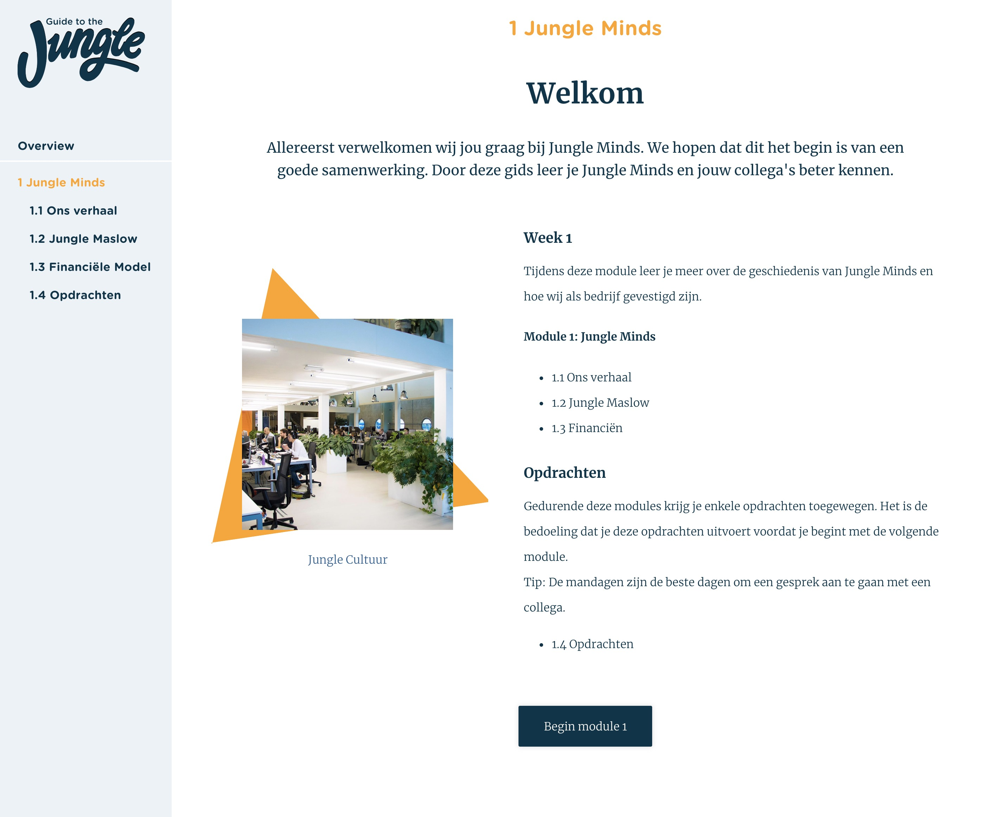
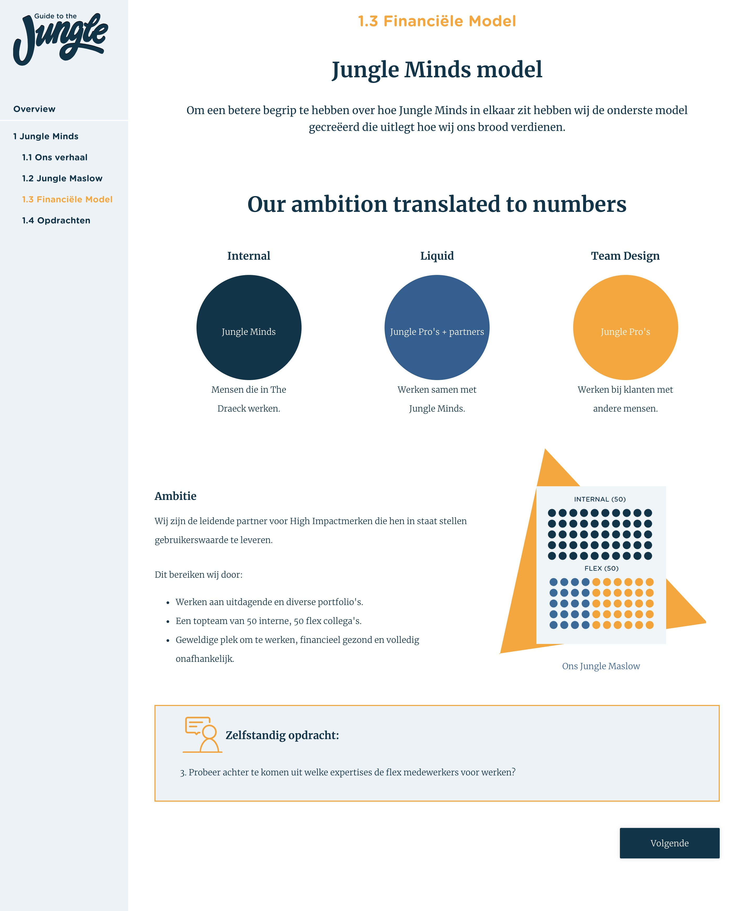
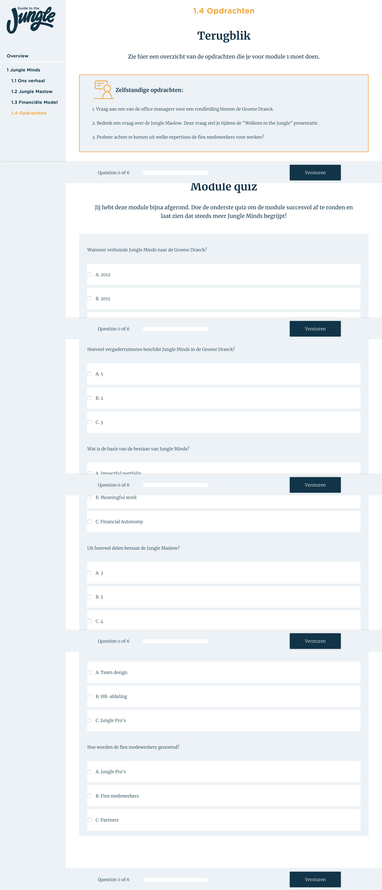
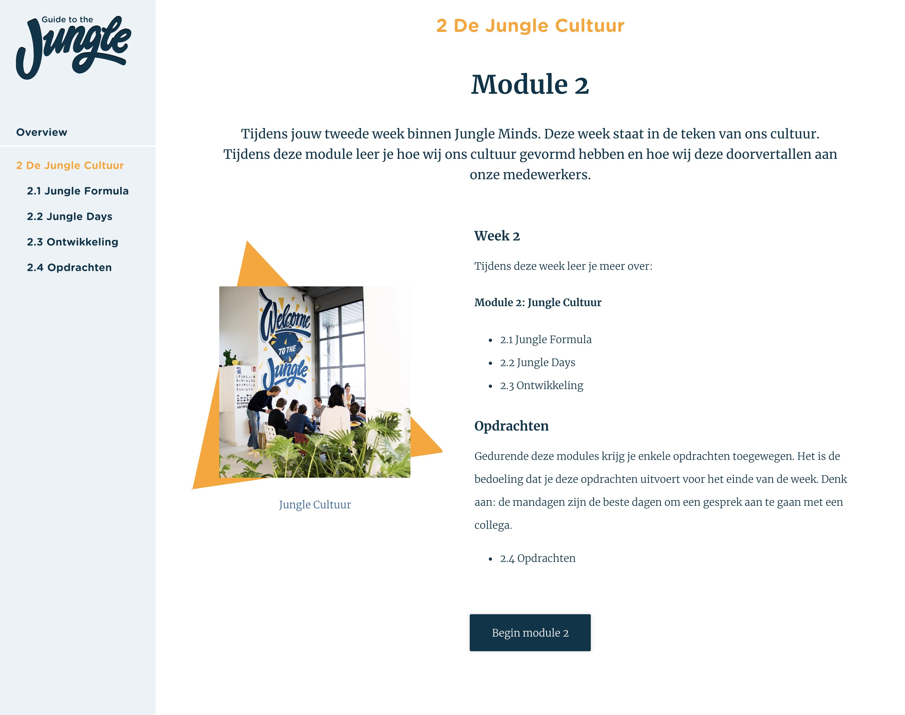
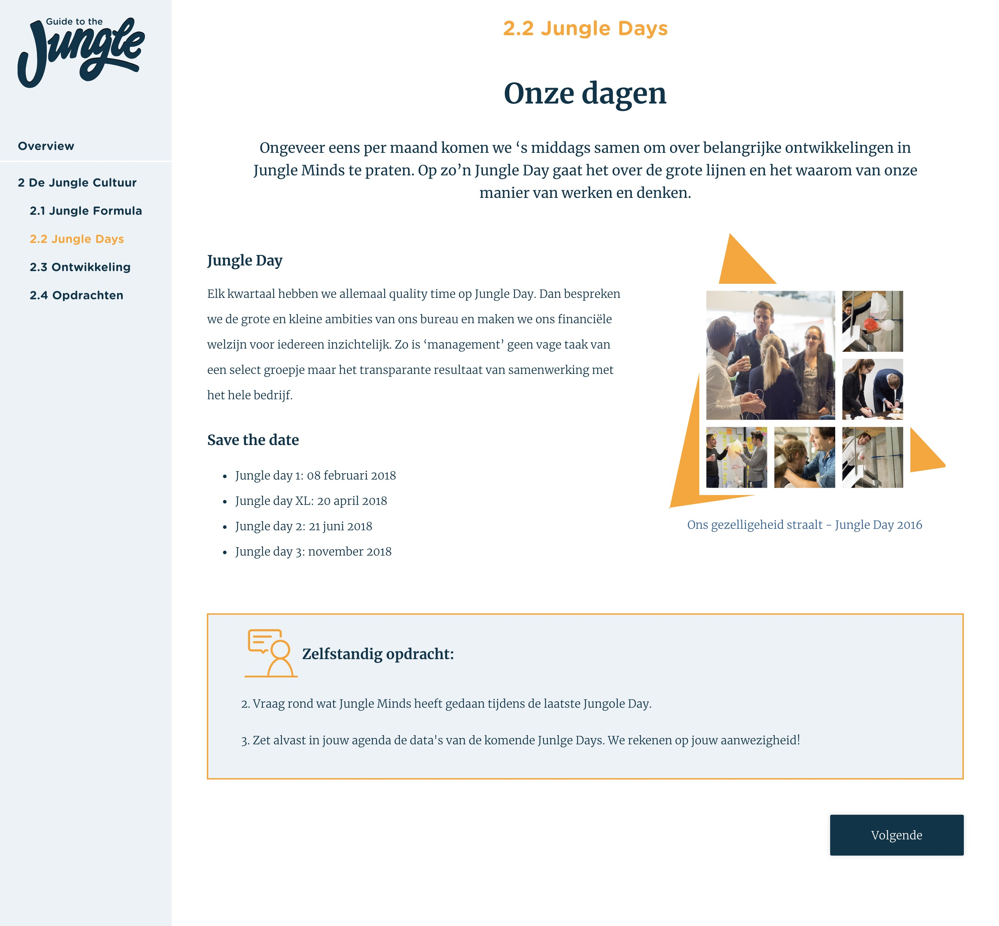
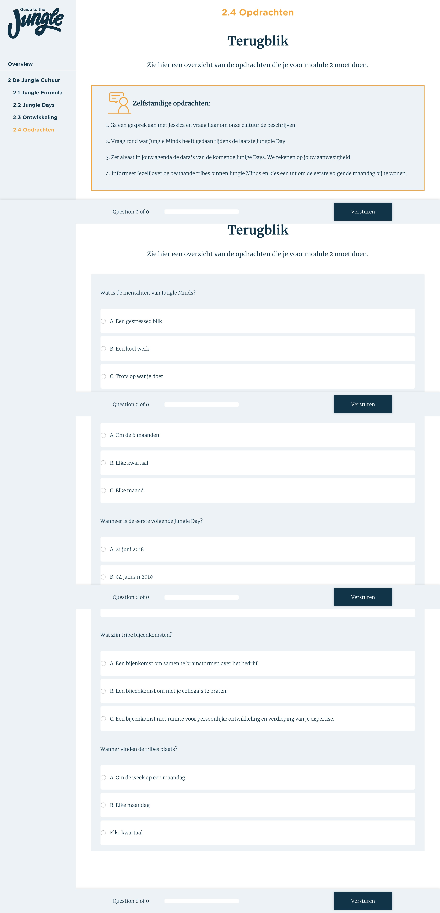
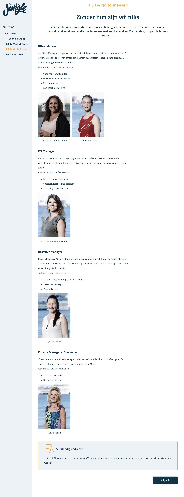
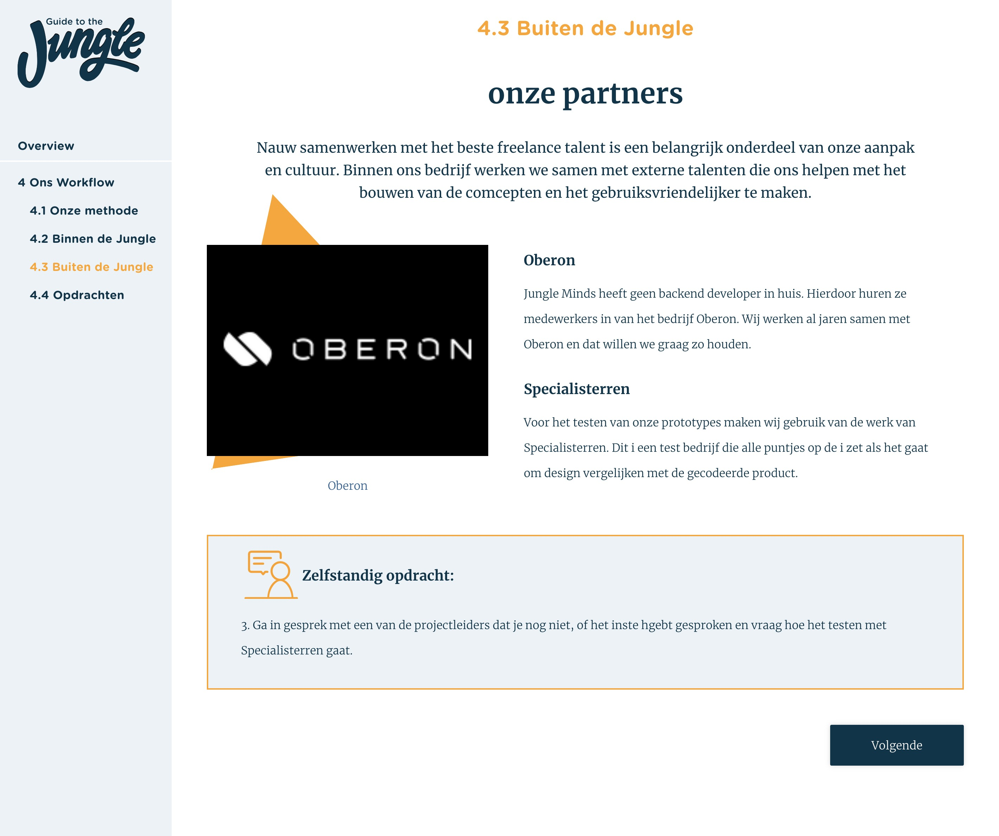

# 4.9 Prototype v.1.0

## Prototype.

Door middel van alle voorafgaande onderzoeken heb ik prototype versie 1.0 gemaakt. Zie afbeelding 136 tot en met afbeelding 165  voor de visualisatie van de schermen.

De prototype is ook te vinden op www.lbraga.nl/guide-to-the-jungle.

### Overzicht

Deze pagina bestaat uit de volgende componenten:

* Pagina titel
* subtitel
* introductietekst
* Welkom bericht
* Week telling
* Overzicht van de content
  * Card:
    * Foto
    * Titel van de pagina
    * Korte omschrijving

### FAQ

Deze pagina bestaat uit de volgende componenten:

* Pagina titel
* subtitel
* introductietekst
* Menu:
  * Is altijd in beeld aan de linkerkant.
  * Bevat tekst die gelinkt wordt naar de desbetreffende content
* Vragen collectie
  * Vragen 
  * Icon "+"

Deze pagina bestaat uit de volgende componenten:

* Pagina titel
* subtitel
* introductietekst
* Menu:
  * Is altijd in beeld aan de linkerkant.
  * Bevat tekst die gelinkt wordt naar de desbetreffende content
* Vragen collectie
  * Vragen 
  * Antwoord
  * Icon "-"

### Module 1

Deze pagina bestaat uit de volgende componenten:

* Pagina titel
* subtitel
* introductietekst
* Menu:
  * Is altijd in beeld aan de linkerkant.
  * Bevat tekst die gelinkt wordt naar de desbetreffende content
* Tekst en afbeelding
  * Titel
  * Subtitle
  * Tekst
* Knop

Deze pagina bestaat uit de volgende componenten:

* Pagina titel
* subtitel
* introductietekst
* Menu:
  * Is altijd in beeld aan de linkerkant.
  * Bevat tekst die gelinkt wordt naar de desbetreffende content
* Afbeelding en tekst
* Quote
* Zelfstandig opdracht
* Knop

Deze pagina bestaat uit de volgende componenten:

* Pagina titel
* subtitel
* introductietekst
* Menu:
  * Is altijd in beeld aan de linkerkant.
  * Bevat tekst die gelinkt wordt naar de desbetreffende content
* Afbeelding en tekst
* Zelfstandig opdracht
* Knop

Deze pagina bestaat uit de volgende componenten:

* Pagina titel
* subtitel
* introductietekst
* Menu:
  * Is altijd in beeld aan de linkerkant.
  * Bevat tekst die gelinkt wordt naar de desbetreffende content
* Illustratie volledige breedte
* Afbeelding en tekst
* Zelfstandig opdracht
* Knop

Deze pagina bestaat uit de volgende componenten:

* Pagina titel
* subtitel
* introductietekst
* Menu:
  * Is altijd in beeld aan de linkerkant.
  * Bevat tekst die gelinkt wordt naar de desbetreffende content.
* Zelfstandig opdrachten op een rij.
* Quiz:
  * Vragen 
  * Antwoorden
  * progressie balk die altijd in beeld is.
* Knop

### Module 2

Deze pagina bestaat uit de volgende componenten:

* Pagina titel
* subtitel
* introductietekst
* Menu:
  * Is altijd in beeld aan de linkerkant.
  * Bevat tekst die gelinkt wordt naar de desbetreffende content
* Afbeelding en tekst
* Knop

Deze pagina bestaat uit de volgende componenten:

* Pagina titel
* subtitel
* introductietekst
* Menu:
  * Is altijd in beeld aan de linkerkant.
  * Bevat tekst die gelinkt wordt naar de desbetreffende content
* Afbeelding en tekst
* Quote
* Zelfstandig opdracht
* Knop

Deze pagina bestaat uit de volgende componenten:

* Pagina titel
* subtitel
* introductietekst
* Menu:
  * Is altijd in beeld aan de linkerkant.
  * Bevat tekst die gelinkt wordt naar de desbetreffende content
* Afbeelding en tekst
* Zelfstandig opdracht
* Knop

Deze pagina bestaat uit de volgende componenten:

* Pagina titel
* subtitel
* introductietekst
* Menu:
  * Is altijd in beeld aan de linkerkant.
  * Bevat tekst die gelinkt wordt naar de desbetreffende content
* Afbeelding en tekst
* Zelfstandig opdracht
* Knop

Deze pagina bestaat uit de volgende componenten:

* Pagina titel
* subtitel
* introductietekst
* Menu:
  * Is altijd in beeld aan de linkerkant.
  * Bevat tekst die gelinkt wordt naar de desbetreffende content.
* Zelfstandig opdrachten op een rij.
* Quiz:
  * Vragen 
  * Antwoorden
  * progressie balk die altijd in beeld is.
* Knop

### Module 3

Deze pagina bestaat uit de volgende componenten:

* Pagina titel
* subtitel
* introductietekst
* Menu:
  * Is altijd in beeld aan de linkerkant.
  * Bevat tekst die gelinkt wordt naar de desbetreffende content
* Afbeelding en tekst
* Knop

Deze pagina bestaat uit de volgende componenten:

* Pagina titel
* subtitel
* introductietekst
* Menu:
  * Is altijd in beeld aan de linkerkant.
  * Bevat tekst die gelinkt wordt naar de desbetreffende content
* Section subtitel:
  * Uitleg 
  * Afbeeldingen
* Zelfstandig opdracht
* Knop

Deze pagina bestaat uit de volgende componenten:

* Pagina titel
* subtitel
* introductietekst
* Menu:
  * Is altijd in beeld aan de linkerkant.
  * Bevat tekst die gelinkt wordt naar de desbetreffende content
* Afbeelding en tekst
* Zelfstandig opdracht
* Knop

Deze pagina bestaat uit de volgende componenten:

* Pagina titel
* subtitel
* introductietekst
* Menu:
  * Is altijd in beeld aan de linkerkant.
  * Bevat tekst die gelinkt wordt naar de desbetreffende content
* Section subtitel:
  * Uitleg 
  * Afbeeldingen
* Zelfstandig opdracht
* Knop

Deze pagina bestaat uit de volgende componenten:

* Pagina titel
* subtitel
* introductietekst
* Menu:
  * Is altijd in beeld aan de linkerkant.
  * Bevat tekst die gelinkt wordt naar de desbetreffende content.
* Zelfstandig opdrachten op een rij.
* Quiz:
  * Vragen 
  * Antwoorden
  * progressie balk die altijd in beeld is.
* Knop

### Module 4

Deze pagina bestaat uit de volgende componenten:

* Pagina titel
* subtitel
* introductietekst
* Menu:
  * Is altijd in beeld aan de linkerkant.
  * Bevat tekst die gelinkt wordt naar de desbetreffende content
* Afbeelding en tekst
* Knop

Deze pagina bestaat uit de volgende componenten:

* Pagina titel
* subtitel
* introductietekst
* Menu:
  * Is altijd in beeld aan de linkerkant.
  * Bevat tekst die gelinkt wordt naar de desbetreffende content
* Illustratie volledige breedte
* Afbeelding en tekst
* Zelfstandig opdracht
* Knop

Deze pagina bestaat uit de volgende componenten:

* Pagina titel
* subtitel
* introductietekst
* Menu:
  * Is altijd in beeld aan de linkerkant.
  * Bevat tekst die gelinkt wordt naar de desbetreffende content
* Afbeelding en tekst
* Zelfstandig opdracht
* Knop

Deze pagina bestaat uit de volgende componenten:

* Pagina titel
* subtitel
* introductietekst
* Menu:
  * Is altijd in beeld aan de linkerkant.
  * Bevat tekst die gelinkt wordt naar de desbetreffende content
* Afbeelding en tekst
* Zelfstandig opdracht
* Knop

Deze pagina bestaat uit de volgende componenten:

* Pagina titel
* subtitel
* introductietekst
* Menu:
  * Is altijd in beeld aan de linkerkant.
  * Bevat tekst die gelinkt wordt naar de desbetreffende content.
* Zelfstandig opdrachten op een rij.
* Quiz:
  * Vragen 
  * Antwoorden
  * progressie balk die altijd in beeld is.
* Knop

### Module 5

Deze pagina bestaat uit de volgende componenten:

* Pagina titel
* subtitel
* introductietekst
* Menu:
  * Is altijd in beeld aan de linkerkant.
  * Bevat tekst die gelinkt wordt naar de desbetreffende content.
* Afbeelding en tekst
* Knop

Deze pagina bestaat uit de volgende componenten:

* Pagina titel
* subtitel
* introductietekst
* Menu:
  * Is altijd in beeld aan de linkerkant.
  * Bevat tekst die gelinkt wordt naar de desbetreffende content
* Logo's
* Quote
* Zelfstandige vraag
* Knop

Deze pagina bestaat uit de volgende componenten:

* Pagina titel
* subtitel
* introductietekst
* Menu:
  * Is altijd in beeld aan de linkerkant.
  * Bevat tekst die gelinkt wordt naar de desbetreffende content
* Afbeelding en tekst
* Zelfstandig opdracht
* Knop

Deze pagina bestaat uit de volgende componenten:

* Pagina titel
* subtitel
* introductietekst
* Menu:
  * Is altijd in beeld aan de linkerkant.
  * Bevat tekst die gelinkt wordt naar de desbetreffende content.
* Illustratie volledige breedte
* Afbeelding en tekst
* Zelfstandige vraag
* Knop

Deze pagina bestaat uit de volgende componenten:

* Pagina titel
* subtitel
* introductietekst
* Menu:
  * Is altijd in beeld aan de linkerkant.
  * Bevat tekst die gelinkt wordt naar de desbetreffende content.
* Zelfstandig opdrachten op een rij.
* Quiz:
  * Vragen 
  * Antwoorden
  * progressie balk die altijd in beeld is.
* Knop

### Eind scherm

Deze pagina bestaat uit de volgende componenten:

* Achtergrond afbeelding
* Logo
* Tekst

