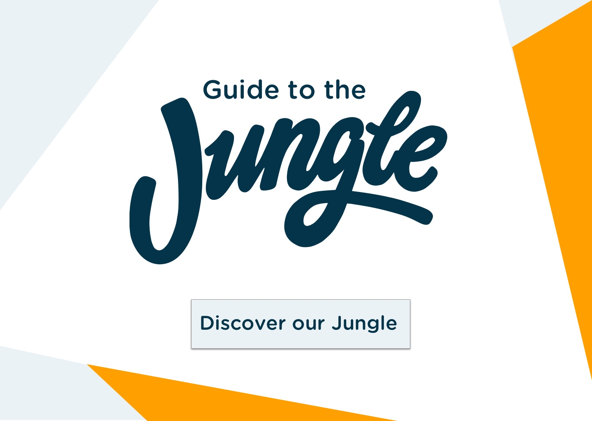
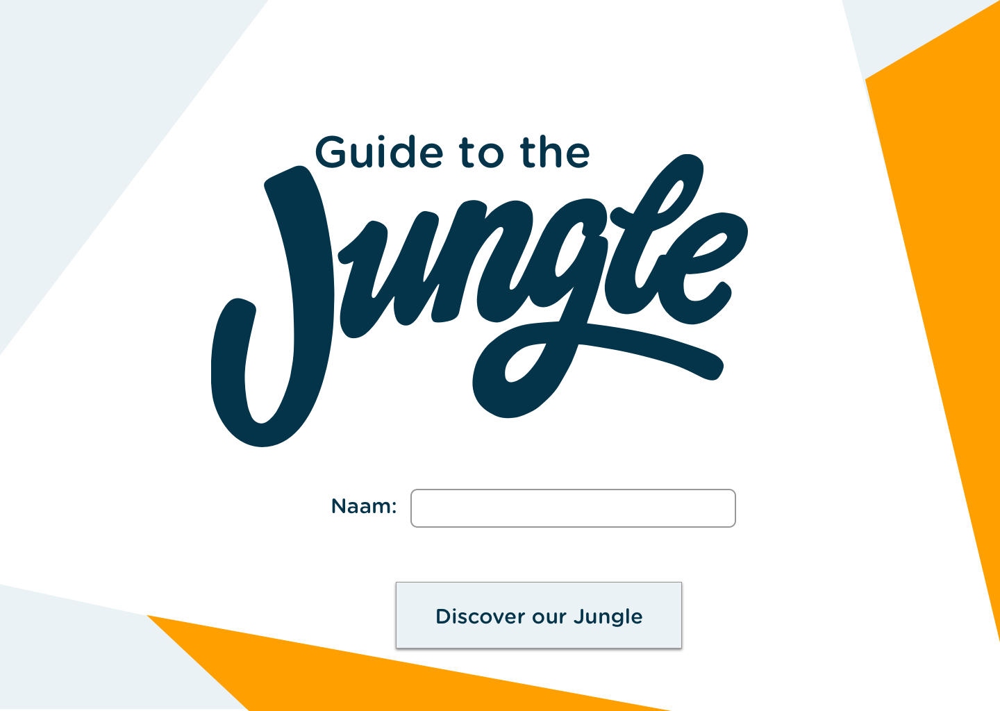
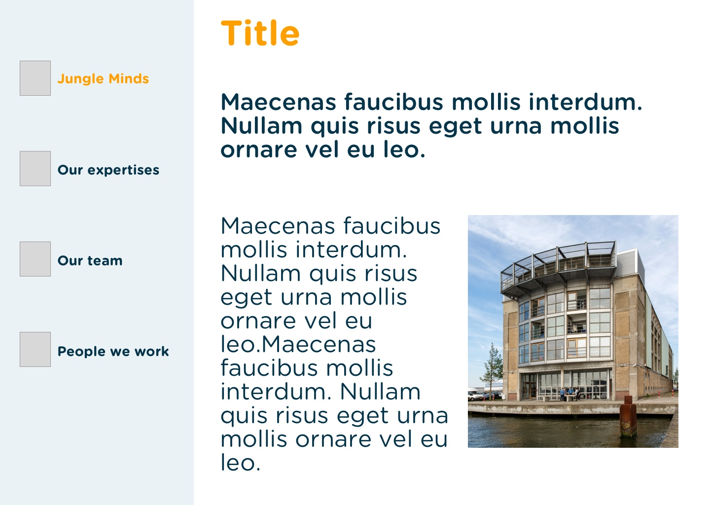
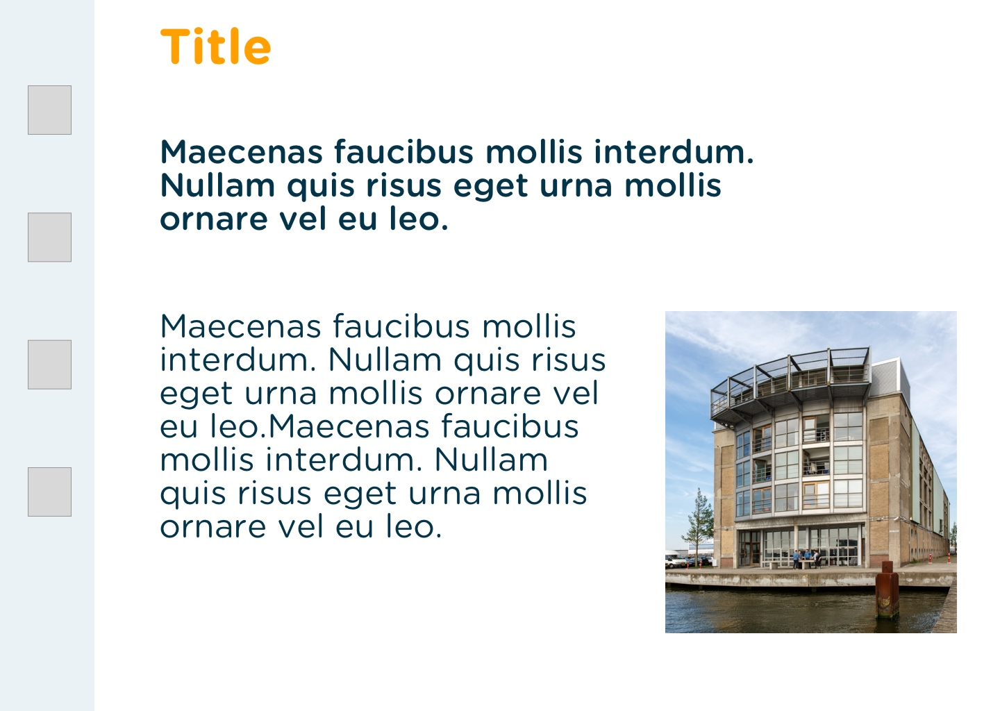
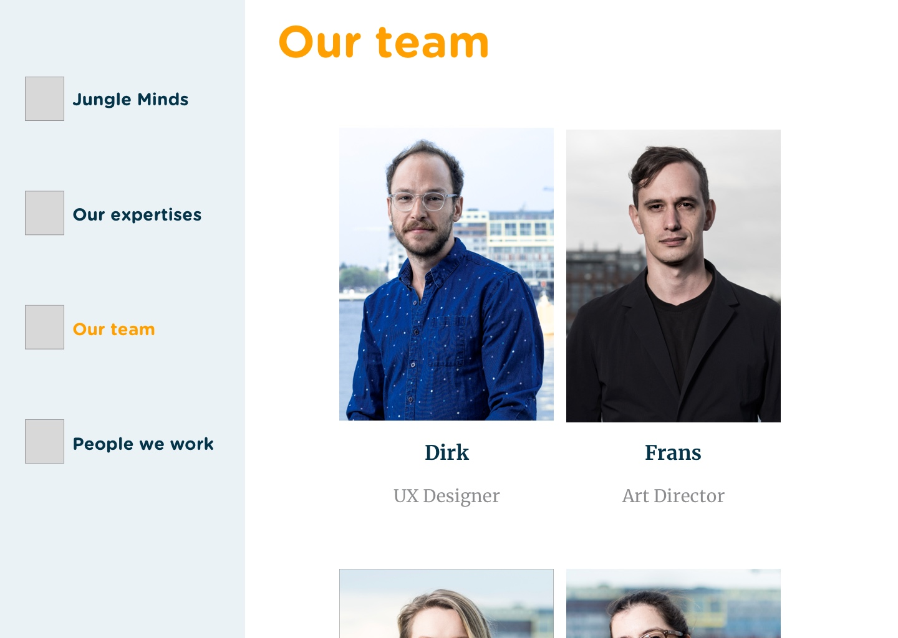

# 4.3 Prototype v0.3

## Prototype 

Vanaf prototype v0.3 ben ik begonnen met het gebruiken van de nieuwe huisstijl. Deze wordt beschreven in [4.2 Identiteit & merkbeleving](4.2-identiteit-and-merkbeleving.md#nieuwe-huisstijl). Tijdens heb bouwen van deze prototype ben ik bezig geweest met het testen van verschillende variaties die ik zal kunnen toepassen voor het eindproduct. 

* Introductie pagina

* Beginscherm: Jungle Minds pagina

  

* Our team pagina

* Our Team modal

## Expert review

Deze prototype heb ik door middel van een [Expert review](../6.5-prototype-tests/6.5.2-expert-review-v0.3.md) getest met een van de visual designers van Jungle Minds, die ook verantwoordelijk is voor de huidige en nieuwe huisstijl van het bedrijf. Hieruit heb ik de volgende inzichten gekregen:

* Gebruik alleen iconen als ze vanzelfsprekend zijn. Dus zonder de tekst moeten de iconen te begrijpen zijn. Daarnaast kreeg ik een vrije kaart om nieuwe iconen te ontwerpen \(in hetzelfde stijl\) als dat nodig zal zijn .
* Denk aan de hierargie van de items die in beeld komen.
* Beslis van te voren de content om te kunnen bepalen wat en waar elementen moeten komen.

### conclusie

De belangrijkste bevinding uit de Expert review was dat ik eerst mijn content zal moeten beslissen om vervolgens een goede ontwerp ervoor te kunnen maken. Echter, ben ik erg afhankelijk van het bedrijf om de content te krijgen. De content die het bedrijf beschikbaar heeft is vaak in het Nederlands, waardoor ik zelf zal moeten vertalen of zal moeten wachten tot de juiste persoon binnen Jungle Minds mij zal kunnen helpen ermee. Hierdoor zal ik tijdens mijn prototype vaak gebruik maken van "Lorem ipsum" of Nederlandse teksten. Tijdens het testen van de prototype met de doelgroep zal ik ervoor zorgen dat deze teksten allemaal in het Engels wordt. 

Daarnaast heb ik gekeken naar de beschikbare iconen en ik heb een selectie gemaakt van potentiële iconen die ik zal kunnen gebruiken voor de menu. Die heb ik daarna aan mensen gevraagd of ze de betekenis van wisten zonder dat er tekst bij zat en vaak kreeg ik een negatieve antwoord. Zelf iconen ontwerpen zal een oplossing kunnen zijn, maar vanwege tijdbeperkingen was dat voor mij geen oplossing. Hierdoor ben ik naar verschillende design patterns gaan kijken die mij een andere mogelijkheid boden voor de menu. 

