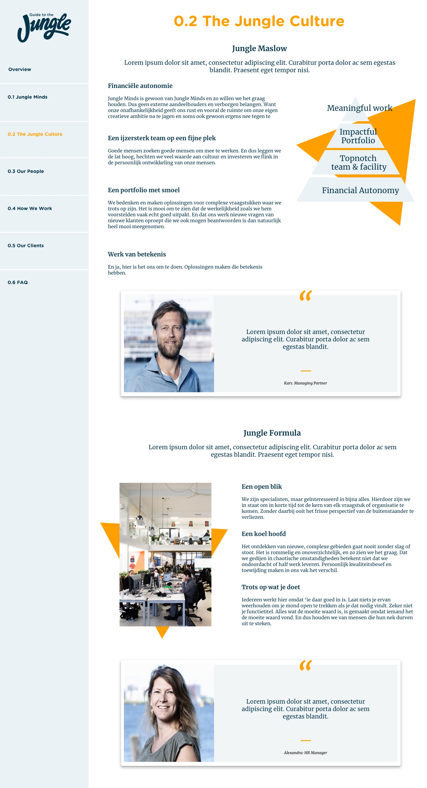
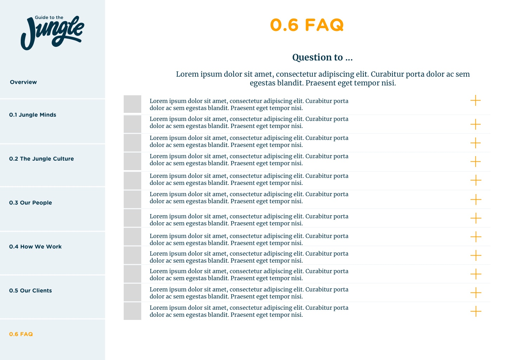

# 4.5 Prototype v0.5

## Prototype

Uitgaande van mijn vorige prototypes, mijn onderzoek en de onderzoeksvraag “Hoe kan een webapp ervoor zorgen dat nieuwe medewerkers van Jungle Minds de benodigde informatie over procedures en regels binnen het bedrijf verkrijgen, zodat er efficiënter met de inwerktijd wordt omgegaan?” heb ik prototype 0.5 van The guide to the Jungle gemaakt. 

Hier volgen de belangrijkste schermen van prototype 0.5:

### **Overview**

In afbeelding ... ziet u de visuele weergave van de overview pagina, dit is de homepage van het applicatie. In deze pagina ziet de gebruiker 6 onderwerpen. Deze pagina bestaat uit drie hoofdcomponenten, namelijk: 

* De pagina titel.
* Een sectie titel met een introductie tekst.
* Een verzameling van kaarten. 

De component van de verzameling van kaarten bestaat uit 6 kaarten. Elke kaart wordt gelinkt naar een andere pagina. Daarnaast bestaan die kaarten uit een plaatje die de sfeer weergeeft van waar het onderwerp over gaat, een titel van de desbetreffende pagina en een kleine omschrijving van wat de gebruiker kan verwachten van het onderwerp. Deze beschrijving bestaat uit een Nederlandse gezegde die letterlijk naar het Engels vertaald is. Hiervoor is er bewust gekozen om de app een toon of voice van fun te geven.

### **0.1 Jungle Minds**

In afbeelding ... ziet u de visuele weergave van de Jungle Minds pagina. In deze pagina worden de belangrijkste momenten van het bedrijf weergegeven in een vorm van een tijdlijn. Het verhaal begint in 2000 wanneer het bedrijf is opgericht en gaat tot de laatste belangrijke gebeurtenis, in dit geval is het 2017. Deze pagina bestaat uit de volgende componenten:

* De pagina titel.
* Een sectie titel met een introductie tekst.
* Een tijdlijn als een slider.
* De content van de desbetreffende jaartal:
  * Titel.
  * 3 Fotocollectie van het onderwerp.
  * Omschrijving van het onderwerp.
* Een quote van een van de medewerkers die een grote rol speelde binnen         de desbetreffende onderwerp:

  * Foto van de medewerker.
  * De quote over het onderwerp.
  * Modal met informatie over het persoon van de quote.

  

In deze pagina wordt er door middel van de tijdlijn slider de geschiedenis van het bedrijf weergegeven. Dit geeft de groei ambitie van het bedrijf aan en met de quotes van de medewerkers wordt er elke keer een persoonlijk verhaal verteld over hoe een persoon een project ervaren heeft of wat hij of zij er zo leuk aan vond. Door deze verhalen te kunnen lezen kan de gebruiker zich beter inleven in het onderwerp. Daarnaast maken deze verhaaltjes het makkelijk voor een nieuwe medewerker naar een collega toe te stappen en een praatje te maken. De foto van de quote is klikbaar. Wanneer erop geklikt wordt, opent  er een modal met informatie over de desbetreffende medewerker.. Dit gebeurt overigens bij elke quote. Zie afbeelding 6 voor de visuele weergave. 

### **0.2 The Jungle Culture**

In The Jungle Culture pagina wordt de cultuur van Jungle Minds beschreven. Hier worden belangrijke begrippen van het bedrijf uitgelegd. De Cultuur van Jungle Minds bestaat uit twee delen. Het eerste deel gaat over de Jungle Maslow. Dit is een piramide die laat zien hoe het bedrijf gevestigd is.  Elk aspect van de piramide wordt uitgelegd in de tekst component. Het tweede gedeelte gaat over de Jungle Formule. Hierin worden de verwachtingen voor een medewerker van Jungle Minds in kaart gebracht. Deze pagina bestaat uit de volgende componenten:

* De pagina titel.
* Een sectie titel met een introductie tekst:
* Tekst met plaatje:
  * Tekst wordt links gealigned:
    * Subtitel.
    * Tekst.
  * Plaatje wordt rechts gealigned:
    * Plaatje.
    * Bijschrift.
* Een quote van een van de medewerkers die een grote rol speelde binnen     de desbetreffende onderwerp.
  * Foto van de medewerker.
  * De quote over het onderwerp.
  * Modal met informatie over het persoon van de quote.

Wanneer de pagina uit meerdere delen bestaat, wordt de component \(tekst met plaatje\) om en om links of rechts gealigned.  Zie afbeelding ... voor de visuele weergave van deze pagina. 

### **0.3 Our People**

In de Our People pagina wordt er per expertise binnen het bedrijf uitgelegd wat het inhoudt en worden de medewerkers weergegeven die voor de betreffende expertise werken. Zie afbeelding ... voor de visuele weergave van Our People pagina. Deze pagina bestaat uit de volgende componenten:

* De pagina titel.
* Een sectie titel met een introductie tekst.
* Een dropdownmenu, keuze uit de expertises.
* Subtitel met de naam van de expertise.
* Korte omschrijving van de expertise.
* Medewerker kaart: 

  * Foto van Medewerker.
  * Naam van medewerker.
  * Modal met informatie over de medewerker.

  

### **0.4 How We Work**

In de How We Work pagina wordt er uitgelegd hoe Jungle Minds te werk gaat met hun projecten. Zie afbeelding 9 voor de visuele weergave van deze pagina. Deze pagina bestaat uit de volgende componenten:

* De pagina titel.
* Een sectie titel met een introductie tekst.
* Tekst met plaatje:
  * Tekst wordt links gealigned:
    * Subtitel.
    * Tekst.
  * Plaatje wordt rechts gealigned:
    * Plaatje.
    * Bijschrift.
* Plaatje
* Tekst met plaatje:
  * Tekst wordt links gealigned:
    * Subtitel.
    * Tekst.
  * Plaatje wordt rechts gealigned:
    * Plaatje.
    * Bijschrift.
* Een quote van een van de medewerkers die een grote rol speelde binnen     de desbetreffende onderwerp.
  * Foto van de medewerker.
  * De quote over het onderwerp.
  * Modal met informatie over het persoon van de quote.
  * Een sectie titel met een introductie tekst.

Wanneer de pagina uit meerdere delen bestaat, wordt de component \(tekst met plaatje\) om en om links of rechts gealigned.  Zie afbeelding ... voor de visuele weergave van deze pagina.

**0.5 Our Clients**

In afbeelding 10 ziet u de visuele weergave van de Our Clients pagina. In deze pagina worden al onze klanten weergegeven waar Jungle Minds voor heeft gewerkt. Daarnaast worden er reviews over Jungle Minds weergegeven in de vorm van een beschrijving, deze reviews zijn door een aantal partners geschreven.  Deze reviews zullen de sociale kant van het bedrijf weergeven en tegelijkertijd ook de formaliteit naar klanten toe. 

Deze pagina bestaat uit de volgende componenten:

* De pagina titel.
* Een sectie titel met een introductie tekst.
* Een quote vanuit het bedrijf
* Een lijst met de klanten van Jungle Minds
* Verschillende quotes vanuit de partners van Jungle Minds.

### **0.6 FAQ**

In de FAQ pagina worden de meest voorkomende vragen weergeven. Zie afbeelding 11 voor de weergave ervan. In deze pagina worden er een selectie van 15 vragen weergegeven die medewerkers vaak stellen. Deze worden in een harmonica menu weergegeven en wanneer er op geklikt wordt klapt het open en krijgt de gebruiker het antwoord te zien met daarbij de bijbehorende persoon die over dat onderwerp gaat.  Deze pagina bestaat uit de volgende componenten:

* De pagina titel.
* Een sectie titel met een introductie tekst.
* Harmonica menu 
  * Vragen met antwoorden

## Expert review

Deze prototype heb ik door middel van een Expert review getest met een van de visual designers van Jungle Minds. Hieruit heb ik de volgende inzichten gekregen:

* Test 

### conclusie

De belangrijkste bevinding uit de

