# 4.6 Prototype v.0.7

## Prototype

Uitgaande van mijn vorige prototypes en mijn Expert review met de opdrachtgever heb ik het concept kunnen veranderen naar een product waar het bedrijf echt wat aan heeft.  

Hier volgen de schermen van prototype versie 0.7:

### Overzicht

In afbeelding 109 ziet u de visuele weergave van de overzicht pagina, dit is de homepage van het applicatie. In deze pagina ziet u de gebruiker 6 onderwerpen. Deze pagina bestaat uit drie hoofdcomponenten, namelijk: 

* De pagina titel.
* Een sectie titel met een introductie tekst.
* Een verzameling van kaarten. 
  * Elke module wordt per week vrijgegeven.

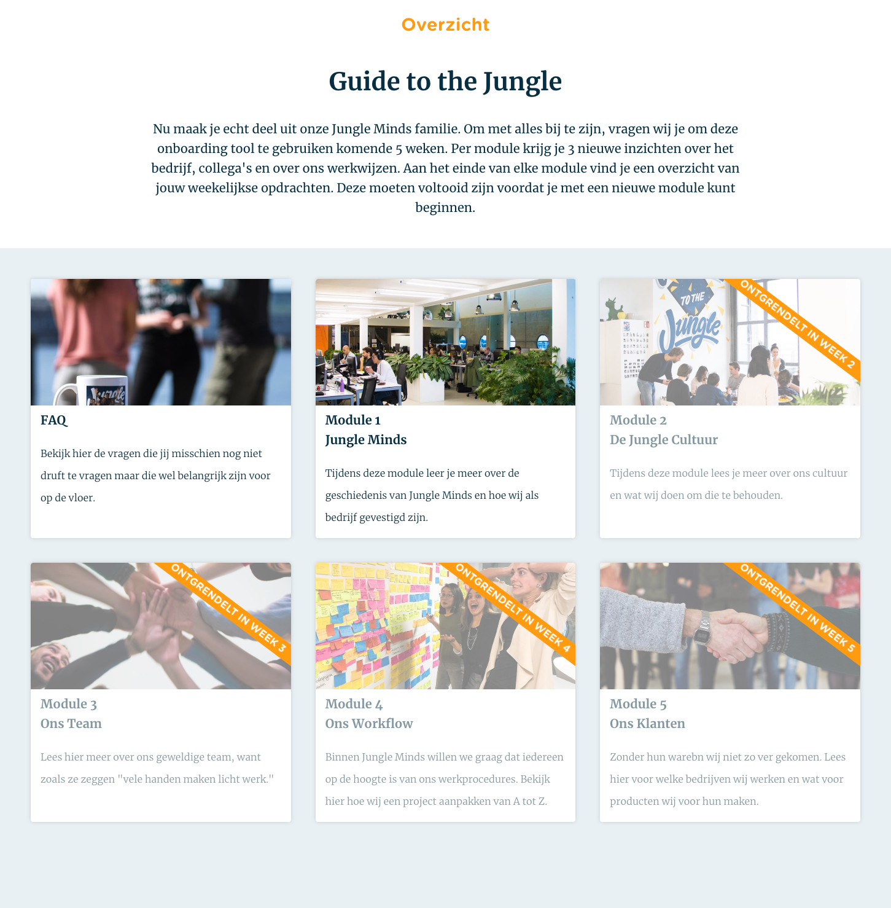

### FAQ

Bij dit pagina worden de meeste gestelde vragen weergegeven. Dit zijn vragen met betrekking tot de rooster, uren en 

### Module 1

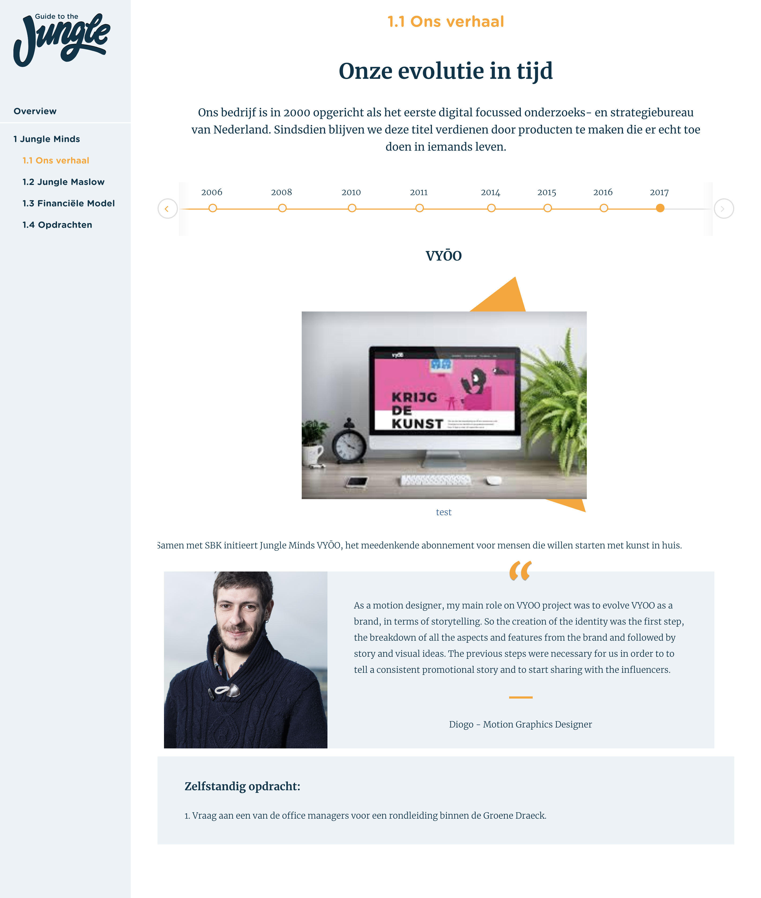

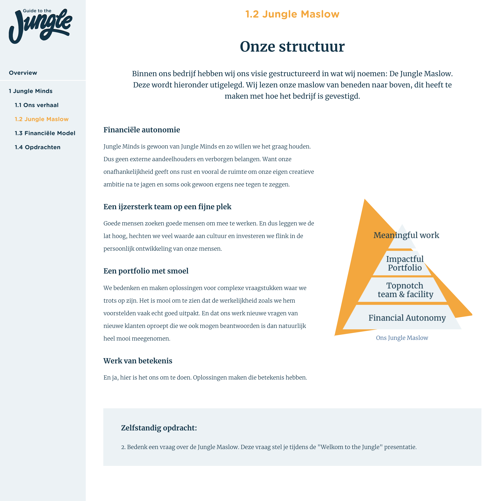

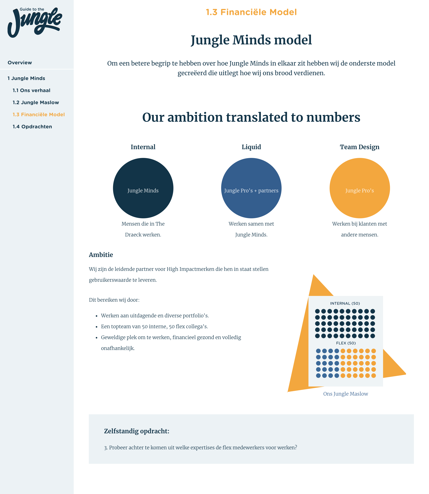

### Module 2

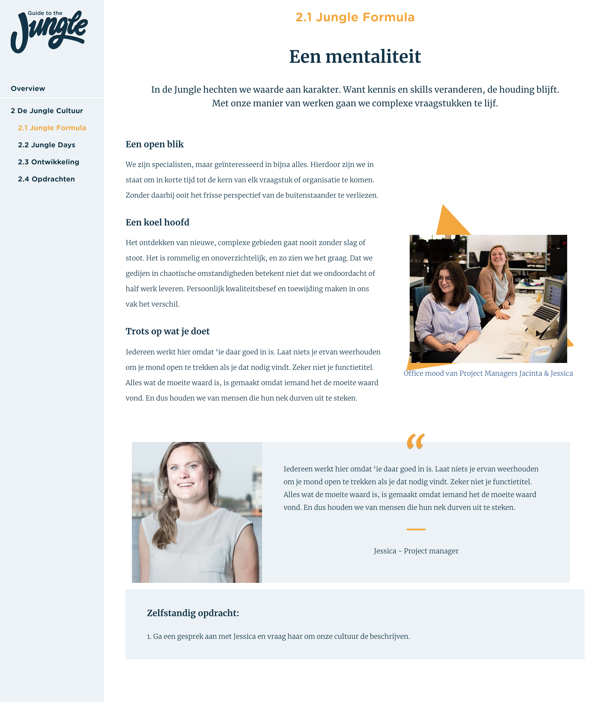

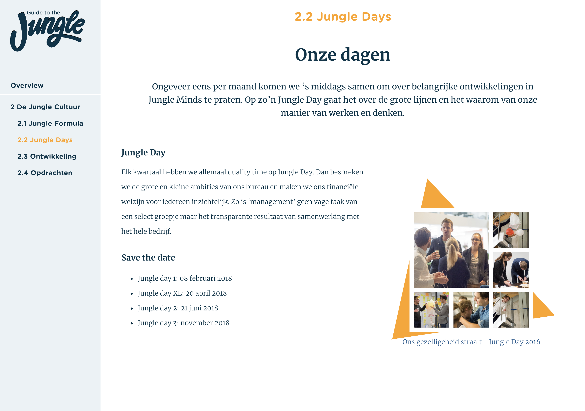

### Module 3

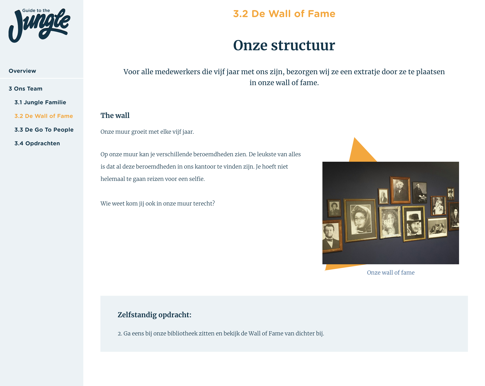

### Module 4

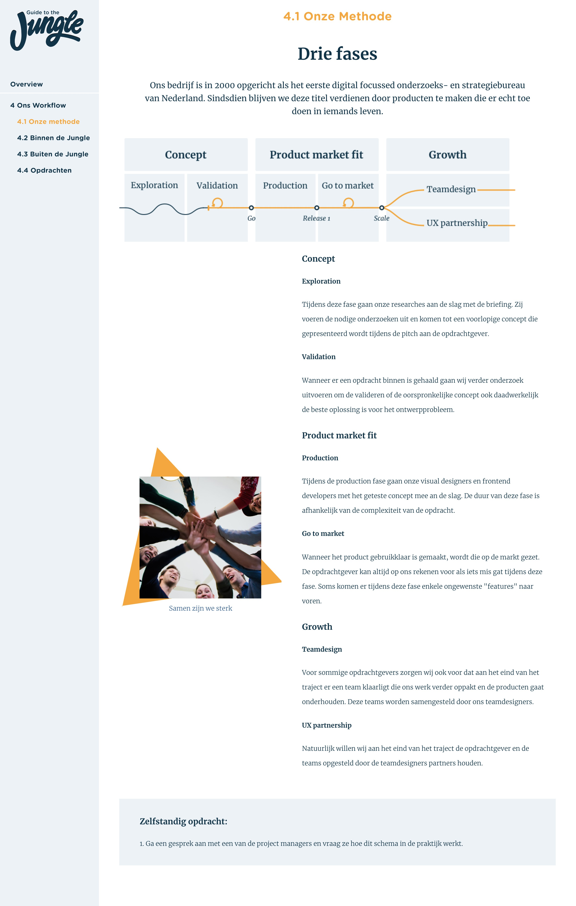

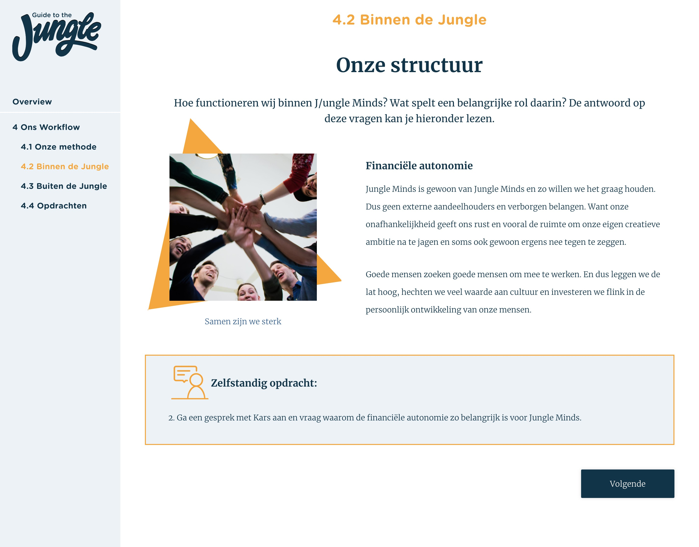

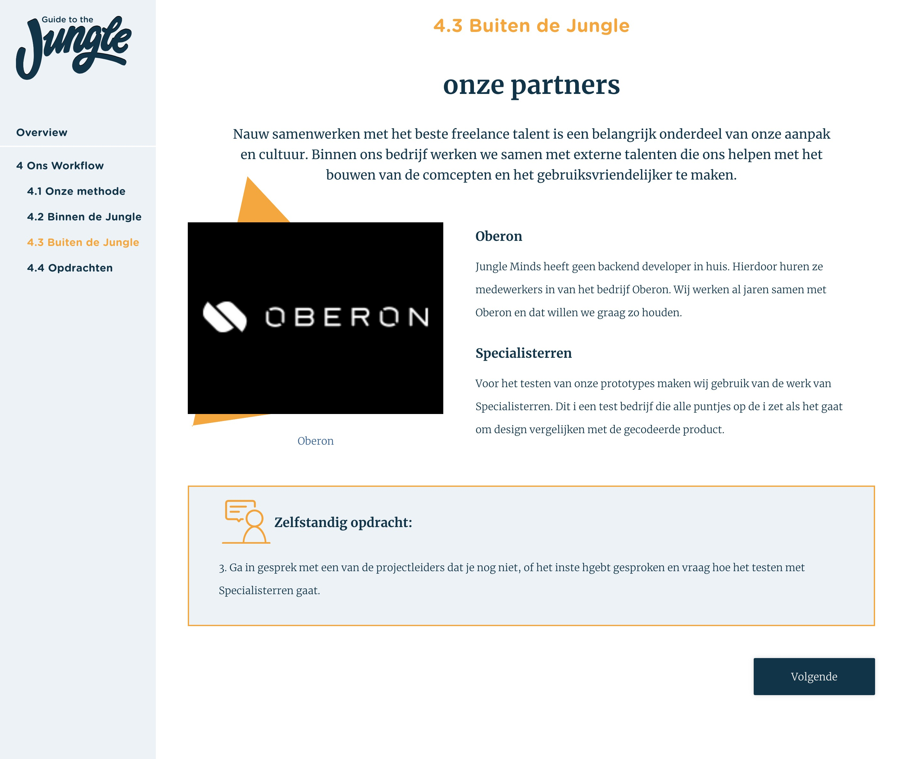

### Module 5

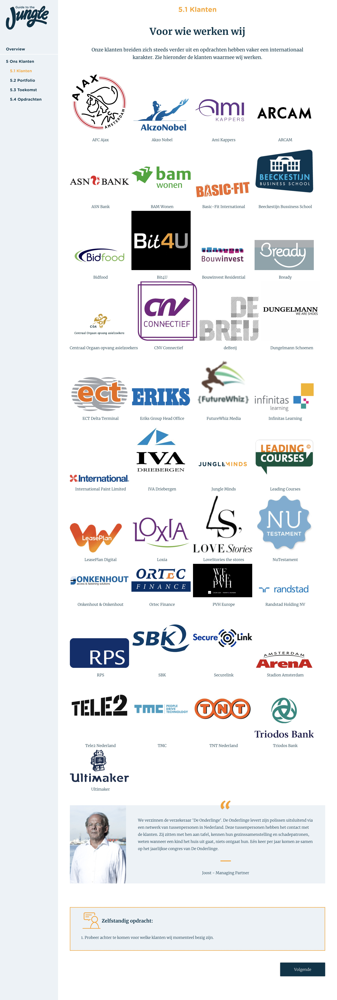

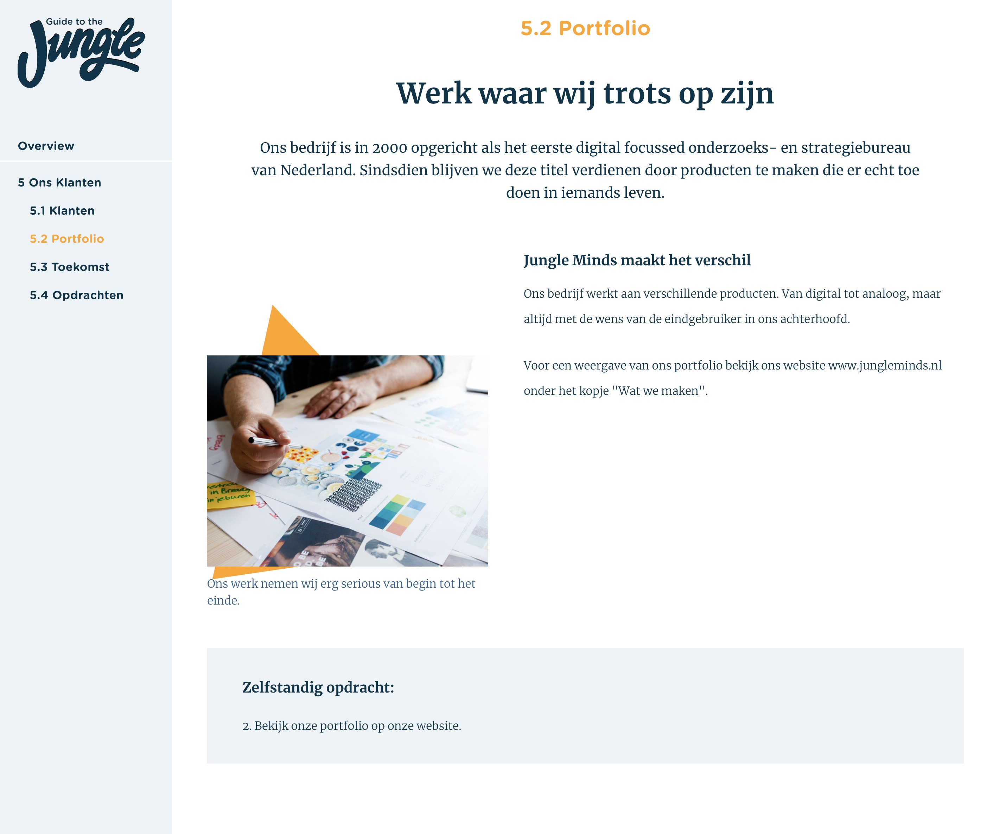

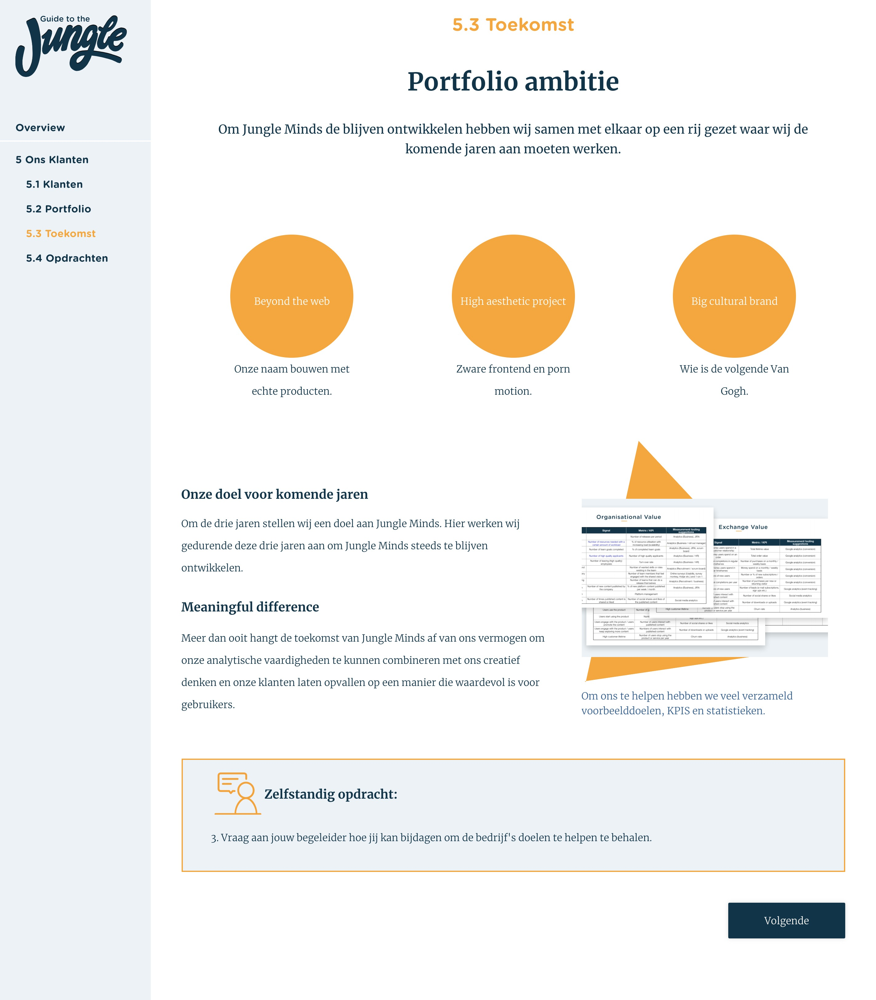

  

Prototype v0.6

Code:[React Router: Declarative Routing for ReactLearn once, Route Anywherereacttraining.com](https://reacttraining.com/react-router/web/api/NavLink)

Navigation menu &lt;NavLink&gt; \(https://reacttraining.com/react-router/web/api/NavLink\)

## Usability testing

Gedurende mijn project waren er geen nieuwe medewerkers aangenomen voor Jungle Minds, hierdoor heb ik mijn prototype getest met 2 personen die buiten Jungle Minds werken, maar wel de rol hebben van een nieuwe medewerker in een andere bedrijf en ik heb het getest met de twee meeste recente medewerkers van Jungle Minds. 

Uit de [testresultaten](../6.5-prototype-tests/6.5.4-usability-testing-v.0.7.md) van de medewerkers van Jungle Minds kreeg ik de volgende belangrijke inzichten:

* Er is veel meer tekst dan plaatjes, echter ervoeren de testers het niet als vervelend om te lezen. Door de teksten verdeeld is in verschillende hoofdstukken oogt het minder te zijn waardoor je makkelijker doorheen leest.
* De verhalen over de ervaringen van collega’s binnen projecten of gebeurtenisen van Jungle Minds was onverwacht voor de medewerkers. Echter, vonden ze het erg leuk om te lezen. Hierdoor kregen ze nieuwe inzichten van collega’s.
* De twee testpersonen gaven aan dat ze veel informatie herkende van de website of het “Welkom to the Jungle” boekje. Echter, gaven ze ook aan dat niet elke nieuwe medewerker van deze informatie bronnen bewust is.Ondanks dat veel informatie te vinden was op de website of het boekje, vonden de testpersonen dat de informatie van de gids informatiever en uitgebreider was en dat ze meer inzichten kregen doordat de toegevoegde elementen als foto’s, quote’s en tijdslijn. 
* Testers gaven het idee om elke module te sluiten met een mini quiz. Ze gaven aan dat het dan veel serieuzer wordt genomen en dat de informatie die wordt verteld beter blijft hangen.

### conclusie

De belangrijkste bevinding uit de Usability testing is dat de flow van de tool goed wordt begrepen en ervaren. Echter zijn er sommige onderdelen van de tool die beter moeten ogen, onderdelen als de zelfstandig opdrachten en de FAQ vakje. Zie "[3.3 Inspiratie patters](../3.-concept/3.3-inspiratie-patterns.md#patterns-voor-v-0-5-greater-than)" voor mijn onderzoek naar de patterns van deze elementen. 

