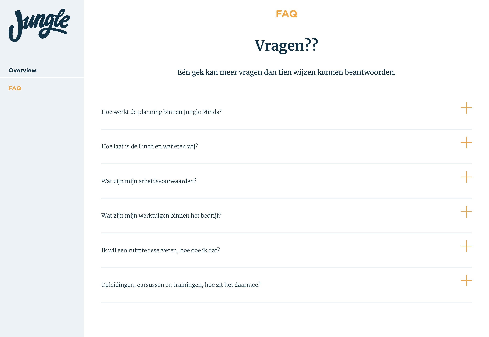

# 4.6 Prototype v0.7

## Prototype

### Overzicht

### FAQ

### Module 1

### Module 2

### Module 3

### Module 4

### Module 5

  

Prototype v0.6

Code:[React Router: Declarative Routing for ReactLearn once, Route Anywherereacttraining.com](https://reacttraining.com/react-router/web/api/NavLink)

Navigation menu &lt;NavLink&gt; \(https://reacttraining.com/react-router/web/api/NavLink\)

