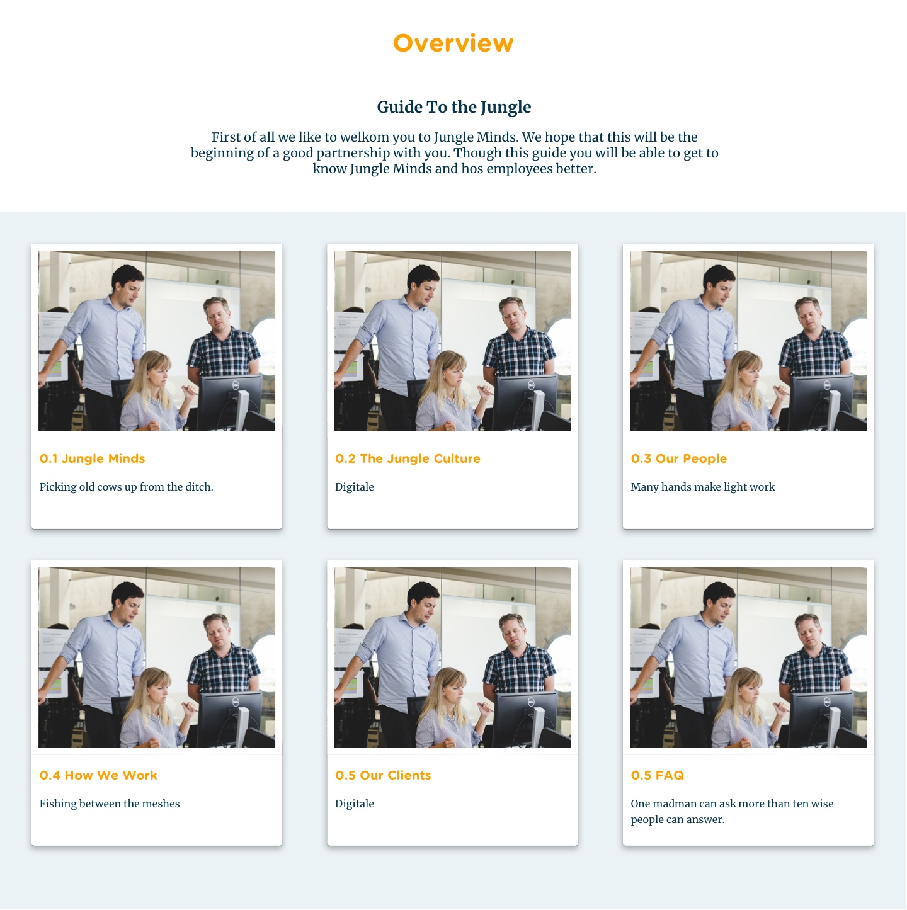
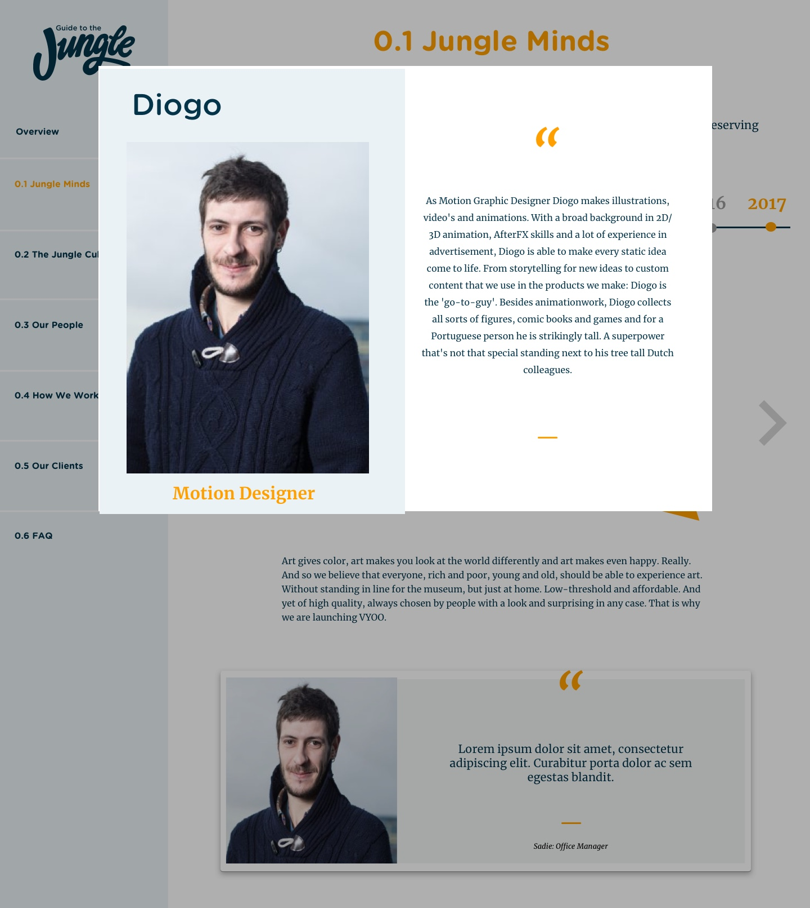

# 4.6 Prototype v0.7

## Prototype

### Overzicht

### 0.1

### 0.2

### 0.3

### 0.4

### 0.5

### FAQ

Prototype v0.6

Code:[React Router: Declarative Routing for ReactLearn once, Route Anywherereacttraining.com](https://reacttraining.com/react-router/web/api/NavLink)

Navigation menu &lt;NavLink&gt; \(https://reacttraining.com/react-router/web/api/NavLink\)

