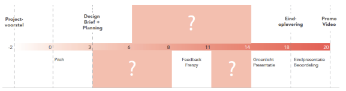
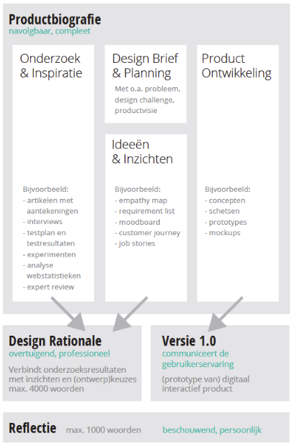

# 5.1 Inleiding

Binnen mijn afstudeerproces zijn er een aantal mijlpalen vastgezet waarbij ik een aantal opleveringen moet doen. Zie afbeelding ... voor de weergave van het gehele proces. 

Zie hieronder een lijst van deze opleveringen met een korte toelichting erover:

| **Wanneer** | **Mijlpaal** | **Wie** | **Toelichting** |
| --- | --- | --- | --- | --- | --- | --- |
| Week -2 \(22 jan\) | [Projectvoorstel](5.2-projectvoorstel.md) | Afstudeercoördinator kijkt of het voorstel af is. | Dit voorstel schrijf je bij het online vak afstudeervaardigheden |
| Week 1 of 2    \(12 feb\) | [Pitch projectvoorstel](5.3-pitch-projectvoorstel.md) | Pitch eerste & tweede lezer          Go / Go mits / No go | Geef een korte \(1-2 min.\) pitch van je project en er wordt gekeken of je project aan de eisen voldoet. |
| Week 3 \(19 feb\) | [Design Brief](5.4-design-brief.md) + [Planning](5.5-planning.md) | Eerste lezer & Afstudeercommissie  Go / Go mits / No go | De criteria waarnaar wordt gekeken, staan bij het inleverpunt. |
| Week 8  \(09 apr\) | [Feedback Frenzy ](5.6-feedback-frenzy.md)   | Een grote groep medestudenten en begeleiders | Presenteer je concepten/ontwerpen en verzamel feedback op punten waar je zelf over twijfels hebt of niet uitkomt. |
| Week 14 \(14 mei\) | [Groenlicht presentatie](5.7-groenlicht-presentatie.md) | Eerste & tweede lezer  Groen / Rood / Oranje | Lever ruim vantevoren al je werk in bij de begeleiders en presenteer in 10-15 minuten je project. Sluit af met een planning voor de laatste weken. Je krijgt feedback op basis van de eindcriteria van het project. |
| Week 18 \(04 jun\) | [Eindoplevering](5.8-eindoplevering.md) | Eerste & derde lezer  Voorlopige beoordeling | Lever alles digitaal in. Zie afbeelding ... |

