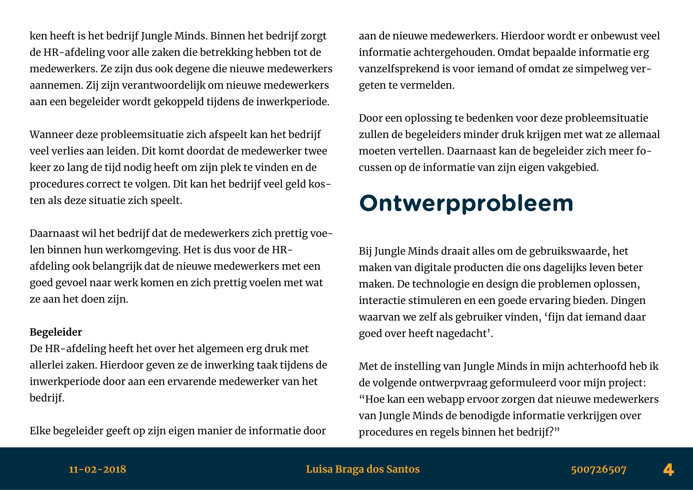
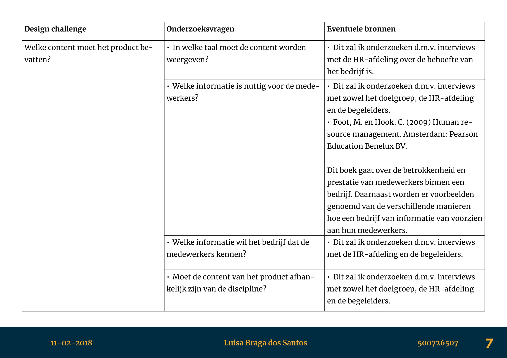

# 5.2 Projectvoorstel

Mijn projectvoorstel heb ik gemaakt aan de hand van de verschillende opdrachten die ik heb gemaakt tijdens het vak afstudeervaardigheden. De opdrachten daarvan kunt zien door de klikken op de volgende links: Opdracht 1 & 2, Opdracht 3: Methodes en Opdracht 4: Rapporteren en Valideren.

## Afstudeervaardigheden

### Afbakenen en oriënteren

De opdracht is te vinden op [Moodle - Opdracht 1](https://moodle.cmd.hva.nl/mod/page/view.php?id=14922)

Mijn ingestuurde opdracht 1 & 2 is te downloaden op: [https://mega.nz/\#!MnYmRRDI!1UAvEkfLqVZ1-vhmNJNns1CtUbpIMUIPkM3fIKC9oEo](https://mega.nz/#!MnYmRRDI!1UAvEkfLqVZ1-vhmNJNns1CtUbpIMUIPkM3fIKC9oEo)

### Opdracht 2: Bronnen

De opdracht is te vinden op [Moodle - Opdracht 2](https://moodle.cmd.hva.nl/mod/page/view.php?id=14923)

Mijn ingestuurde opdracht 1 & 2 is te downloaden op:   
[https://mega.nz/\#!MnYmRRDI!1UAvEkfLqVZ1-vhmNJNns1CtUbpIMUIPkM3fIKC9oEo](https://mega.nz/#!MnYmRRDI!1UAvEkfLqVZ1-vhmNJNns1CtUbpIMUIPkM3fIKC9oEo)

### Opdracht 3: Methodes

De opdracht is te vinden op [Moodle - Opdracht 3](https://moodle.cmd.hva.nl/mod/page/view.php?id=14928)

Mijn ingestuurde opdracht is te downloaden op: [https://mega.nz/\#!tzI3TA4b!35LuWr7IsFpFUoXteeVx77JKkpZHypjBTaoJNBSYGS4](https://mega.nz/#!tzI3TA4b!35LuWr7IsFpFUoXteeVx77JKkpZHypjBTaoJNBSYGS4)

### Opdracht 4: Rapporteren en Valideren

De opdracht is te vinden op [Moodle - Opdracht 4](https://moodle.cmd.hva.nl/mod/page/view.php?id=14932)

Mijn ingestuurde opdracht is te downloaden op:   
[https://mega.nz/\#!B2IhCbIA!1JC-eNdysyzqTynXcSlqytp9r-9RYV674upyYQZa59k](https://mega.nz/#!B2IhCbIA!1JC-eNdysyzqTynXcSlqytp9r-9RYV674upyYQZa59k)

## Projectvoorstel

De projectvoorstel is te downloaden op:   
[https://mega.nz/\#!17JwzAxB!zdm7nmCfMDGQzEjbPBF\_eu6iEfioCiL5LaPLjgZDNm4](https://mega.nz/#!17JwzAxB!zdm7nmCfMDGQzEjbPBF_eu6iEfioCiL5LaPLjgZDNm4)

