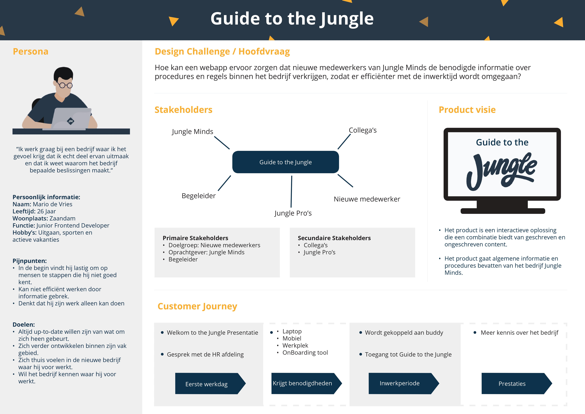
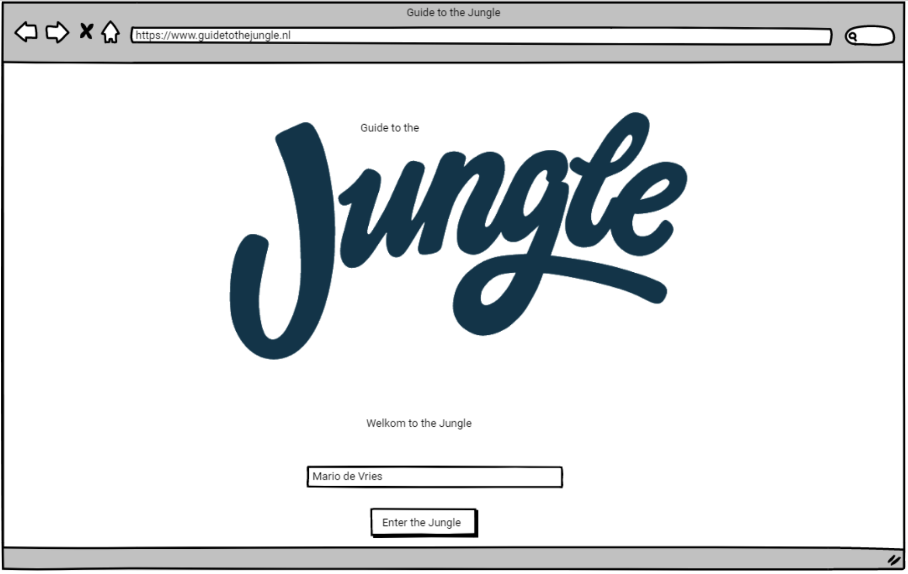

# 5.6 Feedback Frenzy

## Poster

De poster is te downloaden op:  
[https://mega.nz/\#!suoBSaqZ!M18SI8yi30LZbiDM3S0yZcYabgnttokip-IHpH6g2kA](https://mega.nz/#!suoBSaqZ!M18SI8yi30LZbiDM3S0yZcYabgnttokip-IHpH6g2kA)

## Lo-fi prototype

Voor de feedback Frenzy heb ik een lo-fi prototype gemaakt, zie afbeelding ..., om de richting van mijn product te kunnen aantonen. De prototype gaf een beeld van de content die terug zal komen in het eind product en de mogelijke weergave van de content. Een interactieve versie van deze prototype is te vinden op [https://invis.io/K4GQM0HC9F2\#/289913261\_home](https://invis.io/K4GQM0HC9F2#/289913261_home). Voor meer uitleg over de prototype zie [4.2 Prototype v.01](../4.-ontwerpfase/4.2-prototype-v.0.1.md).

## Feedback 

Tijdens de feedback Frenzy heb ik goed nagedacht om op welke aspect ik graag feedback op zal willen krijgen van de medestudenten en de docenten. Omdat tijdens deze fase nog erg gefocust was op het onderzoekgebied wilde ik voornamelijk feedback en ideeën krijgen over welke informatie het product moet bevatten en hoe ik deze informatie zal kunnen vertalen naar het product. Dit waren mijn vragen:

* Wat zou jij willen weten van het bedrijf die je gaat werken? \(Als een nieuwe medewerker\)
* Hoe zorg je ervoor dat de inhoud van het product interessant blijft voor de gebruiker?

### Vraag 1:

Wat zou jij willen weten van het bedrijf die je gaat werken? \(Als een nieuwe medewerker\)

Dit waren de antwoorden op vraag 1:

| Praktische informatie als werktijden, printers en lunch. |
| --- | --- | --- | --- | --- |
| Procedures van het bedrijf. |
| Bij wie kan ik terecht als ik een vraag heb die buiten de FAQ valt.  |
| Wie is wie bij het bedrijf. |
| Welke software het bedrijf gebruikt en waarvoor het dient. |

### Vraag 2: 

Hoe zorg je ervoor dat de inhoud van het product interessant blijft voor de gebruiker?

Dit waren de antwoorden op vraag 2:

| Veel illustraties en animaties maakt het begrijpen makkelijker. Vooral als je wat saais moet lezen. |
| --- | --- | --- | --- | --- | --- |
| Filmpjes bekijken is leuker dan het lezen van een tekst. |
| Teksten kort maar krachtig maken. |
| Wellicht een interactieve video maken. |
| Misschien ook kleine quiz toevoegen tussendoor, zodat de gebruiker het beter onthoudt.  |
| Grote stukken tekst ontleden in kleinere paragraven. |

### Docent Eerste lezer

Mijn eerste lezer heeft naast het beantwoorden van mijn feedback vragen ook algemene feedback gegeven over mijn voorlopige proces:

| Koppel zo snel mogelijk het product met de gewenste huisstijl van Jungle Minds |
| --- | --- | --- | --- | --- |
| Ik zie een potentiële product: je maakt een instrument die medewerkers verbindt aan de organisatie. |
| Opnames van medewerkers die laten zien hoe trots ze zijn op het bedrijf. |
| De gebruiker het gevoel laten krijgen "Leuk dat deze mijn collega's zijn". |
| Tone of voice moet een warme gevoel geven. |

### Docent tweede lezer

Mijn tweede lezer heeft naast het beantwoorden van mijn feedback vragen ook algemene feedback gegeven over mijn voorlopige proces:

| Een vertel vertellen over "de eerste keer" wordt altijd als leuk ervaart, daarnaast maakt het mensen ook meer benaderbaarder. |
| --- | --- | --- | --- | --- | --- | --- | --- | --- |
| Hou het persoonlijk. |
| Denk aan leuke titels als: "Most \(not\) stupid questions asked in the Jungle" |
| Vertel het verhaal met zinnen als "Maikel zegt ....." |
| Probeer zoveel mogelijke ervaringen van de collega's erin te krijgen. Dit zorgt ervoor dat het leuk blijft naast dat het informatieve saaie gedeelte. |
| Denk aan een kleine gamification met vragen. |
| Begin met het bouwen van je prototype om het te kunnen testen.  |
| Test je prototype met bijvoorbeeld 4 nieuwe medewerkers. Als het bedrijf zelf geen nieuwe medewerkers aanneemt, vraag of je een personen kan gebruiken die mogelijk nieuwe medewerkers kunnen spelen.  |
| Controleer met het bedrijf of de inhoud klopt. |

## Conclusie

Uit de verkregen feedback heb ik kunnen concluderen dat het product moet een goede balans bevatten tussen geschreven en ongeschreven tekst. Voorbeelden van hoe dit opgelost kan worden zijn door video's te gebruiken, kort maar krachtige teksten schrijven en grote stukken teksten te ontleden in kleinere paragraven. 

Daarnaast heb ik van mijn tweede lezer te horen gekregen dat ik nu zo snel mogelijk moet beginnen met het bouwen van prototypes. Dit komt doordat ik tijdens het bouwen ervan meer vragen zal opwekken door het te itereren en het te testen met de doelgroep.

