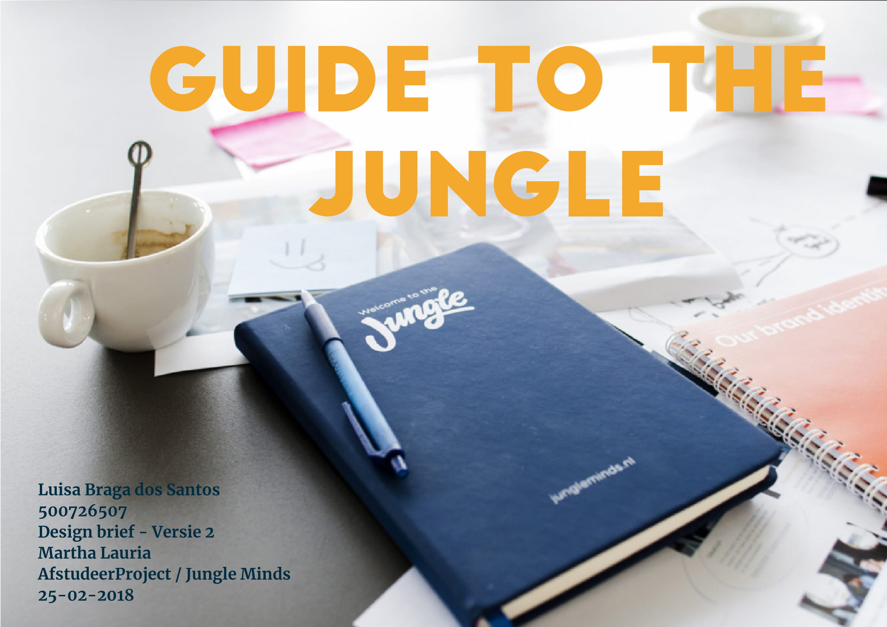
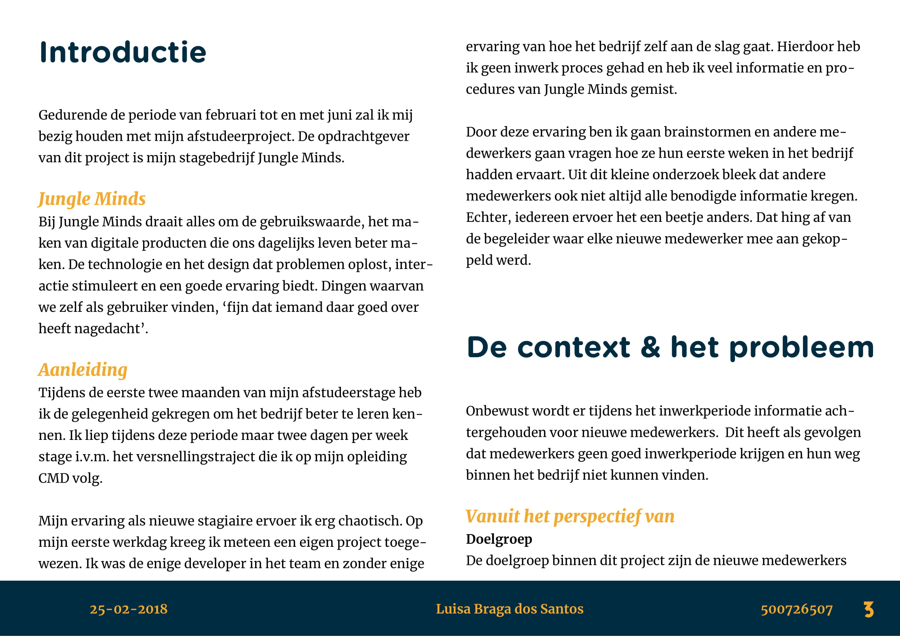
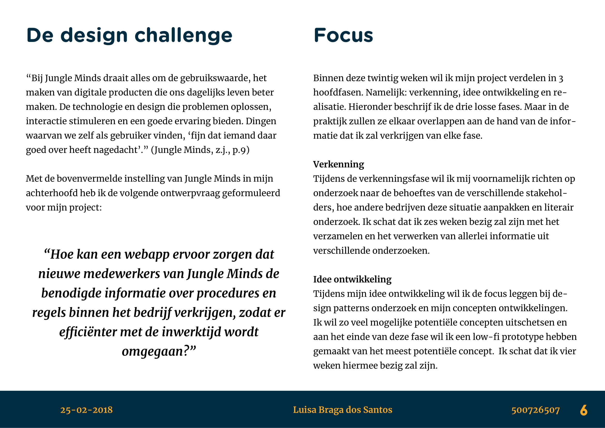
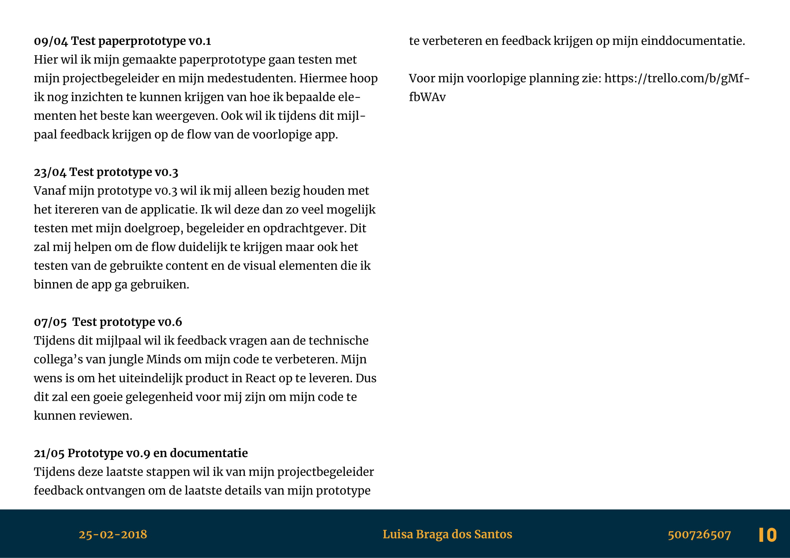
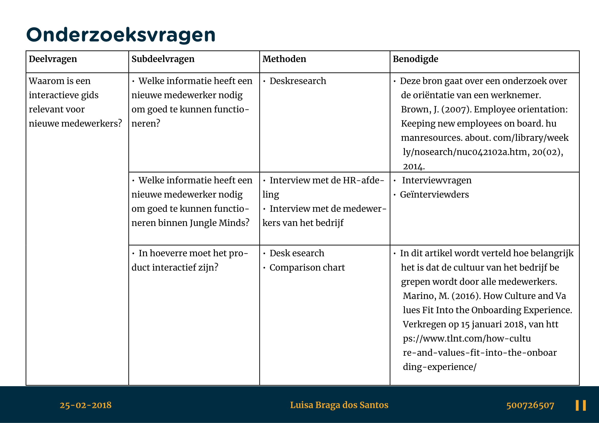
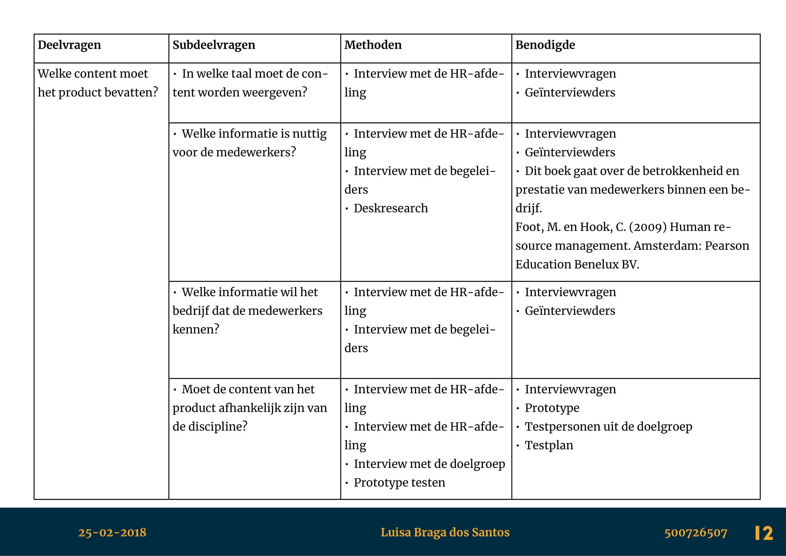
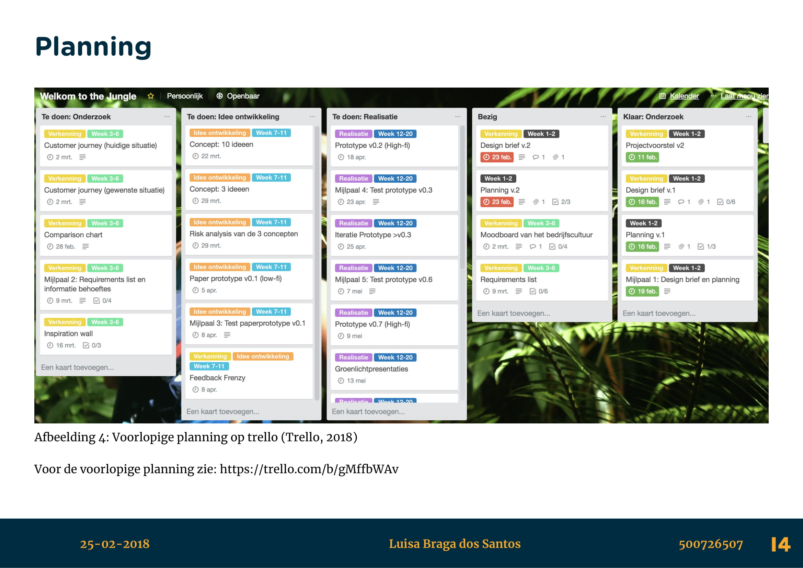

# 5.4 Design Brief

In de derde week van de afstudeerproject hebben wij een designbrief moeten inleveren met een bijbehorende planning van het project. Voor het maken van de design brief en de planning hebben we op mijn studie twee workshops gevolgd die ons hiermee hielpen. 

### Feedback 

Tijdens het inleveren van een eerste versie van de designbrief heb ik feedback ontvangen van een klasgenoot en mijn eerste lezer:

**Feedback van Kimberley Toredjo**

* Let op taal en vakjargon.
* Er wordt bij de stakeholders niet besproken over aannames die ik verder wil zoeken.
  * Geen aan hoe je op deze informatie bent gekomen.
  * Wat heb je gedaan.
  * Misschien gebruik maken van bronnen als dat het geval is.
* Er wordt niet verteld hoe overtuigd ik als designer ben met mijn oplossing.
  * Wel over hoe effectief het is voor de stakeholders.

**Feedback van Martha Lauría**

* Ook denken aan effecten van de maatschappelijke trends binnen mijn project
* Aangeven dat ik de behoeftes van de stakeholders heb geverifieërd.
* Duidelijker aangeven wanneer het product is geslaagd.
* Zijn er andere 'best practices' voorbeelden die ik ook zal kunnen gebruiken?
* Aangeven in hoeverre ik al overtuigd ben dat het eindproduct een goed oplossing is.
* TIP: Afspraken op tijd inplannen om te kunnen testen met de begeleider en medestudenten.

## Designbrief

De laatste versie van de designbrief is te downloaden op:   
[https://mega.nz/\#!wj5VzCoa!79Uh9W3Nn4rWdrpX4qFrVhngJ4gUd6AkNmxCoNWJZn4](https://mega.nz/#!wj5VzCoa!79Uh9W3Nn4rWdrpX4qFrVhngJ4gUd6AkNmxCoNWJZn4)

