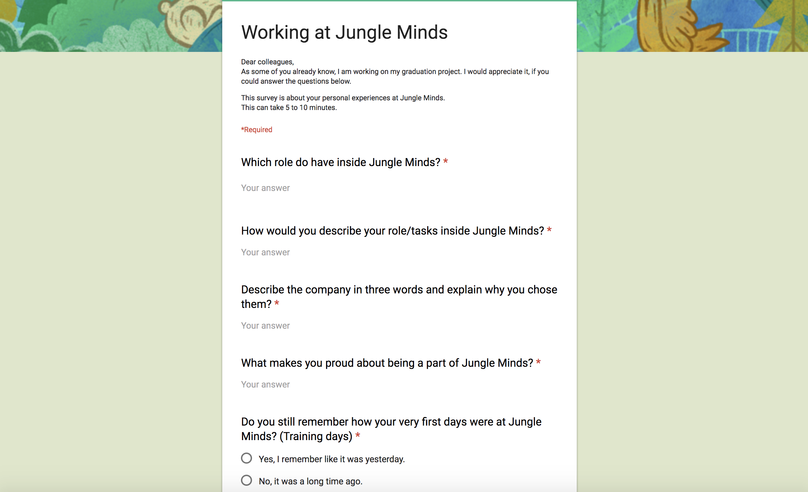
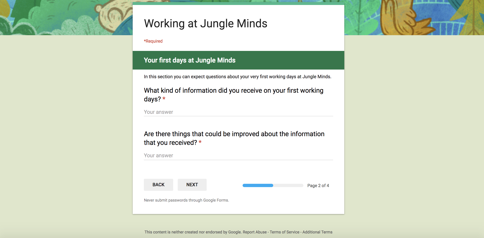
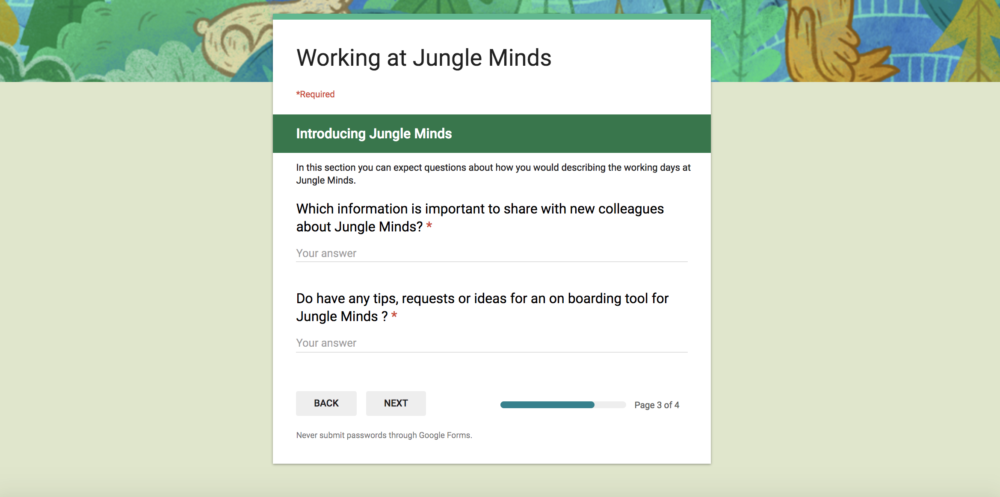

# 6.4.1 Working at Jungle Minds

Bij de survey met de medewerkers van Jungle Minds heb ik verschillende inzichten kunnen krijgen over hoe zij over Jungle Minds en de inwerkproces denken. Dit heeft mij zeer geholpen om een beter beeld te krijgen van het bedrijf en de informatie die wordt gegeven tijdens de inwerkperiode. Daarnaast heb ik doormiddel van deze survey de vraag naar de content voor de onboarding tool kunnen bepalen.

## Survey

De enquête bestaat uit drie delen.

### Deel 1

Het eerste deel van de enquête gaat over het bedrijf zelf. In deze deel vraag ik informatie aan de medewerkers over hun taken binnen het bedrijf en hoe zij het bedrijf omschrijven. De vraag over het bedrijf is voor mij van belang om later de omschrijvingen van het bedrijf te vertalen naar de app toe.

In de laatste vraag van deel 1 vraag ik aan de medewerker of hij zich herinnert hoe zijn inwerkperiode was binnen het bedrijf. Als hij dit vraag met een ja beantwoordt, wordt hij doorverwezen naar onderdeel 2 van enquête. Bij nee, wordt hij doorverwezen naar onderdeel 3.

### Deel 2

Onderdeel 2 gaat over de informatie die de medewerker heeft verkregen tijdens zijn inwerkperiode. Dit is voor mij belangrijk om te weten hoe groot de verschil in informatievoorzieningen bij de medewerkers. Daarnaast vraag ik wat ze vinden dat het beter had gekund. Deze informatie neem ik mee voor de informatievoorzieningen van de onboarding tool. 

Na het beantwoorden van deel 2 worden ze doorverwezen naar deel 3.

### Deel 3

Tijdens deel 3 vroeg ik aan de medewerkers welke informatie zij belangrijk vinden dat nieuwe medewerkers moeten kennen wanneer ze voor Jungle Minds komen werken. 

Daarnaast vroeg ik of ze tips of ideeën hebben voor de onboarding tool waarmee ik tijdens het proces mee rekening van houden. 

## Resultaten

### Beschrijving van het bedrijf

Resultaten uit de enquete hoe mensen het bedrijf Jungle Minds beschrijven.

| **Beschrijving** | **Aantal keer** |
| --- | --- | --- | --- | --- | --- | --- | --- | --- | --- | --- | --- | --- | --- | --- | --- | --- | --- | --- | --- | --- | --- | --- | --- | --- | --- | --- | --- | --- | --- | --- | --- | --- | --- | --- |
| Fun | 4 |
| Freedom | 3 |
| Ambitious | 3 |
| Social | 3 |
| Great Atmosphere | 2 |
| Creativity | 2 |
| Quality | 2 |
| Professional | 2 |
| Great brands | 1 |
| Creativity | 1 |
| Different | 1 |
| Research first approach | 1 |
| UX driven | 1 |
| Small | 1 |
| Personal | 1 |
| Transparent | 1 |
| Mature | 1 |
| Learning | 1 |
| Challenge | 1 |
| Experts | 1 |
| Partners | 1 |
| Open | 1 |
| Joyful | 1 |
| Family | 1 |
| Motivated | 1 |
| Room for own input | 1 |
| Logics | 1 |
| Home | 1 |
| Jong | 1 |
| Niet achter de ellebogen | 1 |
| Digital | 1 |
| Teamwork | 1 |
| Real user value | 1 |
| Experience | 1 |

### Informatievoorzieningen 

Informatievoorzieningen die de medewerker belangrijk vinden dat een nieuwe medewerker kent.

| **Belangrijke informatie voor medewerkers**                                                            | **Aantal keer**                                                                                                                                       |
| --- | --- | --- | --- | --- | --- | --- | --- | --- | --- | --- | --- | --- | --- | --- |
| Manier van werken | 5 |
| Bij wie kan je terecht voor welke vragen | 4 |
| Wees niet bang om vragen te stellen | 3 |
| De rollen binnen Jungle Minds | 3 |
| De cultuur | 2 |
| Specifieke templates / dropbox / wifi / timetell / Ziek regel | 2 |
| Wat verwacht Jungle Minds van jou | 2 |
| Projecten | 1 |
| Welke tool Jungle Minds gebruiken voor een bepaalde type communicatie \(email = slow, slack = fast, talking is direct but should be avoided when wearing headphones\) | 1 |
| Wacht niet om dingen gedaan te krijgen | 1 |
| Regels | 1 |
| Medewerkers | 1 |
| Visie | 1 |
| kernwaardes | 1 |

### Tips & ideeën

Tips en ideeën voor het eind product.

| **Tips en ideeën voor het product** | **Aantal keer**                              |
| --- | --- | --- | --- | --- | --- | --- | --- | --- | --- | --- | --- | --- | --- |
| De rollen uitleg binnen Jungle Minds | 3 |
| Korte video's \(Vines\) | 2 |
| Cultuur moet duidelijk naar voren | 2 |
| Voorbeelden van creatieve sessies | 2 |
| Meer informatie over collega's | 2 |
| Good reads \(nuttig zijn voor het beginnen met werken\) | 1 |
| Uitleggen wat is Jungle Minds | 1 |
| Wat Jungle Minds doet als bedrijf | 1 |
| Relevante data over HR en PM | 1 |
| Hou het simpel | 1 |
| Bij wie kan je terecht | 1 |
| Maak het grappig en eigenzinnige | 1 |
| Ervaringen van het bedrijf | 1 |

## Conclusie

### Het bedrijf

De medewerkers van het bedrijven beschrijven Jungle Minds als: Fun, vrijheid, ambitieus en sociaal. Zie afbeelding ... voor de weergave van de antwoorden gegeven op de enquête

### De content

De medewerkers van het bedrijven vinden dat nieuwe medewerkers de volgende informatie over het bedrijf moeten kennen:

* Manier van werken van het bedrijf
* Bij wie je terecht kan als je vragen hebt.
* Uitleg over de rollen binnen het bedrijf.
* De cultuur van het bedrijf.

Zie afbeelding ... voor de weergave van de antwoorden gegeven op de enquête

