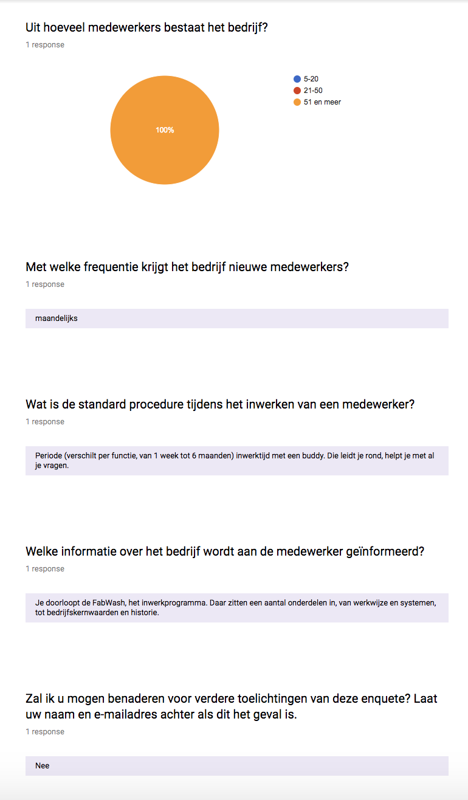

# 6.4.2 Inwerkproces

Om een beter beeld te krijgen van hoe andere vergelijkbare bedrijven als Jungle Minds hun medewerkers inwerken, heb ik een kleine enquete aangemaakt met de vraag aan bedrijven wat hun proces is gedurende de inwerkperiode van een nieuwe medewerker. Door middel van deze onderzoek geef ik antwoord op de subdeelvraag "[3.2 Welke methoden gebruiken bedrijven met kantoorwerkzaamheden om nieuwe werknemers in te werken?](../../1.-introductie/1.4-onderzoeksvragen.md#deelvraag-3)". 

De bedrijven die ik benaderd heb waren [Fabrique](https://www.fabrique.nl/), [Huge](https://www.hugeinc.com/) en [Ideo](https://www.ideo.com/eu). Ik heb bewust deze drie bedrijven benaderd omdat uit mijn interviews met de opdrachtgevers werden deze bedrijven als inspiratiebronnen benoemd voor Jungle Minds. 

## Survey

Tijdens deze survey heb ik gebruik gemaakt van Google forms om informatie te verkrijgen van bedrijven. De bedrijven waar ik informatie van wilde verkregen waren niet allemaal Nederlandstalig, hierdoor heb ik de survey via een persoonlijke e-mail gestuurd.

### Google forms

In de Google from wilde ik voornamelijk de grootte van het bedrijf weten en wat hun proces is tijdens het inwerken van een nieuwe medewerker. Zie afbeelding ... voor de visualisatie van de verstuurde enquête.

## Resultaten

### Fabrique

[Fabrique](https://www.fabrique.nl/) \(2018\) beschrijft haar bedrijf als een strategisch ontwerpbureau, die gelooft in de vernieuwende kracht van design. Ontwerp als kracht om dingen te veranderen, te verbeteren en om impact te hebben. Niet slechts om dingen mooi of bruikbaar te maken.

Via een e-mail heb ik Fabrique benaderd en verzocht om mijn enquete te beantwoorden voor mijn afstudeerproject. Zie afbeelding 22 voor de antwoorden op mijn enquete gegeven door Fabrique. Uit de enquete heb ik de volgende inzichten kunnen krijgen over de inwerkproces van dit bedrijf:

* Het bedrijf bestaat uit meer dan 51 medewerkers.
* Het bedrijf neemt maandelijks nieuwe medewerkers aan. 
* De inwerkperiode verschilt per functie, van 1 week tot 6 maanden met een buddy. 
* Buddy leidt nieuwe medewerkers rond en helpt hem met al zijn vragen.
* Nieuwe medewerkers doorloopt de "FabWash", het inwerkprogramma. Daar zitten een aantal onderdelen in, van werkwijze en systemen, tot bedrijf's kernwaarden en historie.

### Huge

[Huge](https://www.hugeinc.com/) \(2018\) transformeert bedrijven door het ontwerpen van best-in-class ervaringen, aangedreven door sterke creatieve en geworteld in de technologie, data en organisatorische strategie die nodig is voor operationele uitmuntendheid. Ze combineren deze mogelijkheden tot één oplossing, waarbij huge  merkervaringen creëert die industrieën veranderen en zinvolle relaties met gebruikers bevorderen. Deze gebruikersgerichte aanpak heeft van huge het snelst groeiende bureau van het afgelopen decennium gemaakt.

Via een e-mail heb ik Huge benaderd en verzocht om mijn enquete te beantwoorden voor mijn afstudeerproject. Omdat het een engelstalige bedrijf is heb ik een e-mail opgesteld waarin ik kort uitleg gaf over mijn project en waarin ik ze vriendelijk verzocht om vier vragen te beantwoorden voor mijn afstudeerproject. Zie afbeelding 23 voor de e-mail die ik naar ze heb opgestuurd. Helaas, heb ik geen antwoord van Huge terug gehad. 

### Ideo 

[Ideo](https://www.ideo.com/eu) \(2018\) beschrijft zijn bedrijf als is een gemeenschap van ontwerpers, ondernemers, ingenieurs, docenten, onderzoekers en meer. Hun gedeelde waarden en overtuigingen beïnvloeden het werk dat ze doen en de impact die Ideo hoopt te bereiken. Als pioniers van mensgericht ontwerpen, houden we mensen centraal in ons werk. Het is een belangrijk principe van ontwerpdenken, en zelfs als onze methoden evolueren in antwoord op nieuwe, complexe uitdagingen, ontwerpen we altijd eerst oplossingen voor mensen. We bouwen aan leren en leren terwijl we bouwen, door inspiratie, ideeën en implementatie.

Via een e-mail heb ik Ideo benaderd en verzocht om mijn enquete te beantwoorden voor mijn afstudeerproject. Omdat het een engelstalige bedrijf is heb ik een e-mail opgesteld waarin ik kort uitleg gaf over mijn project en waarin ik ze vriendelijk verzocht om vier vragen te beantwoorden voor mijn afstudeerproject. Zie afbeelding 24 voor de e-mail die ik naar ze heb opgestuurd. 

Mijn contact persoon binnen Ideo, komt uit de afdeling [Ideo U](https://www.ideou.com/pages/design-thinking-certificate?utm_medium=cpc&utm_source=google&utm_campaign=1360634357&utm_term=ideo%20design%20thinking%20certification&gclid=Cj0KCQjwgMnYBRDRARIsANC2dfkF_AAuCqggJFYYfsBShIGgCXAvLEi4aCdT8q6KXlpiHSl3h9WzSd4aAlVEEALw_wcB). Ideo U \(2018\) is een online school waar iedereen zijn creatieve potentieel kan ontsluiten en complexe problemen kan oplossen door middel van ontwerpgericht te denken. Zie afbeelding 25 voor de beantwoorde e-mail van Ideo U. Uit de antwoord die ik kreeg op mijn verstuurde e-mail heb ik de volgende inzichten verkregen over Ideo's inwerkproces:

* Ideo U bestaat uit 25 medewerkers en is snel aan het groeien. 
* Via "[https://lboi.ideo.com/](https://lboi.ideo.com/)" kunnen potentiële nieuwe medewerkers lezen over het bedrijfsgeschiedenis en cultuur.
* Verder mocht het bedrijf niet veel informatie vertellen over hun inwerkproces.  

## Conclusie

Uit dit onderzoek ben ik op de volgende inzichten gekomen die antwoord geven op de subdeelvraag "[3.2 Welke methoden gebruiken bedrijven met kantoorwerkzaamheden om nieuwe werknemers in te werken?](../../1.-introductie/1.4-onderzoeksvragen.md#deelvraag-3)":

* Grotere bedrijven die maandelijks nieuwe werknemers aannemen gebruiken vaak een tool tijdens de inwerkperiode. 
* De inwerk tool bevat vaak informatie als:
  * De werkwijze van het bedrijf.
  * Systemen waarmee een bedrijf werkt.
  * De bedrijf's kernwaarden en historie.
* Kleine en middelgrote bedrijven gebruiken vaak een online pdf om het bedrijfs historie en cultuur te vertellen.

