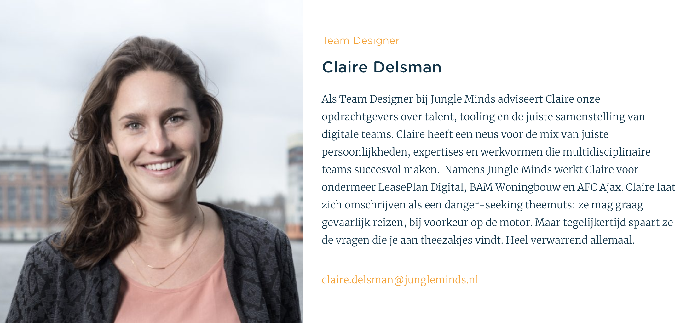

# 6.1.4 Team Designer: Claire

## De interview

### De geïnterviewde

* **Wanneer ben jij komen werken voor Jungle Minds? **20 november 2017 
* **Ben je ingestroomd als vaste medewerker? Als nee hoe? **ja 
* **Hoe vaak per week werkte je in het begin? En nu? **full time, en twee weken op vakantie geweest. Nu werk ik nog steeds fulltime. 
* **Wat is jouw expertise binnen het bedrijf? **Wist zelf nog niet zo goed toen ik hier binnen kwam, ik kom zelf uit een heel andere branch. Mijn titel is team designer en tijdens mijn sollicitatiegesprek kwam ik vooral achter wat mijn taken zouden zijn. Nu heb ik voor mijzelf bedacht dat ik 3 ledig heb binnen mijn expertise, namelijk:  - Recruitment. - Team poll schakeling tussen opdrachtgever en team. \(internet team wordt opgezet en gebracht wordt naar realisatie in de tussen periode van ontwikkeling hakken we freelancers aan om te zorgen dat de product uitloopt en dan willen we die freelancers omzetten naar vaste medewerkers bij het bedrijf waarvoor ze aan het werken zijn.  - Freelancers poll en meer hechtere te maken om gevoel te geven dat we niet zomaar een recruitment partij zijn, maar betrokken zijn bij de opdracht, evalueren en wat zij als verbeter punt zien ook meenemen. Ik zie dat zelf als de HR-functie van de freelancers ook gezien als jungle pro's. 
* **Welke informatie krijgen de Jungle pro's over Jungle Minds? **- Introductie brief met emailadres. - Timetell instructie om uren te noteren. - Opdrachten overeenkomst met juridische dingen als contract en regels. - En wij zijn nu aan het kijken voor een onboarding gids voor freelancers maar daar zijn we nog niet aan toe. - We geven geen informatie over jungle minds zelf als normen en waarden.

### Inwerkperiode toen

* **Hoe heb je jouw inwerkperiode ervaard? I**k ben nog steeds beetje mee bezig met wennen omdat ik vanuit en hele andere branch kom. Alle termen, producten moet ik nog aan wennen. Dit komt wel tot je door door met mensen te praten, kennismakingsgesprekken. Ook door te praten met de freelancers vragen naar wat hun rollen zijn, waar ze tegen aan lopen. Sfeer hier vond ik meteen erg fijn. In begin had ik meteen een bosbloemen op tafel. Is een klein gebaar maar geeft aan dat ze aan je denken, ik vond het erg waardevol. Ik heb veel met Ernst mee gelopen en hij heeft mij veel laten zien en geleerd. Maar ik ben nog steeds op zoek naar wat mijn rol precies is binnen het bedrijf. Ik ervoer het prettig en open omgeving voelde me erg onwetend in het begin en mensen stonden open om uit te leggen en gingen prettig met om. 
* **Door wie werd je begeleid?** Ernst en Maikel. 
* **Had je voor dat je bent komen werken al bepaalde informatie over het bedrijf gezocht? Zo ja wat?** Ik kom hier via Jessica, dus ik had al veel informatie gekregen en zij verteld hoe zij het bedrijf heeft ervaard, over cultuur en de type bedrijf. Ook beetje uitleg gekregen over hoe ze hier werken, welke functies er zijn en hoe de mensen hier zijn. 
* **Is er iets wat u zal willen veranderen aan de manier waarop nieuwe medewerkers worden ingewerkt? **Aanvulling qua inhoudelijk mee te krijgen zodat je weet hoe het werkt. Dit zal mij helpen om te weten wat ik moet zoeken bij mensen en of ze goed passen bij de groep. Vakinhoudelijk meer weten, zodat je weet hoe team werken. Daarnaast weten wanneer je bij een project zal kunnen meekijken en welk projecten er nu lopen.

### Inwerkperiode nu

* **Begeleid je zelf ook nieuwe medewerkers?** Nee 
* **Welke informatie zal je geven aan een nieuwe medewerker als je die zal moeten begeleiden?** - Personeel gids dike je krijgt staat veel in over het bedrijf \(website\) - Doelen ideeen 
* **Hoe heb je de cultuur van Jungle Minds ervaart?** - bloemen , kleine dingen die voelen dat je hele egr welkom bent - mensen stappen naar je toe om te vragen wat je gaat doen . - In begin ff zoeken je rol en heo je zelf in de organisatie inzet \(nog steeds zoeken\) - Wel heel fijn op ben genomen. - gevoel en vertrouwen dat je fouten mag maken en vragen mag stellen. 

## Tips, ideeën en opmerkingen

*  _scrum training besproken hoe jm dingen aanpakt. - We hebben een project en we doen het zo &gt;&gt; meelopen met een rpoject en begrijpt hoe en waarom wij een bepaalde dingen aanpakken_
* JM faciliteert dat je bij vershcillende disciplines mee mag kijkejn en dat je begrijpt hoe zo een proces werkt. 

