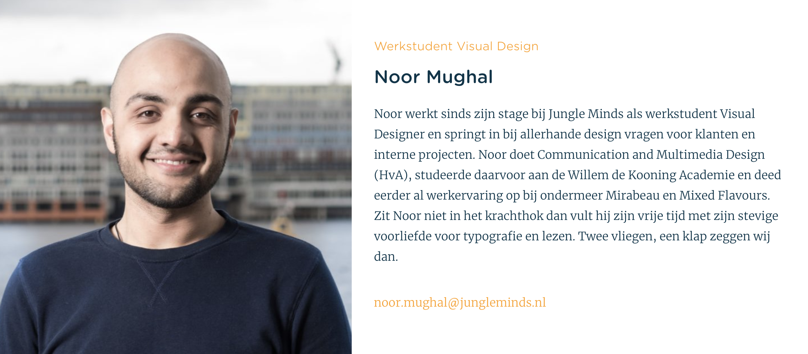

# 6.1.5 Visual Designer: Noor

## De interview

### De geïnterviewde

* **Wanneer ben jij komen werken voor Jungle Minds?** In september 2017 
* **Ben je ingestroomd als vaste medewerker? Als nee hoe?** In september begonnen als stagiere tot januari. Vanaf februari ben ik aangenomen als vaste medewerker. 
* **Hoe vaak per week werkte je in het begin? En nu?** Tijdens mijn stage werkte ik 5 dagen per week en nu werk ik 3 dagen in de week i.v.m. mijn afstudeerstage. 
* **Wat is jouw expertise binnen het bedrijf?** Visual designer

### Inwerkperiode toen

* **Hoe heb je jouw inwerkperiode ervaard?** Goed, in het begin was het erg wennen omdat ik wist niet hoe alles werkte, de mensen en de manier van werken niet kende. Ik merkte een duidelijke verschil tussen school en hier. Op school was alles verspreid en hier zit meer vaart in. Wel vond ik dat mijn rol binnen het proces vaak ff zoeken was in het begin. 
* **Door wie werd je begeleid?** Wessel Tijdens het werk zelf werd ik bij sommige projecten uitgelegd hoe het in elkaar zit en het huisstijl gebruik. Dit gebeurde niet direct maar kwam langzamerhand van toepassing. 
* **Had je voor dat je bent komen werken al bepaalde informatie over het bedrijf gezocht? Zo ja wat?** Ja, veel zelf gelezen op hun website, daar ben ik de handboek tegengekomen. Die legt wat de algemene voorwaarden van het bedrijf zijn. 
* **Is er iets wat u zal willen veranderen aan de manier waarop nieuwe medewerkers worden ingewerkt?** Ik ben zelf een person die het liefste stap voor stap alles wilt weten, bijvoorbeeld wat mijn taken zijn binnen de team, voor dat ik zelf aan de slag ga. Als stagiere weet je niet goed hoe alles binnen het bedrijf functioneert, hierdoor kreeg ik vaak het idee dat ik wilde weten wat er aan de hand was en waarom iets gebeurde. Hier wordt er verwacht dat je zelf rolt binnen de projecten en veel vragen steelt. Echter, zat ik steeds in mijn hoofd dat de projecten anders waren als je ging switchen maar achteraf bleek vaak dat niet het geval te zijn maar meer de mensen en hoe ze werkten waren anders.

### Inwerkperiode nu

* **Begeleid je zelf ook nieuwe medewerkers?** nee 
* **Welke informatie zal je geven aan een nieuwe medewerker als je die zal moeten begeleiden?**  
  - Algemene zaken die in het bedrijf lopen

  - Belangrijke mensen in het bedrijf

  - Taken van mensen in bedrijf

  - Programma’s die je moet beheersen om je functie goed te kunnen bespreken

  - Belangrijke meetings/opdrachten/andere zaken die in het bedrijf lopen en de rest is vaak denken aanvoelen op het moment zelf heb ik het idee.  

* **Welke informatie vindt u noodzakelijk dat een medewerker moet weten?** - Algemene informatie krijg je over het algemeen tijdens het sollicitatie gesprek. - Wat mij handig lijkt is om meer te weten over collega's zowel hun taken als hoe ze zijn als persoon. Dit omdat je met ze gaat werken en dat lijkt mij leuk. Hierdoor kan je beter inschatten wat jouw rol binnen het team is. 
* **Hoe heb je de cultuur van Jungle Minds ervaart?** - _Ervaring_: Ik heb het prettig ervaart. Hier is iedereen heel open en de mis van disciplines is ook erg fijn, je merkt dat er weinig tot geen verschil is er tussen of tussen managers. - _Overdacht_: Dit gebeurt vaak door de "Monday mornings". Hierin krijgen we te horen waar Jungle Minds zich gaat bezig houden gedurende de week \(formeel\) maar ook dingen als kinderen die zijn geboren binnen het team of nieuwe medewerkers \(informeel\). 

## Tips, ideeën en opmerkingen

