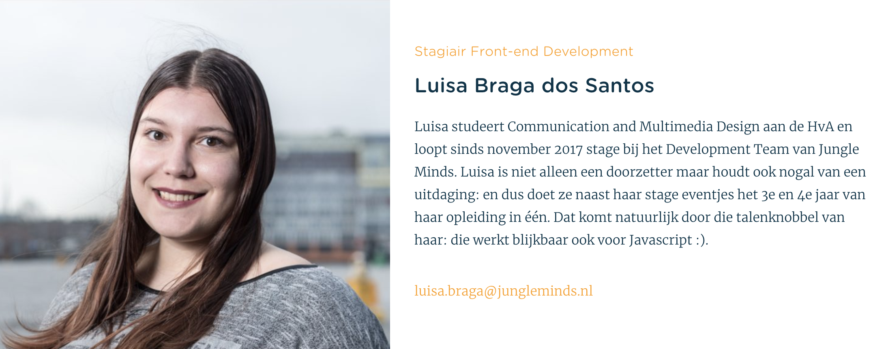

# 6.1.6 Frontend Developer: Luisa

## De interview

### De geïnterviewde {#de-geinterviewde}

* **Wanneer ben jij komen werken voor Jungle Minds?**  In november 2017. 
* **Ben je ingestroomd als vaste medewerker? Als nee hoe?**  In november begonnen als stagiaire tot juli 2018. 
* **Hoe vaak per week werkte je in het begin? En nu?**  Tijdens mijn eerste 2 maanden stage liep ik twee keer in de week stage, nu loop ik er vier dagen in de week. 
* **Wat is jouw expertise binnen het bedrijf?**  Front end developer.

### Inwerkperiode toen {#inwerkperiode-toen}

* **Hoe heb je jouw inwerkperiode ervaren?**  Ik ervoer het erg chaotisch, dit kwam zowel omdat ik in het begin maar twee dagen in de week werkte en doordat ik heel veel informatie niet mee kreeg. Er werd gekozen om geen kennismakingsgesprekken te doen bij mij i.v.m. de weinig dagen die ik stage liep. Daarnaast werd ik al sinds mijn eerste werkdag ingezet in een project waar ik de enige frontend developer was, dit was voor mij niet leerzaam en zorgde ervoor dat ik alles twee keer moest doen, omdat ik nooit mee kreeg hoe het bedrijf te werk ging.  
* **Door wie werd je begeleid?**  Door Rilliano. 
* **Had je voor dat je bent komen werken al bepaalde informatie over het bedrijf gezocht? Zo ja wat?**  - De website doorgenomen - Informatie op LinkedIn gelezen  
* **Is er iets wat u zal willen veranderen aan de manier waarop nieuwe medewerkers worden ingewerkt?**  - Meer informatie geven over procedures en regels binnen het bedrijf. - Expertises uitleggen, zodat een medewerker weet bij wie hij terecht kan bij vragen. - Eerste week kunnen meelopen om te zien hoe in een project wordt gewerkt. 

### Inwerkperiode nu {#inwerkperiode-nu}

* **Begeleid je zelf ook nieuwe medewerkers?**  Nee. 
* **Welke informatie zal je geven aan een nieuwe medewerker als je die zal moeten begeleiden?**  - Personeel gids die te vinden is op de website. \(Niet iedereen leest het.\) - Algemene procedures binnen een project - Expertises uitleg. 
* **Welke informatie vindt u noodzakelijk dat een medewerker moet weten?**  - Normen en waarden van het bedrijf - Procedures - Taken uitleg 
* **Hoe heb je de cultuur van Jungle Minds ervaart?**  Voor dat ik kwam werken heb ik een Jungle Day meegemaakt, hierdoor kreeg ik meteen een beter indruk over hoe het bedrijf werkt en hoe ze omgaan met hun medewerkers. Echter, kwam ik tijdens die dag veel begrippen tegen die mij niks zeiden met het gevolg dat ik niet veel van heb kunnen onthouden. Er werd toen mij verteld dat ik later wanneer ik aan de slag zal gaan het mij zal verteld worden en het duidelijker zal zijn.

