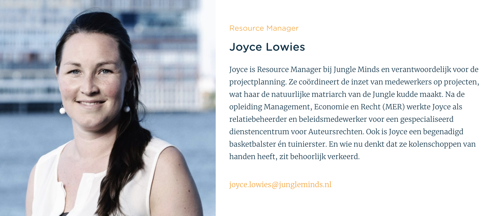

# 6.1.6 Resource Manager: Joyce

## De interview

### De geïnterviewde

### Het bedrijf

* **Waar staat Jungle Minds voor?** Eeen bureau waarde toevoeged vor klanten en gebruikers. mnaken van mooie goedwerkende we producten 
* **Wat is de missie van Jungle Minds?** gebruikerswaarde toevoegen/bieden 
* **Wat is de visie van Jungle Minds?** E 
* **Hoe straalt Jungle Minds haar missie en visie?** Dat kan beter, naar huigdige klanten gaat gord, maar naar biuiten kandat beter 
* **Wat zijn dingen die het bedrijf inspireren? \(bedrijven, producten en/of diensten\)** - vanuit jungleminds &gt; kunst, nieuwe markten, innovatie. verschillende typen kalmnten, gezondheid sports gezelligheid. locatie. 
* **Waar bent u het meeste trots op van het bedrijf?** op de cultuur die we hier hebben. moeilijk om ergens anders te vinden. Met elkaar omgaan. 
* **Omschrijf jouw functie binnen het bedrijf?** plan ik mensen, de juiste mensen op de juiste planning gepland worden. Puzzle dagelijks, soft project management voor kleine projecten. Grote rol in uren e project admnistratie.

### Procedures en Informatie

* **Wat beschouwt u als inhoudelijke informatie over het bedrijf? -** H
* **Welke zijn de procedures binnen Jungle Minds wat een project betreft?** - Standarts project: - Bedrijf rechtsstreeks of zelf promoten - Maken voorstel of workshop fase om te laten zien wat we de klanten kunne binnen. - Als het bevalt gaat het akkord met een bepaalde budget. - Project leider maakt een plan van hoeveel mensen gaan werken en budget - eerste concept - design - bouwen  budget speelt grote rol , ambtie van de klant. 
* **Hoe zit de planning uit van het bedrijf bij projecten? -** H 
* **Waar moet er rekening gehouden worden tijdens het plannen van projecten? -** beschikbaarheid, ambitie van mensen, team samenstelling voor prestatie. 
* **Welke informatie vindt u noodzakelijk dat een medewerker moet weten over het bedrijf?** - missie en vissie &gt; goed op de hoogte - achtergrond, geschiedenis - Cultuur behouden door geod kenismakingsgesprekken met iedereen - Financieel door strakke uren proces. \(kars ligt het uit, voor de transparantie\) - Hoe werken we. de werkwijze, welke tools en welke procesen er zijn om achter een bepaalde dingen te komen. 
* **Is er iets wat u zal willen veranderen aan de manier waarop nieuwe medewerkers worden ingewerkt?** - verbeterd afgelopen maande maar het blijft lastig omdat verschil in wat iemand kan, en junior is meestal lastig omadat het best een intensief traject kan zijn qua beschikbaarheid, 

## Tips, ideeën en opmerkingen

*  dingen die met jungleminds te maken hebben zoals pondtijd
* manieren heo je kan dingen reserveerd, ruoimte auto
* boek wie is wie.
* planning voor kennismakinggesprek
* jaar agenda van JM &gt; wnr zijn jungle days, tribe meetings uittjes. rekening houden met interne uitjes.
* templates van presentaties.
* tijdlijn samenvatting welkom to the jungle belangrijke data

