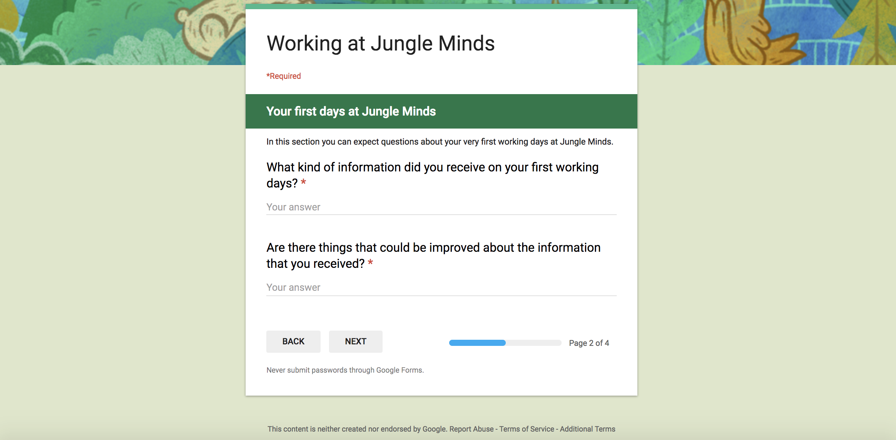
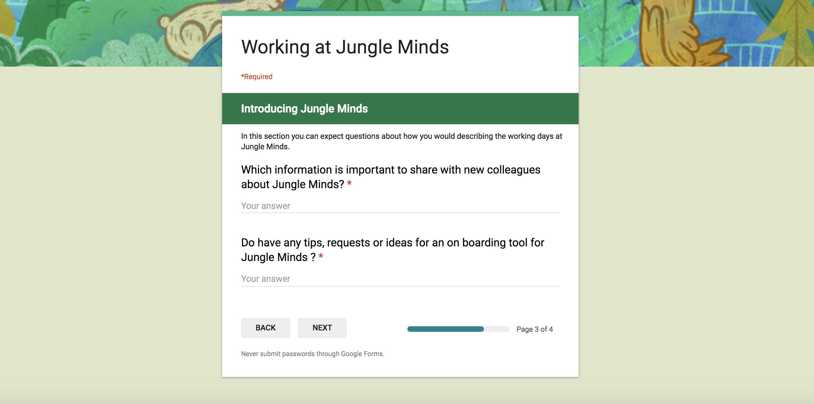
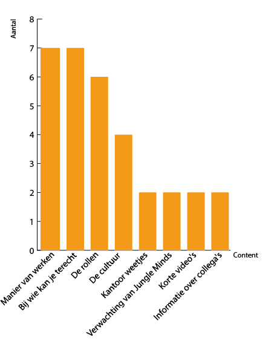

# 6.4.1 Working at Jungle Minds

### Survey

### 

### Resultaten

Resultaten uit de enquete hoe mensen het bedrijf Jungle Minds beschrijven.

| **Beschrijving** | **Aantal keer** |
| --- | --- | --- | --- | --- | --- | --- | --- | --- | --- | --- | --- | --- | --- | --- | --- | --- | --- | --- | --- | --- | --- | --- | --- | --- | --- | --- | --- | --- | --- | --- | --- | --- | --- | --- |
| Fun | 4 |
| Freedom | 3 |
| Ambitious | 3 |
| Social | 3 |
| Great Atmosphere | 2 |
| Creativity | 2 |
| Quality | 2 |
| Professional | 2 |
| Great brands | 1 |
| Creativity | 1 |
| Different | 1 |
| Research first approach | 1 |
| UX driven | 1 |
| Small | 1 |
| Personal | 1 |
| Transparent | 1 |
| Mature | 1 |
| Learning | 1 |
| Challenge | 1 |
| Experts | 1 |
| Partners | 1 |
| Open | 1 |
| Joyful | 1 |
| Family | 1 |
| Motivated | 1 |
| Room for own input | 1 |
| Logics | 1 |
| Home | 1 |
| Jong | 1 |
| Niet achter de ellebogen | 1 |
| Digital | 1 |
| Teamwork | 1 |
| Real user value | 1 |
| Experience | 1 |

## Conclusie

### Het bedrijf

### De content

